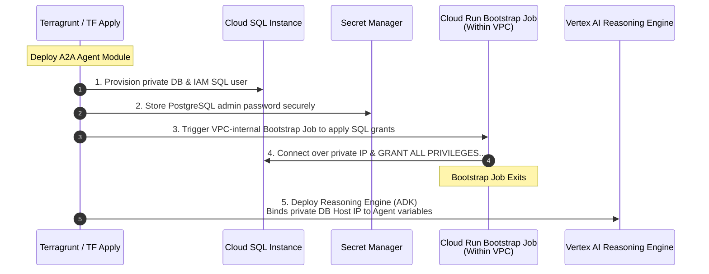

# Esmeralda Live Workloads Assembly & Lifecycle Coordination

This document specifies the dev environment live assembly variables definitions and defines the startup dependencies and DB schema bootstrapping sequence.

## 1. Live Environment Composition (`live/dev/stage-4-workloads/`)

## 4. Workloads Assembly Configurations

These HCL declarations demonstrate how the micro-services are configured and chained in your live environment:

### A. The A2A Agent (`live/dev/stage-4-workloads/agents/a2a-agent/terragrunt.hcl`)
```hcl
# infrastructure/live/dev/stage-4-workloads/agents/a2a-agent/terragrunt.hcl
include "root" {
  path = find_in_parent_folders()
}

terraform {
  source = "../../../../../modules//4-workloads/agents/a2a-agent"
}

dependency "projects" {
  config_path = "../../../stage-1-projects"
}

dependency "networking" {
  config_path = "../../../stage-2-networking"
}

dependency "security" {
  config_path = "../../../stage-3-security"
}

locals {
  env_vars = read_terragrunt_config(find_in_parent_folders("env.yaml"))
}

inputs = {
  # Dynamically deploys into the isolated A2A agent platform project!
  project_id            = dependency.projects.outputs.a2a_project_id
  region                = local.env_vars.locals.region
  vpc_id                = dependency.networking.outputs.network_id
  subnet_id             = dependency.networking.outputs.subnet_id
  agent_service_account = dependency.security.outputs.a2a_agent_sa_email

  database_product      = local.env_vars.locals.database_product
  database_name         = "a2a_tasks"
}
```

### B. The Root Orchestrator (`live/dev/stage-4-workloads/agents/base-adk-agent/terragrunt.hcl`)
```hcl
# infrastructure/live/dev/stage-4-workloads/agents/base-adk-agent/terragrunt.hcl
include "root" {
  path = find_in_parent_folders()
}

terraform {
  source = "../../../../../modules//4-workloads/agents/base-adk-agent"
}

dependency "projects" {
  config_path = "../../../stage-1-projects"
}

dependency "security" {
  config_path = "../../../stage-3-security"
}

dependency "mcp_dms" {
  config_path = "../../mcp-servers/mcp-dms"
}

dependency "mcp_calc" {
  config_path = "../../mcp-servers/mcp-calculator"
}

locals {
  env_vars = read_terragrunt_config(find_in_parent_folders("env.yaml"))
}

inputs = {
  # Deploys into the isolated customer-facing Line of Business (LOB) project!
  project_id            = dependency.projects.outputs.root_project_id
  region                = local.env_vars.locals.region
  agent_service_account = dependency.security.outputs.root_agent_sa_email

  # Inject downstream endpoints
  mcp_dms_url           = dependency.mcp_dms.outputs.mcp_dms_url
  mcp_calc_url          = dependency.mcp_calc.outputs.mcp_calc_url

  # NOTE: To bypass circular dependency (where the Gateway needs Agent endpoints to compile its mapping,
  # and the Root Agent needs the Gateway URL), the Root Agent routes downstream to the Gateway 
  # using a static, predictable private DNS address. The Gateway dynamically intercepts and routes this.
  a2a_agent_url         = "http://a2a-agent.esmeralda.internal"
}
```

---


## 2. Integrated A2A & Cloud SQL Lifecycle Coordination

## 5. The Integrated A2A Agent & Cloud SQL Lifecycle

By packaging Cloud SQL, bootstrapping, and the Vertex AI Reasoning engine inside the `modules/4-workloads/agents/a2a-agent` pure module, we obtain an atomic, self-contained workload.



---

