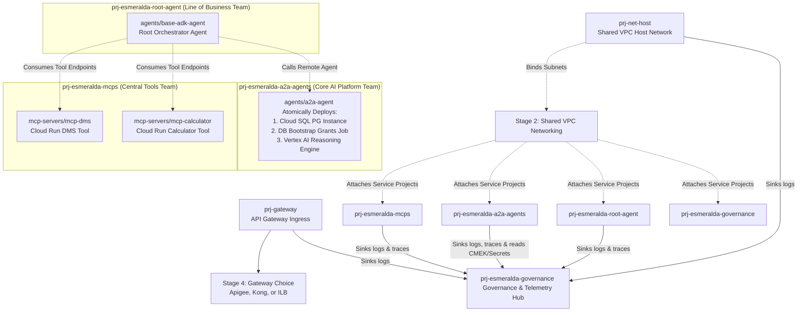

# Esmeralda FAST-Aligned Composable Platform Design

This blueprint establishes a highly elegant, **FAST-aligned platform architecture** for Esmeralda. It collapses granular, rigid developer stages into 3 base foundations and introduces a composable, multi-project **Stage 4: Workloads** designed like a "product catalog". 

Under this design, your `/modules` folder is the **Product Shelf**, your `env.yaml` is your **Shopping Cart**, and individual components (such as specific MCP tools, the orchestrator agent, and the A2A agent containing its own dedicated taskstore database) are deployed and updated completely in isolation across **six distinct GCP Projects**, simulating a real-world enterprise multi-tenant landing zone.

---

## 1. The FAST-Aligned Platform Layout

We organize Esmeralda's lifecycle stages to map directly to Google Cloud's enterprise landing zone standards. We divide our workloads across **four independent service projects** representing distinct engineering and business teams, connected back to a central Shared VPC, alongside a dedicated central governance and telemetry hub project:



### The Architecture Design Philosophy:
*   **The Shared VPC Project (`prj-net-host`)**: Managed by NetOps. Owns the core routing, private DNS zones, and Private Service Connect (PSC).
*   **The Ingress Project (`prj-gateway`)**: Managed by PlatformOps. Hosts the public gateway endpoint.
*   **The Central Tools Project (`prj-esmeralda-mcps`)**: Managed by the AppDev Team. Deploys the reusable corporate tool API servers.
*   **The AI Platform Project (`prj-esmeralda-a2a-agents`)**: Managed by the Core AI Team. Hosts cross-company re-usable assistant agents and their SQL task stores.
*   **The LOB App Project (`prj-esmeralda-root-agent`)**: Managed by a specific business unit. Owns the customer-facing user reasoning engine, which orchestrates calls to the other projects.
*   **The Governance & Telemetry Hub Project (`prj-esmeralda-governance`)**: Managed by SecOps / PlatformOps. Centralizes security elements (KMS Keyrings, Secrets, Certificate Manager certificates) and telemetry components (Log Analytics buckets, Cloud Trace datasets, BigQuery tables), completely separating security/observability governance from core workloads.

---

## 2. Updated Terragrunt Repository Structure

```text
infrastructure/
├── modules/                                 # PURE, REUSABLE TERRAFORM MODULES
│   ├── 1-projects/                          # Seeds projects & enables APIs (Stage 1)
│   ├── 2-networking/                        # Provisions Shared VPC, subnets, DNS (Stage 2)
│   ├── 3-security/                          # Provisions Secret Manager, KMS, Log Sinks (Stage 3)
│   │
│   └── 4-workloads/                         # THE PRODUCT CATALOG SHELF (Stage 4)
│       ├── gateways/                        # --- GATEWAYS SHELF ---
│       │   ├── apigee/                      # Product A: Apigee X Enterprise Gateway
│       │   ├── kong/                        # Product B: Lightweight Kong on Cloud Run
│       │   └── ilb/                         # Product C: Direct Internal Load Balancer
│       │
│       ├── mcp-servers/                     # --- MCP TOOLS SHELF ---
│       │   ├── mcp-dms/                     # DMS Document Tool Service
│       │   └── mcp-calculator/              # Financial Calculator Tool Service
│       │
│       └── agents/                          # --- AI AGENTS SHELF ---
│           ├── base-adk-agent/              # Root Orchestrator (Reasoning Engine Only)
│           └── a2a-agent/                   # Mortgage Assistant (Atomic: SQL + Bootstrap + Agent)
│
└── live/                                    # LIVE INFRASTRUCTURE ENVIRONMENT CONFIG
    ├── terragrunt.hcl                       # Root config: remote state, global provider blocks
    ├── dev/                                 # DEVELOPMENT ENVIRONMENT
    │   ├── env.yaml                         # Dev environment vars (billing_id, region, prefix)
    │   │
    │   ├── stage-1-projects/
    │   │   └── terragrunt.hcl               # Deploys up to 6 Projects & APIs
    │   ├── stage-2-networking/
    │   │   └── terragrunt.hcl               # Deploys VPC, NAT, Firewalls, Private DNS
    │   ├── stage-3-security/
    │   │   └── terragrunt.hcl               # Deploys KMS, Secrets, Sinks across projects
    │   │
    │   └── stage-4-workloads/               # COMPOSABLE ASSEMBLY DIRECTORY
    │       ├── gateway/
    │       │   └── terragrunt.hcl           # Swappable: Deploys chosen Gateway
    │       ├── mcp-servers/
    │       │   ├── mcp-dms/
    │       │   │   └── terragrunt.hcl       # Deploys DMS to prj-esmeralda-mcps
    │       │   └── mcp-calculator/
    │       │       └── terragrunt.hcl       # Deploys Calculator to prj-esmeralda-mcps
    │       └── agents/
    │           ├── a2a-agent/
    │           │   └── terragrunt.hcl       # Deploys private SQL & ADK Agent to prj-esmeralda-a2a-agents
    │           └── base-adk-agent/
    │               └── terragrunt.hcl       # Deploys Orchestrator to prj-esmeralda-root-agent
```

---


## Navigation Map
- [01_platform_foundations.md](file:///usr/local/google/home/afonsomenegola/codigos/esmeralda/migration/01_platform_foundations.md)
- [02_workloads_and_delivery.md](file:///usr/local/google/home/afonsomenegola/codigos/esmeralda/migration/02_workloads_and_delivery.md)
- [stage_1_projects.md](file:///usr/local/google/home/afonsomenegola/codigos/esmeralda/migration/stage_1_projects/stage_1_projects.md)
- [stage_2_networking.md](file:///usr/local/google/home/afonsomenegola/codigos/esmeralda/migration/stage_2_networking/stage_2_networking.md)
- [stage_3_security.md](file:///usr/local/google/home/afonsomenegola/codigos/esmeralda/migration/stage_3_security/stage_3_security.md)
- [stage_4_workloads/gateways.md](file:///usr/local/google/home/afonsomenegola/codigos/esmeralda/migration/stage_4_workloads/gateways.md)
- [stage_4_workloads/mcp_servers.md](file:///usr/local/google/home/afonsomenegola/codigos/esmeralda/migration/stage_4_workloads/mcp_servers.md)
- [stage_4_workloads/agents.md](file:///usr/local/google/home/afonsomenegola/codigos/esmeralda/migration/stage_4_workloads/agents.md)
