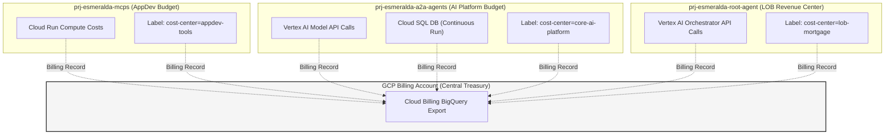
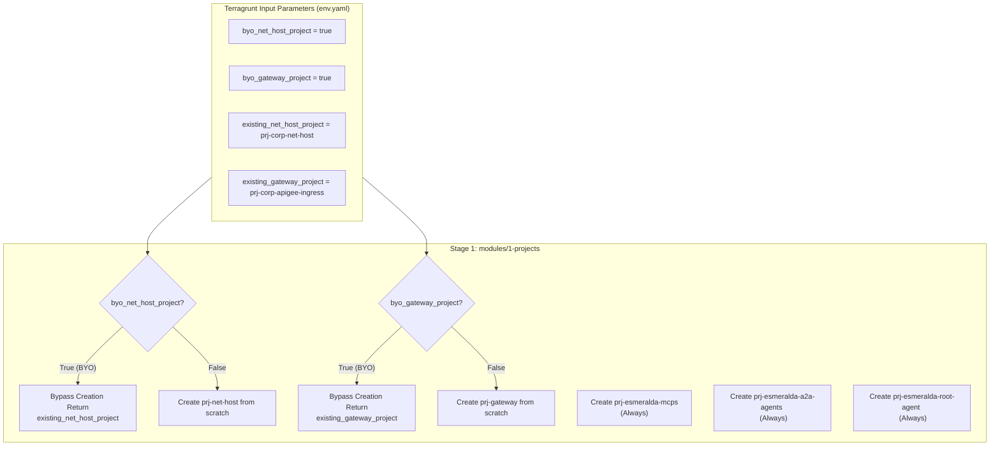

# Stage 1: Foundational Projects, Billing & APIs

This module manages the automated provisioning of isolated GCP service projects, links them securely to the corporate billing account, and activates standard APIs natively.

## 7. Detailed Module Implementation Specifications

This section defines the precise layout, HCL blueprints, and resources that must be built inside each of the pure reusable directories under `infrastructure/modules/`.

### 7.1 Stage 1: `modules/1-projects/` Specification

This module manages the creation of isolated GCP projects, links them to enterprise billing, activates necessary service APIs, and establishes the foundational service account mappings. Under this design, the module handles **up to six distinct projects**, reflecting a standard enterprise landing zone.

#### A. Enterprise Team & Project Simulation Mapping
To simulate a real-world enterprise multi-tenant landing zone, we split our architecture across six projects, allowing separate business, engineering, and observability units to operate independently:

| Simulated Team | GCP Project ID | Business & Operational Role | Primary Resources Hosted |
| :--- | :--- | :--- | :--- |
| **Network Ops (NetOps)** | `prj-net-host` | Owns the central networking backbones, Shared VPC, Private Service Connect (PSC), and firewall policies. | Shared VPC, Subnets, Cloud NAT, Cloud DNS, PSC Endpoints. |
| **Platform Ops (PlatformOps)** | `prj-gateway` | Manages the public-facing application ingress, corporate domain name registration, and corporate API Gateways. | Apigee X, Kong Gateway on Cloud Run, external HTTPS Load Balancers. |
| **AppDev Tools Team** | `prj-esmeralda-mcps` | Creates, maintains, and packages reusable Model Context Protocol (MCP) tool servers for the whole company. | Cloud Run (DMS Server, Calculator Server), Artifact Registry. |
| **Core AI Platform Team** | `prj-esmeralda-a2a-agents` | Develops reusable, cross-company Assistant-to-Assistant (A2A) agents, handling centralized business domain reasoning. | Cloud SQL PostgreSQL, Cloud Run Database Bootstrapping Job, Vertex AI Reasoning Engine (A2A). |
| **Line-of-Business Team (LOB)** | `prj-esmeralda-root-agent` | Develops the final client-facing user reasoning engine, which acts as the frontend orchestrator and orchestrates upstream agents. | Vertex AI Reasoning Engine (Root), client-facing IAM roles, GCS Buckets. |
| **Security & Governance Hub** | `prj-esmeralda-governance` | Consolidates central security/governance (KMS keys, secrets, certs) and central telemetry/observability (BigQuery dataset, trace views, log sinks), establishing strict Separation of Concerns (SoC) between Platform Governance and Workload Runtimes. | KMS Keyrings, secrets, Certificate Manager certificates, BigQuery Audit Sinks, and log buckets. |

---

#### B. The FinOps Challenge: Cost Attribution & Billing Isolation
Deploying agentic pipelines across multiple distinct GCP projects solves major enterprise pain points but introduces key FinOps and tracking challenges. Our multi-project structure solves these as follows:



##### 1. Vertex AI Model API Billing Attribution
When multiple teams call Gemini via Vertex AI, a monolithic project makes it impossible to distinguish which team consumed how many input/output tokens. By splitting workloads:
*   Calls to Gemini made by the Root Orchestrator are charged directly to `prj-esmeralda-root-agent` (LOB Budget).
*   Calls to Gemini made by the A2A Agent during sub-task execution are charged to `prj-esmeralda-a2a-agents` (Core AI Budget).
*   *Implementation*: Resource labels (`env=dev`, `cost-center=...`, `team=...`) are systematically applied at the project level and resource level, flowing directly into the **GCP Billing Export to BigQuery** for clean dashboards.

##### 2. Persistent vs. Ephemeral Resource Cost Allocation
*   **Cloud SQL Instance**: Run as a shared state machine for the A2A agent, running 24/7. This represents a fixed cost that is isolated inside the Core AI Platform budget (`prj-esmeralda-a2a-agents`) and is not subsidized by the LOB team.
*   **Cloud Run (MCP Tool Servers)**: Run serverless, scaling to zero when there are no requests. This ensures that the AppDev team only incurs compute costs when tools are actively invoked, preventing resource wasting.

##### 3. Cross-Project Network Transit Cost Optimization
Data transferring across VPC subnets and project boundaries can incur inter-zone egress fees.
*   To address this, all projects are systematically locked to a single region (`us-central1`) and use Shared VPC Private IP communication, eliminating public internet NAT gateway egress charges for inter-agent communication.

---

#### C. The BYOInfra (Brownfield) Integration Architecture
In real enterprise deployments, customers will **never** allow a tool to provision a new Shared VPC Host Project (`net_host`) or change their centralized Gateway Ingress Project (`gateway`). 

Esmeralda elegantly handles this by using a dynamic **BYOInfra Fallback Architecture**:



*   **Conditional Project Seed**: In `main.tf`, `google_project.net_host` and `google_project.gateway` use a `count` conditional (`count = var.byo_net_host_project ? 0 : 1`).
*   **API Enablement Isolation**: Service API enablement is also conditional. If `byo_net_host_project` is true, Esmeralda skips enabling APIs in that project to prevent permission conflicts with corporate security policies (which restrict IAM permissions to create/enable APIs on shared host projects).
*   **Dynamic Outputs Mapping**: Regardless of whether a project is created from scratch or provided as pre-existing, `outputs.tf` resolves the correct active project IDs, ensuring downstream modules (networking, security, and workloads) consume them transparently.

---

#### D. File Inventory & Blueprints

```text
infrastructure/modules/1-projects/
├── versions.tf          # Mandates HashiCorp Google provider bounds (>= 5.0)
├── variables.tf         # Inputs for billing, organization folders, prefix, and BYO parameters
├── main.tf              # Implements projects, API enablement, billing bindings, and labels
└── outputs.tf           # Exposes project IDs & numbers to downstream stages
```

##### 1. Versions Specification (`versions.tf`)
```hcl
terraform {
  required_version = ">= 1.5.0"
  required_providers {
    google = {
      source  = "hashicorp/google"
      version = ">= 5.0.0, < 6.0.0"
    }
    random = {
      source  = "hashicorp/random"
      version = ">= 3.5.0"
    }
  }
}
```

##### 2. Variables Specification (`variables.tf`)
```hcl
# infrastructure/modules/1-projects/variables.tf

variable "billing_account" {
  description = "The enterprise billing account ID to bind to all created projects"
  type        = string
}

variable "folder_id" {
  description = "The folder ID under which to create the projects. If omitted, projects are created at organization root."
  type        = string
  default     = ""
}

variable "project_prefix" {
  description = "A prefix string appended to the start of all projects to guarantee uniqueness"
  type        = string
  default     = "esmeralda"
}

# BYO Project Toggles
variable "byo_net_host_project" {
  description = "Set to true if the customer is bringing a pre-existing Shared VPC Host Project"
  type        = bool
  default     = false
}

variable "byo_gateway_project" {
  description = "Set to true if the customer is bringing a pre-existing API Gateway/Ingress Project"
  type        = bool
  default     = false
}

variable "byo_governance_project" {
  description = "Set to true if the customer is bringing a pre-existing governance/security/telemetry project"
  type        = bool
  default     = false
}

variable "existing_net_host_project" {
  description = "The project ID of the pre-existing Shared VPC Host Project. Required if byo_net_host_project is true."
  type        = string
  default     = ""
}

variable "existing_gateway_project" {
  description = "The project ID of the pre-existing API Gateway/Ingress Project. Required if byo_gateway_project is true."
  type        = string
  default     = ""
}

variable "existing_governance_project" {
  description = "The project ID of the pre-existing governance/security/telemetry project. Required if byo_governance_project is true."
  type        = string
  default     = ""
}

# Cost Allocation Labels
variable "environment" {
  description = "The environment classification label (e.g., dev, qa, prod)"
  type        = string
  default     = "dev"
}
```

##### 3. Implementation Logic (`main.tf`)
```hcl
# infrastructure/modules/1-projects/main.tf

resource "random_id" "project_suffix" {
  byte_length = 2
}

locals {
  suffix = random_id.project_suffix.hex
  
  # Resolve Project IDs dynamically: Use existing ID if BYO, otherwise generate unique name
  net_host_id   = var.byo_net_host_project ? var.existing_net_host_project : "${var.project_prefix}-net-host-${local.suffix}"
  gateway_id    = var.byo_gateway_project  ? var.existing_gateway_project  : "${var.project_prefix}-gateway-${local.suffix}"
  governance_id = var.byo_governance_project ? var.existing_governance_project : "${var.project_prefix}-governance-${local.suffix}"
  mcps_id       = "${var.project_prefix}-mcps-${local.suffix}"
  a2a_id        = "${var.project_prefix}-a2a-${local.suffix}"
  root_agent_id = "${var.project_prefix}-root-agent-${local.suffix}"

  # Systematic project-specific labeling mapping for FinOps and Cost Center attribution
  common_labels = {
    "env"        = var.environment
    "managed-by" = "terragrunt-esmeralda"
  }

  net_host_apis = [
    "compute.googleapis.com",
    "dns.googleapis.com",
    "servicenetworking.googleapis.com"
  ]

  gateway_apis = [
    "compute.googleapis.com",
    "apigee.googleapis.com",
    "certificatemanager.googleapis.com"
  ]

  mcps_apis = [
    "compute.googleapis.com",
    "run.googleapis.com",
    "artifactregistry.googleapis.com",
    "secretmanager.googleapis.com"
  ]

  a2a_apis = [
    "compute.googleapis.com",
    "aiplatform.googleapis.com",
    "sqladmin.googleapis.com",
    "storage.googleapis.com",
    "secretmanager.googleapis.com",
    "run.googleapis.com", # Required to trigger the private VPC bootstrapping Cloud Run Job!
    "artifactregistry.googleapis.com"
  ]

  root_agent_apis = [
    "compute.googleapis.com",
    "aiplatform.googleapis.com",
    "storage.googleapis.com"
  ]

  governance_apis = [
    "bigquery.googleapis.com",
    "logging.googleapis.com",
    "clouderrorreporting.googleapis.com",
    "cloudtrace.googleapis.com",
    "monitoring.googleapis.com",
    "cloudkms.googleapis.com",
    "secretmanager.googleapis.com"
  ]
}

# ====================================================================
# 1. GCP PROJECTS CREATION
# ====================================================================

# Provisioned conditionally: Only created if the customer does not BYO
resource "google_project" "net_host" {
  count           = var.byo_net_host_project ? 0 : 1
  name            = "Esmeralda Shared VPC Host"
  project_id      = local.net_host_id
  folder_id       = var.folder_id != "" ? var.folder_id : null
  billing_account = var.billing_account
  auto_create_network = false

  labels = merge(local.common_labels, {
    "cost-center" = "networking-infrastructure"
    "team"        = "netops"
  })
}

# Provisioned conditionally: Only created if the customer does not BYO
resource "google_project" "gateway" {
  count           = var.byo_gateway_project ? 0 : 1
  name            = "Esmeralda Ingress Gateway"
  project_id      = local.gateway_id
  folder_id       = var.folder_id != "" ? var.folder_id : null
  billing_account = var.billing_account
  auto_create_network = false

  labels = merge(local.common_labels, {
    "cost-center" = "ingress-gateways"
    "team"        = "platformops"
  })
}

# Central Tools Project: ALWAYS created by Esmeralda from scratch
resource "google_project" "mcps" {
  name            = "Esmeralda MCP Server Tools"
  project_id      = local.mcps_id
  folder_id       = var.folder_id != "" ? var.folder_id : null
  billing_account = var.billing_account
  auto_create_network = false

  labels = merge(local.common_labels, {
    "cost-center" = "central-developer-tools"
    "team"        = "appdev-tools"
  })
}

# Core AI Platform Project: ALWAYS created by Esmeralda from scratch
resource "google_project" "a2a" {
  name            = "Esmeralda A2A Core Agents"
  project_id      = local.a2a_id
  folder_id       = var.folder_id != "" ? var.folder_id : null
  billing_account = var.billing_account
  auto_create_network = false

  labels = merge(local.common_labels, {
    "cost-center" = "enterprise-ai-platform"
    "team"        = "core-ai-agents"
  })
}

# Line-of-Business User Facing Root Agent Project: ALWAYS created from scratch
resource "google_project" "root_agent" {
  name            = "Esmeralda LOB Root Agent"
  project_id      = local.root_agent_id
  folder_id       = var.folder_id != "" ? var.folder_id : null
  billing_account = var.billing_account
  auto_create_network = false

  labels = merge(local.common_labels, {
    "cost-center" = "lob-business-solutions"
    "team"        = "lob-root-agent"
  })
}

# Governance and Telemetry Hub Project: Conditional creation
resource "google_project" "governance" {
  count           = var.byo_governance_project ? 0 : 1
  name            = "Esmeralda Central Governance & Telemetry Hub"
  project_id      = local.governance_id
  folder_id       = var.folder_id != "" ? var.folder_id : null
  billing_account = var.billing_account
  auto_create_network = false

  labels = merge(local.common_labels, {
    "cost-center" = "central-governance-and-telemetry"
    "team"        = "security-and-platformops"
  })
}

# ====================================================================
# 2. GCP SERVICE APIS ENABLEMENT
# ====================================================================

# Enable APIs on Shared VPC project only if Esmeralda created it
resource "google_project_service" "net_host" {
  for_each                   = var.byo_net_host_project ? [] : toset(local.net_host_apis)
  project                    = local.net_host_id
  service                    = each.key
  disable_on_destroy         = false
  disable_dependent_services = false

  depends_on = [google_project.net_host]
}

# Enable APIs on Ingress Gateway project only if Esmeralda created it
resource "google_project_service" "gateway" {
  for_each                   = var.byo_gateway_project ? [] : toset(local.gateway_apis)
  project                    = local.gateway_id
  service                    = each.key
  disable_on_destroy         = false
  disable_dependent_services = false

  depends_on = [google_project.gateway]
}

# Enable Central Tools APIs
resource "google_project_service" "mcps" {
  for_each                   = toset(local.mcps_apis)
  project                    = local.mcps_id
  service                    = each.key
  disable_on_destroy         = false
  disable_dependent_services = false

  depends_on = [google_project.mcps]
}

# Enable Core AI Platform APIs
resource "google_project_service" "a2a" {
  for_each                   = toset(local.a2a_apis)
  project                    = local.a2a_id
  service                    = each.key
  disable_on_destroy         = false
  disable_dependent_services = false

  depends_on = [google_project.a2a]
}

# Enable Line-of-Business APIs
resource "google_project_service" "root_agent" {
  for_each                   = toset(local.root_agent_apis)
  project                    = local.root_agent_id
  service                    = each.key
  disable_on_destroy         = false
  disable_dependent_services = false

  depends_on = [google_project.root_agent]
}

# Enable Governance and Telemetry APIs only if created by Esmeralda
resource "google_project_service" "governance" {
  for_each                   = var.byo_governance_project ? [] : toset(local.governance_apis)
  project                    = local.governance_id
  service                    = each.key
  disable_on_destroy         = false
  disable_dependent_services = false

  depends_on = [google_project.governance]
}

# ====================================================================
# 3. OUTPUTS SPECIFICATION
# ====================================================================

output "net_host_project_id" {
  description = "The active project ID hosting the Shared VPC network"
  value       = local.net_host_id
}

output "gateway_project_id" {
  description = "The active project ID hosting the API Ingress Gateway"
  value       = local.gateway_id
}

output "mcps_project_id" {
  description = "The project ID allocated for corporate MCP servers"
  value       = local.mcps_id
}

output "a2a_project_id" {
  description = "The project ID allocated for Core AI Platform and A2A agents"
  value       = local.a2a_id
}

output "root_project_id" {
  description = "The project ID allocated for client-facing LOB Root agent"
  value       = local.root_agent_id
}

output "governance_project_id" {
  description = "The active project ID hosting central governance, encryption, secrets, and telemetry"
  value       = local.governance_id
}

output "project_suffix" {
  description = "The random project suffix generated in Stage 1"
  value       = local.suffix
}
```
*(With this, any client's NetOps/PlatformOps teams can hand over pre-configured net_host and gateway projects, and Esmeralda will automatically provision and deploy the isolated workload projects and attach them securely to their Shared VPC.)*

