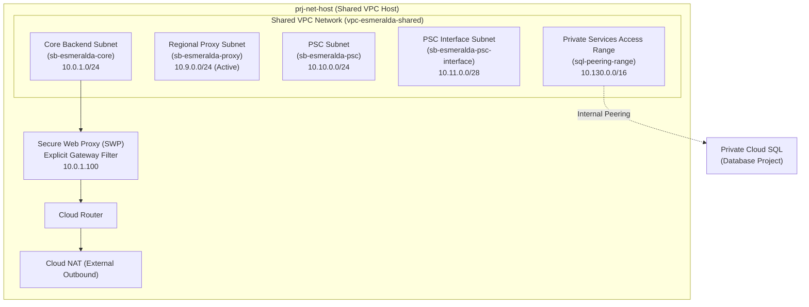
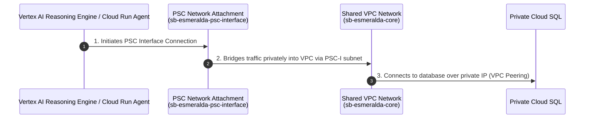
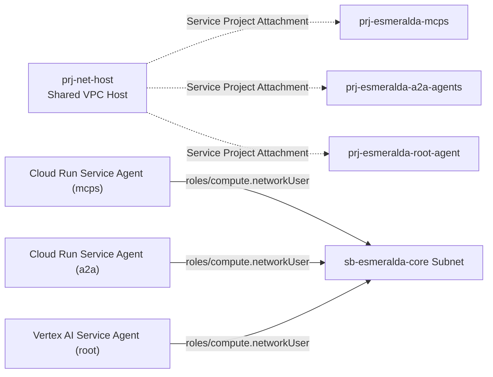

# Stage 2: Shared VPC Host Networking & Secure Egress

This module handles core network topologies including private IP address allocation, Shared VPC, Cloud NAT gateway egress, Secure Web Proxy (SWP) whitelist policies, and Private Service Connect (PSC).

### 7.2 Stage 2: `modules/2-networking/` Specification

This module establishes the Shared VPC network, configures the internal subnet routing topologies, sets up Private Service Connect (PSC) Network Attachments, deploys Google Cloud's Secure Web Proxy (SWP) for audited internet egress, and handles corporate DNS zones. It is designed to run on the Shared VPC Host Project (`prj-net-host`), but can be toggled to a pure-attachment mode for pre-existing (brownfield) customer networks.

#### A. Network Subnet and Routing Architecture
In Greenfield mode, the module provisions a comprehensive hub network with dedicated subnets for core workloads, proxy-only routing, PSC endpoints, serverless integration, and database peering:



##### 1. Subnet Classifications
*   **Core Backend Subnet (`sb-esmeralda-core`)**: Host IP range `10.0.1.0/24`. All primary internal workloads (Cloud Run instances, VPC connectors, and private VMs) operate inside this range. Private Google Access is enabled to permit calling Vertex AI and Secret Manager without traversing the public internet.
*   **Regional Envoy Proxy Subnet (`sb-esmeralda-proxy`)**: Host IP range `10.9.0.0/24`. Required by regional internal Application Load Balancers or secure regional gateways (Apigee or Kong). Configured with purpose `REGIONAL_MANAGED_PROXY` and role `ACTIVE`.
*   **PSC Endpoint Subnet (`sb-esmeralda-psc`)**: Host IP range `10.10.0.0/24` reserved for private Google services PSC endpoints.
*   **PSC Interface Subnet (`sb-esmeralda-psc-interface`)**: Host IP range `10.11.0.0/28`. A highly specific regular subnet utilized solely to bind Google-managed Serverless runtimes.
*   **Private Services Access (`sql-peering-range`)**: Allocated block `10.130.0.0/16` reserved for Serverless Cloud SQL Private Services peering connections.

---

#### B. Serverless Bridges: Private Service Connect (PSC) Network Attachment
Because Vertex AI Reasoning Engines and serverless Cloud Run agents reside natively in Google-managed tenant projects, they do not have direct access to resources inside custom customer VPCs. Esmeralda bridges this boundary using a **PSC Network Attachment**:



1.  **Subnet Isolation**: A dedicated regular subnetwork (`sb-esmeralda-psc-interface`) is configured.
2.  **Compute Network Attachment**: The resource `google_compute_network_attachment` references the PSC-I subnet and is set to `ACCEPT_AUTOMATIC`. This creates a PSC interface point. Serverless agents use this resource link to establish incoming tunnels directly into the VPC.
3.  **Firewall Protection**: Ingress firewalls are restricted to only allow ports `22` (SSH for debugging), `443` (HTTPS for APIs), and `ICMP` originating from the PSC Interface subnet (`10.11.0.0/28`).

---

#### C. Egress Auditing & Filtering: Secure Web Proxy (SWP)
To comply with enterprise security requirements, reasoning engines and corporate AI agents are not permitted to establish arbitrary connections to the public internet. Stage 2 provisions a **Secure Web Proxy (SWP)** to audit and control egress traffic:
*   **The SWP Instance**: Deployed via GCP's `google_network_security_gateway_security_policy` (or Fabric's `net-swp` module) in the workloads subnet with a static internal IP (`10.0.1.100`).
*   **Egress Interception**: Workloads communicating via the PSC Interface are configured with an explicit proxy pointing to `10.0.1.100:443`.
*   **Access Rules**: Configured with strict session matching and rules (e.g., matching corporate whitelisted LLMs and SaaS tools while blocking unauthorized domains, with error logging activated).

---

#### D. Shared VPC Attachments & Network User IAM Bindings
To allow the separate workload projects to send private traffic across the Shared VPC, they must be attached as service projects, and their respective service agents must be granted subnet execution rights:



For workloads in service projects to bind VPC Connectors or establish PSC attachments in the host subnet, the host project must authorize the following service agents with the `roles/compute.networkUser` role on the specific subnet:
1.  **Google APIs Service Agent**: `service-[PROJECT_NUMBER]@cloudservices.gserviceaccount.com` (Handles backend resources orchestration).
2.  **Serverless VPC Access Robot**: `service-[PROJECT_NUMBER]@serverless-robot-prod.iam.gserviceaccount.com` (Enables Serverless VPC Access Connectors).
3.  **Vertex AI Agent**: `service-[PROJECT_NUMBER]@gcp-sa-aiplatform.iam.gserviceaccount.com` (Allows Direct VPC egress for Vertex AI Reasoning Engines).

---

#### E. DNS Service Discovery Layout
To facilitate service discovery, Stage 2 deploys two central private DNS zones visible inside the Shared VPC:
1.  **`esmeralda.internal` Zone**: Used for internal service-to-service discovery (e.g., `dms.esmeralda.internal`, `calculator.esmeralda.internal`).
2.  **`internal.gateway` Zone**: Used to peering PSC interfaces. Contains:
    *   Wildcard record `*.internal.gateway.` resolving to the Internal Load Balancer VIP.
    *   Static record `swp.internal.gateway.` resolving to the Secure Web Proxy IP (`10.0.1.100`).

---

#### F. Greenfield vs. Brownfield (BYO) Logic
When `byo_networking = true` is supplied:
*   We **bypass** creating the VPC, subnetworks (core, proxy, psc, psc-interface), Cloud Router, NAT, and the service networking connection.
*   We **still execute** Shared VPC Host Project enablement, Service Project Attachments, Subnet IAM bindings, and DNS Zones, hooking the three new service projects directly into the customer's pre-configured Shared VPC and SWP infrastructure.

---

#### G. File Inventory & Blueprints

```text
infrastructure/modules/2-networking/
├── versions.tf          # Mandates HashiCorp Google provider bounds (>= 5.0)
├── variables.tf         # Host project IDs, service project IDs, CIDR overrides, and BYO flags
├── main.tf              # Greenfield VPC, NAT, PSA + PSC Attachments, SWP, IAM network users, Cloud DNS
└── outputs.tf           # Exports VPC network ID, Subnet self-links, and DNS private zone name
```

##### 1. Versions Specification (`versions.tf`)
```hcl
terraform {
  required_version = ">= 1.5.0"
  required_providers {
    google = {
      source  = "hashicorp/google"
      version = ">= 5.0.0, < 6.0.0"
    }
  }
}
```

##### 2. Variables Specification (`variables.tf`)
```hcl
# infrastructure/modules/2-networking/variables.tf

variable "net_host_project_id" {
  description = "The project ID of the Shared VPC Host"
  type        = string
}

variable "gateway_project_id" {
  description = "The project ID of the API Ingress Gateway"
  type        = string
}

variable "mcps_project_id" {
  description = "The project ID allocated for corporate MCP servers"
  type        = string
}

variable "a2a_project_id" {
  description = "The project ID allocated for Core AI Platform and A2A agents"
  type        = string
}

variable "root_project_id" {
  description = "The project ID allocated for client-facing LOB Root agent"
  type        = string
}

variable "region" {
  description = "The primary region where subnets and resources are placed"
  type        = string
  default     = "us-central1"
}

# BYO Networking Toggles
variable "byo_networking" {
  description = "If true, skip creating the Shared VPC network and subnets, and attach to existing ones instead."
  type        = bool
  default     = false
}

variable "byo_governance_project" {
  description = "Set to true if the customer is bringing a pre-existing governance/security/telemetry project"
  type        = bool
  default     = false
}

variable "governance_project_id" {
  description = "The project ID allocated for central governance, security, and telemetry"
  type        = string
}

variable "byo_net_host_project" {
  description = "Set to true if the customer is bringing a pre-existing Shared VPC Host Project"
  type        = bool
  default     = false
}

variable "byo_gateway_project" {
  description = "Set to true if the customer is bringing a pre-existing API Gateway/Ingress Project"
  type        = bool
  default     = false
}

variable "existing_vpc_id" {
  description = "The full resource URI of the existing Shared VPC network. Required if byo_networking is true."
  type        = string
  default     = ""
}

variable "existing_subnet_id" {
  description = "The full resource URI of the existing backend workload subnet. Required if byo_networking is true."
  type        = string
  default     = ""
}

# Workload Project Numbers are resolved dynamically in main.tf via data "google_project" to avoid manual inputs and automation locks.

# Explicit Proxy & PSC Options
variable "enable_psc_interface" {
  description = "Set to true to create a PSC Network Attachment for Serverless Agent ingress"
  type        = bool
  default     = true
}

variable "enable_secure_web_proxy" {
  description = "Set to true to deploy the Secure Web Proxy for outbound egress filtering"
  type        = bool
  default     = true
}

variable "environment" {
  description = "The environment classification (e.g., dev, qa, prod)"
  type        = string
  default     = "dev"
}

variable "project_suffix" {
  description = "The random project suffix generated in Stage 1"
  type        = string
}
```

##### 3. Implementation Logic (`main.tf`)
```hcl
# infrastructure/modules/2-networking/main.tf

# Resolve dynamically generated project numbers to avoid manual inputs and automation locks
data "google_project" "mcps" {
  project_id = var.mcps_project_id
}

data "google_project" "a2a" {
  project_id = var.a2a_project_id
}

data "google_project" "root_agent" {
  project_id = var.root_project_id
}

# ====================================================================
# 1. SHARED VPC HOST & SERVICE PROJECTS ATTACHMENTS
# ====================================================================

# Enable Shared VPC host mode on the host project (skipped if BYO)
resource "google_compute_shared_vpc_host_project" "host" {
  count   = var.byo_net_host_project ? 0 : 1
  project = var.net_host_project_id
}

# Attach the MCP Central Tools project as a service project
resource "google_compute_shared_vpc_service_project" "mcps" {
  host_project    = var.net_host_project_id
  service_project = var.mcps_project_id
  depends_on      = [google_compute_shared_vpc_host_project.host]
}

# Attach the Core AI Platform project as a service project
resource "google_compute_shared_vpc_service_project" "a2a" {
  host_project    = var.net_host_project_id
  service_project = var.a2a_project_id
  depends_on      = [google_compute_shared_vpc_host_project.host]
}

# Attach the Line-of-Business Root Agent project as a service project
resource "google_compute_shared_vpc_service_project" "root_agent" {
  host_project    = var.net_host_project_id
  service_project = var.root_project_id
  depends_on      = [google_compute_shared_vpc_host_project.host]
}

# Attach the Gateway Ingress project conditionally as a service project
resource "google_compute_shared_vpc_service_project" "gateway" {
  count           = var.byo_gateway_project ? 0 : 1
  host_project    = var.net_host_project_id
  service_project = var.gateway_project_id
  depends_on      = [google_compute_shared_vpc_host_project.host]
}

# Attach the Governance project conditionally as a service project
resource "google_compute_shared_vpc_service_project" "governance" {
  count           = var.byo_governance_project ? 0 : 1
  host_project    = var.net_host_project_id
  service_project = var.governance_project_id
  depends_on      = [google_compute_shared_vpc_host_project.host]
}

# ====================================================================
# 2. GREENFIELD SHARED VPC NETWORKING CREATION
# ====================================================================

# ====================================================================
# 2. GREENFIELD SHARED VPC NETWORKING CREATION
# ====================================================================

# Provision Shared VPC (Only if greenfield)
resource "google_compute_network" "shared_vpc" {
  count                   = var.byo_networking ? 0 : 1
  name                    = "vpc-esmeralda-shared-${var.environment}"
  project                 = var.net_host_project_id
  auto_create_subnetworks = false
}

# Core Subnet for Workloads
resource "google_compute_subnetwork" "core" {
  count                    = var.byo_networking ? 0 : 1
  name                     = "sb-esmeralda-core-${var.environment}"
  project                  = var.net_host_project_id
  region                   = var.region
  network                  = google_compute_network.shared_vpc[0].id
  ip_cidr_range            = "10.0.1.0/24"
  private_ip_google_access = true
}

# Proxy-only Subnet for regional load balancing (Internal Load Balancer/Kong/Apigee)
resource "google_compute_subnetwork" "proxy" {
  count         = var.byo_networking ? 0 : 1
  name          = "sb-esmeralda-proxy-${var.environment}"
  project       = var.net_host_project_id
  region        = var.region
  network       = google_compute_network.shared_vpc[0].id
  ip_cidr_range = "10.9.0.0/24"
  purpose       = "REGIONAL_MANAGED_PROXY"
  role          = "ACTIVE"
}

# PSC Subnet for Private Service Connect Endpoint bindings
resource "google_compute_subnetwork" "psc" {
  count         = var.byo_networking ? 0 : 1
  name          = "sb-esmeralda-psc-${var.environment}"
  project       = var.net_host_project_id
  region        = var.region
  network       = google_compute_network.shared_vpc[0].id
  ip_cidr_range = "10.10.0.0/24"
}

# PSC Interface Subnet for Serverless Agent Incoming Tunnels
resource "google_compute_subnetwork" "psc_interface" {
  count         = !var.byo_networking && var.enable_psc_interface ? 1 : 0
  name          = "sb-esmeralda-psc-interface-${var.environment}"
  project       = var.net_host_project_id
  region        = var.region
  network       = google_compute_network.shared_vpc[0].id
  ip_cidr_range = "10.11.0.0/28"
}

# Private Service Connection (PSA) range for Cloud SQL Peering
resource "google_compute_global_address" "sql_peering" {
  count         = var.byo_networking ? 0 : 1
  name          = "sql-peering-range-${var.environment}"
  project       = var.net_host_project_id
  purpose       = "VPC_PEERING"
  address_type  = "INTERNAL"
  prefix_length = 16
  network       = google_compute_network.shared_vpc[0].id
}

resource "google_service_networking_connection" "sql_connection" {
  count                   = var.byo_networking ? 0 : 1
  network                 = google_compute_network.shared_vpc[0].id
  service                 = "servicenetworking.googleapis.com"
  reserved_peering_ranges = [google_compute_global_address.sql_peering[0].name]
}

# Cloud Router & NAT for Outbound API access
resource "google_compute_router" "router" {
  count   = var.byo_networking ? 0 : 1
  name    = "cr-esmeralda-nat-${var.environment}"
  project = var.net_host_project_id
  region  = var.region
  network = google_compute_network.shared_vpc[0].id
}

resource "google_compute_router_nat" "nat" {
  count                              = var.byo_networking ? 0 : 1
  name                               = "nat-esmeralda-outbound-${var.environment}"
  project                            = var.net_host_project_id
  router                             = google_compute_router.router[0].name
  region                             = var.region
  nat_ip_allocate_option             = "AUTO_ONLY"
  source_subnetwork_ip_ranges_to_nat = "ALL_SUBNETWORKS_ALL_IP_RANGES"
}

# ====================================================================
# 3. PRIVATE SERVICE CONNECT (PSC) NETWORK ATTACHMENT
# ====================================================================

# Compute Network Attachment allowing Serverless Reasoning engines auto acceptance
resource "google_compute_network_attachment" "psc_interface" {
  count                 = var.enable_psc_interface ? 1 : 0
  project               = var.net_host_project_id
  name                  = "gateway-psc-interface-attachment-${var.environment}"
  region                = var.region
  connection_preference = "ACCEPT_AUTOMATIC"
  subnetworks           = [var.byo_networking ? var.existing_subnet_id : try(google_compute_subnetwork.psc_interface[0].self_link, "")]
}

# Ingress Firewall to accept traffic from the PSC Interface Subnet
resource "google_compute_firewall" "psc_interface_allow" {
  count         = var.enable_psc_interface && !var.byo_networking ? 1 : 0
  project       = var.net_host_project_id
  name          = "allow-psc-interface-ingress-${var.environment}"
  network       = google_compute_network.shared_vpc[0].id
  direction     = "INGRESS"
  priority      = 1000
  source_ranges = ["10.11.0.0/28"]

  allow {
    protocol = "tcp"
    ports    = ["22", "443"]
  }
  allow {
    protocol = "icmp"
  }
}

# ====================================================================
# 4. SECURE WEB PROXY (SWP) egres filtering
# ====================================================================

# Deploy SWP at IP 10.0.1.100 (100th IP of Core subnet)
module "secure_web_proxy" {
  count      = var.enable_secure_web_proxy && !var.byo_networking ? 1 : 0
  source     = "github.com/GoogleCloudPlatform/cloud-foundation-fabric//modules/net-swp?ref=v53.0.0"
  project_id = var.net_host_project_id
  region     = var.region
  name       = "gateway-swp-${var.environment}"
  network    = google_compute_network.shared_vpc[0].id
  subnetwork = google_compute_subnetwork.core[0].id
  
  gateway_config = {
    addresses = ["10.0.1.100"]
  }
  
  policy_rules = {
    allow-all = {
      priority        = 1000
      session_matcher = "host() != ''"
      basic_profile   = "ALLOW"
    }
  }

  depends_on = [google_compute_subnetwork.proxy]
}

# ====================================================================
# 5. SUBNET-LEVEL SERVICE AGENT IAM NETWORK USER BINDINGS
# ====================================================================

locals {
  target_vpc_id    = var.byo_networking ? var.existing_vpc_id : try(google_compute_network.shared_vpc[0].id, "")
  target_subnet_id = var.byo_networking ? var.existing_subnet_id : try(google_compute_subnetwork.core[0].id, "")
  
  # Parse subnet name and region from the subnet ID URI
  subnet_parsed_name   = element(split("/", local.target_subnet_id), length(split("/", local.target_subnet_id)) - 1)
  subnet_parsed_region = element(split("/", local.target_subnet_id), length(split("/", local.target_subnet_id)) - 3)

  # Consolidate all Service accounts that need Subnet Network User access
  subnet_network_users = [
    # 1. MCP Central Tools Project Service SAs
    "serviceAccount:service-${data.google_project.mcps.number}@cloudservices.gserviceaccount.com",
    "serviceAccount:service-${data.google_project.mcps.number}@serverless-robot-prod.iam.gserviceaccount.com",

    # 2. Core AI Platform Project Service SAs
    "serviceAccount:service-${data.google_project.a2a.number}@cloudservices.gserviceaccount.com",
    "serviceAccount:service-${data.google_project.a2a.number}@serverless-robot-prod.iam.gserviceaccount.com",
    "serviceAccount:service-${data.google_project.a2a.number}@gcp-sa-aiplatform.iam.gserviceaccount.com",

    # 3. LOB Root Agent Project Service SAs
    "serviceAccount:service-${data.google_project.root_agent.number}@cloudservices.gserviceaccount.com",
    "serviceAccount:service-${data.google_project.root_agent.number}@gcp-sa-aiplatform.iam.gserviceaccount.com"
  ]
}

# Grant compute.networkUser on the Core Workload subnet to all service project robots
resource "google_compute_subnetwork_iam_member" "network_users" {
  for_each   = toset(local.subnet_network_users)
  project    = var.net_host_project_id
  region     = local.subnet_parsed_region
  subnetwork = local.subnet_parsed_name
  role       = "roles/compute.networkUser"
}

# ====================================================================
# 6. PRIVATE DNS SERVICE DISCOVERY ZONES
# ====================================================================

# A. Central Private Zone for inter-agent communication
resource "google_dns_managed_zone" "private_dns" {
  name        = "esmeralda-private-dns-${var.environment}"
  project     = var.net_host_project_id
  dns_name    = "esmeralda.internal."
  description = "Central Private DNS Zone for Esmeralda micro-agent communications"

  visibility = "PRIVATE"

  private_visibility_config {
    networks {
      network_url = local.target_vpc_id
    }
  }
}

# B. Dedicated Private Zone for Gateway & SWP Resolution Peering
module "psc_interface_dns_zone" {
  count      = var.enable_psc_interface && !var.byo_networking ? 1 : 0
  source     = "github.com/GoogleCloudPlatform/cloud-foundation-fabric//modules/dns?ref=v53.0.0"
  project_id = var.net_host_project_id
  name       = "internal-gateway-${var.environment}"
  zone_config = {
    domain = "internal.gateway."
    private = {
      client_networks = [local.target_vpc_id]
    }
  }
  recordsets = {
    # Resolve wildcard gateway endpoints to the future internal gateway IP placeholder
    "A *"   = { records = ["10.0.1.200"] } # Placeholder for regional load balancer VIP
    # Resolve swp to the Secure Web Proxy IP
    "A swp" = { records = ["10.0.1.100"] }
  }
}
```

##### 4. Outputs Specification (`outputs.tf`)
```hcl
# infrastructure/modules/2-networking/outputs.tf

output "network_id" {
  description = "The resolved Shared VPC network resource ID"
  value       = local.target_vpc_id
}

output "subnet_id" {
  description = "The resolved backend workload subnet resource ID"
  value       = local.target_subnet_id
}

output "subnet_name" {
  description = "The resolved name of the backend workload subnet"
  value       = local.subnet_parsed_name
}

output "dns_zone_name" {
  description = "The name of the private DNS managed zone"
  value       = google_dns_managed_zone.private_dns.name
}

output "dns_zone_dns_name" {
  description = "The suffix domain name of the private DNS managed zone"
  value       = google_dns_managed_zone.private_dns.dns_name
}

output "psc_network_attachment_id" {
  description = "The URI of the Private Service Connect Network Attachment"
  value       = try(google_compute_network_attachment.psc_interface[0].id, "")
}

output "secure_web_proxy_ip" {
  description = "The private IP address of the Secure Web Proxy"
  value       = var.enable_secure_web_proxy && !var.byo_networking ? "10.0.1.100" : ""
}
```

