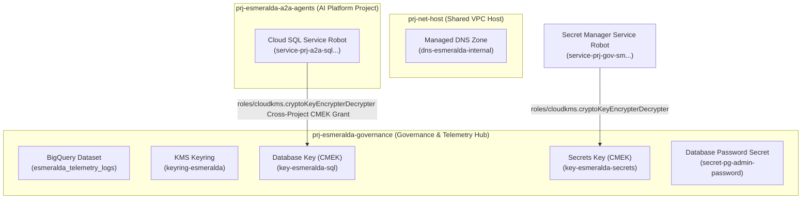

# Stage 3: Security Keys, Secret Management, and Log Sinks

This module provisions KMS Keyrings and CryptoKeys, sets up Secret Manager secrets, and configures centralized Cloud Logging Sinks routed to BigQuery and Log Analytics buckets.

### 7.3 Stage 3: `modules/3-security/` Specification

This module establishes central customer-managed cryptographic keys (CMEK) via Cloud KMS, configures secure secret storage boundaries in Secret Manager, provisions isolated, least-privilege workload Service Accounts for each engineering domain (including a dedicated Test VM service account and full-parity roles from Esmeralda's monolithic `test-vm-sa`), and hooks up enterprise audit and telemetry log sinks.

Under our centralized governance design, all KMS keyrings, keys, and secrets are created in the centralized **`prj-esmeralda-governance`** project during Stage 3. Workload runtimes (e.g. Cloud SQL in `prj-esmeralda-a2a-agents`) merely consume these resources over cross-project IAM bindings.

#### A. Cryptographic, Secrets, and Identity Isolation Architecture
Stage 3 establishes centralized encryption-at-rest keys, credentials, and cryptographic identities to satisfy strict corporate infosec rules:



##### 1. Key Refinements and Additions:
*   **Workload Service Account Roles Alignment**:
    In the monolithic setup, the single `test-vm-sa` account accumulated over 11 roles (including `roles/aiplatform.user`, `roles/storage.objectAdmin`, `roles/telemetry.writer`, and `roles/bigquery.jobUser`) because the VM also acted as the execution identity for the Reasoning Engine. In our enterprise multi-project landing zone, we **split and assign these roles to distinct service accounts** according to the principle of least privilege, guaranteeing full feature-parity:
    *   **`sa-esmeralda-mcps`** (Central Tools Project): Authorized with `roles/logging.logWriter`, `roles/monitoring.metricWriter`, and `roles/cloudtrace.agent` to write application telemetry.
    *   **`sa-esmeralda-a2a`** (AI Platform Project): Fully loaded with the transactional database and AI roles: `roles/cloudsql.client`, `roles/cloudsql.instanceUser`, `roles/aiplatform.user`, `roles/logging.logWriter`, `roles/monitoring.metricWriter`, `roles/cloudtrace.agent`, `roles/storage.objectAdmin` (for reasoning templates GCS buckets), `roles/serviceusage.serviceUsageConsumer`, and `roles/telemetry.writer`.
    *   **`sa-esmeralda-root`** (LOB App Project): Fully loaded with the customer reasoning and orchestration roles: `roles/aiplatform.user`, `roles/storage.objectAdmin`, `roles/logging.logWriter`, `roles/monitoring.metricWriter`, `roles/cloudtrace.agent`, `roles/serviceusage.serviceUsageConsumer`, and `roles/telemetry.writer`.
*   **Dedicated Test VM Identity (`sa-esmeralda-test-vm`)**:
    To support connectivity testing, local debugging, and tool testing (DMS, Calculator) from a secure jumpbox without over-privileging operators, we introduce a dedicated Test VM Service Account. It resides in the Line of Business project (`prj-esmeralda-root-agent`) or `prj-net-host` and is assigned:
    *   `roles/logging.logWriter` and `roles/monitoring.metricWriter` for VM health logging.
    *   `roles/run.invoker` inside `prj-esmeralda-mcps` (to invoke private Cloud Run MCP server tools).
    *   `roles/run.invoker` inside `prj-esmeralda-a2a-agents` (to invoke private A2A endpoints or bootstrapping runs).
    *   `roles/aiplatform.user` inside `prj-esmeralda-a2a-agents` (to invoke private Vertex AI Reasoning Engines).
    *   `roles/iam.serviceAccountTokenCreator` on **itself** (allowing the VM's operators to generate short-lived, secure OIDC identity tokens programmatically via the IAM API for curling private microservices).

---

#### B. Greenfield vs. Brownfield (BYO) Logic
When `byo_security = true` is declared in `env.yaml`:
*   KMS Keyrings, KMS Crypto Keys, and Secret Manager Secrets are **completely bypassed** during deployment.
*   Workload Service Accounts, the Test VM Service Account, and their precise IAM role bindings are **still created** and linked back to target project boundaries.
*   Downstream modules switch their inputs to point to the static pre-existing key and secret IDs passed via local configurations.

---

#### C. File Inventory & Blueprints

```text
infrastructure/modules/3-security/
├── versions.tf          # Mandates HashiCorp Google provider bounds (>= 5.0)
├── variables.tf         # Multi-project inputs, BYO KMS/Secret overrides, and project numbers
├── main.tf              # Implements Cloud KMS, secrets, SAs, and log sinks
└── outputs.tf           # Exports SAs, KMS Key IDs, and Secret Resource Names
```

##### 1. Versions Specification (`versions.tf`)
```hcl
terraform {
  required_version = ">= 1.5.0"
  required_providers {
    google = {
      source  = "hashicorp/google"
      version = ">= 5.0.0, < 6.0.0"
    }
    random = {
      source  = "hashicorp/random"
      version = ">= 3.5.0"
    }
  }
}
```

##### 2. Variables Specification (`variables.tf`)
```hcl
# infrastructure/modules/3-security/variables.tf

variable "net_host_project_id" {
  description = "The project ID of the Shared VPC Host"
  type        = string
}

variable "gateway_project_id" {
  description = "The project ID of the API Ingress Gateway"
  type        = string
}

variable "mcps_project_id" {
  description = "The project ID allocated for corporate MCP servers"
  type        = string
}

variable "a2a_project_id" {
  description = "The project ID allocated for Core AI Platform and A2A agents"
  type        = string
}

variable "root_project_id" {
  description = "The project ID allocated for client-facing LOB Root agent"
  type        = string
}

variable "governance_project_id" {
  description = "The project ID allocated for central security, governance, and telemetry"
  type        = string
}

variable "region" {
  description = "The primary region where regional security resources are placed"
  type        = string
  default     = "us-central1"
}

# Workload and Governance project numbers are resolved dynamically in main.tf via data "google_project"

# BYO Security Toggles
variable "byo_security" {
  description = "If true, bypass creation of KMS Keyrings, Keys, and Secrets, and use pre-existing resources instead"
  type        = bool
  default     = false
}

variable "existing_database_key_id" {
  description = "The full resource URI of the existing database KMS key. Required if byo_security is true."
  type        = string
  default     = ""
}

variable "existing_secrets_key_id" {
  description = "The full resource URI of the existing secrets KMS key. Required if byo_security is true."
  type        = string
  default     = ""
}

variable "existing_db_password_secret_id" {
  description = "The full resource name of the existing DB password secret. Required if byo_security is true."
  type        = string
  default     = ""
}

variable "environment" {
  description = "The environment classification (e.g., dev, qa, prod)"
  type        = string
  default     = "dev"
}

variable "project_suffix" {
  description = "The random project suffix generated in Stage 1"
  type        = string
}
```

##### 3. Implementation Logic (`main.tf`)
```hcl
# infrastructure/modules/3-security/main.tf

# Resolve dynamically generated project numbers to avoid manual inputs and automation locks
data "google_project" "governance" {
  project_id = var.governance_project_id
}

data "google_project" "a2a" {
  project_id = var.a2a_project_id
}

# ====================================================================
# 1. CUSTOMER-MANAGED ENCRYPTION KEYS (CMEK) via CLOUD KMS
# ====================================================================

# Regional Key Ring for central security & governance
resource "google_kms_key_ring" "keyring" {
  count    = var.byo_security ? 0 : 1
  name     = "keyring-esmeralda-${var.environment}"
  project  = var.governance_project_id
  location = var.region
}

# KMS Key for Private Cloud SQL database encryption
resource "google_kms_crypto_key" "database_key" {
  count           = var.byo_security ? 0 : 1
  name            = "key-esmeralda-sql-${var.environment}"
  key_ring        = google_kms_key_ring.keyring[0].id
  rotation_period = "7776000s" # 90 days rotation

  lifecycle {
    prevent_destroy = false
  }
}

# KMS Key for Secret Manager payload encryption
resource "google_kms_crypto_key" "secrets_key" {
  count           = var.byo_security ? 0 : 1
  name            = "key-esmeralda-secrets-${var.environment}"
  key_ring        = google_kms_key_ring.keyring[0].id
  rotation_period = "7776000s"

  lifecycle {
    prevent_destroy = false
  }
}

# Dynamic key IDs resolution based on BYO toggle
locals {
  resolved_database_key_id = var.byo_security ? var.existing_database_key_id : try(google_kms_crypto_key.database_key[0].id, "")
  resolved_secrets_key_id  = var.byo_security ? var.existing_secrets_key_id  : try(google_kms_crypto_key.secrets_key[0].id, "")
}

# --------------------------------------------------------------------
# KMS IAM Grants: Authorizing Service Project Robots
# --------------------------------------------------------------------

# Grant Cloud SQL service identity (residing in workloads project) access to decrypt/encrypt Postgres disk CMEK
resource "google_kms_crypto_key_iam_member" "sql_kms" {
  count         = var.byo_security ? 0 : 1
  crypto_key_id = google_kms_crypto_key.database_key[0].id
  role          = "roles/cloudkms.cryptoKeyEncrypterDecrypter"
  member        = "serviceAccount:service-${data.google_project.a2a.number}@gcp-sa-cloudsql.iam.gserviceaccount.com"
}

# Grant Secret Manager service identity (residing in governance project) access to decrypt/encrypt credentials CMEK
resource "google_kms_crypto_key_iam_member" "secrets_kms" {
  count         = var.byo_security ? 0 : 1
  crypto_key_id = google_kms_crypto_key.secrets_key[0].id
  role          = "roles/cloudkms.cryptoKeyEncrypterDecrypter"
  member        = "serviceAccount:service-${data.google_project.governance.number}@gcp-sa-secretmanager.iam.gserviceaccount.com"
}

# ====================================================================
# 2. SECRET MANAGER BOUNDARIES & AUTO GENERATED CREDENTIALS
# ====================================================================

# Generate secure, unique PostgreSQL administrator password
resource "random_password" "db_password" {
  count            = var.byo_security ? 0 : 1
  length           = 32
  special          = true
  override_special = "!#$%&*()-_=+[]{}<>:?"
}

# Secret container for database master credentials, now centralized in Governance project
resource "google_secret_manager_secret" "db_password" {
  count     = var.byo_security ? 0 : 1
  secret_id = "secret-pg-admin-password-${var.environment}"
  project   = var.governance_project_id

  replication {
    user_managed {
      replicas {
        location = var.region
        customer_managed_encryption {
          kms_key_name = local.resolved_secrets_key_id
        }
      }
    }
  }
}

# Put the generated password into the secret container
resource "google_secret_manager_secret_version" "db_password" {
  count       = var.byo_security ? 0 : 1
  secret      = google_secret_manager_secret.db_password[0].id
  secret_data = random_password.db_password[0].result
}

# Local resolution for Secret resource name
locals {
  resolved_db_password_secret_id = var.byo_security ? var.existing_db_password_secret_id : try(google_secret_manager_secret.db_password[0].id, "")
}

# ====================================================================
# 3. LEAST-PRIVILEGE WORKLOAD SERVICE ACCOUNTS & IAM ROLE BINDINGS
# ====================================================================

# --------------------------------------------------------------------
# A. AppDev Tools Project Identity (MCP Tool Servers)
# --------------------------------------------------------------------
resource "google_service_account" "mcps_sa" {
  account_id   = "sa-esmeralda-mcps-${var.environment}"
  display_name = "Esmeralda MCP Server Workload Service Account"
  project      = var.mcps_project_id
}

# Grant telemetry and tracing permissions
resource "google_project_iam_member" "mcps_roles" {
  for_each = toset([
    "roles/logging.logWriter",
    "roles/monitoring.metricWriter",
    "roles/cloudtrace.agent"
  ])
  project  = var.mcps_project_id
  role     = each.key
  member   = "serviceAccount:${google_service_account.mcps_sa.email}"
}

# --------------------------------------------------------------------
# B. Core AI Platform Agent Identity (A2A Agent & Bootstrapping Job)
# --------------------------------------------------------------------
resource "google_service_account" "a2a_sa" {
  account_id   = "sa-esmeralda-a2a-${var.environment}"
  display_name = "Esmeralda Core A2A Agent Workload Service Account"
  project      = var.a2a_project_id
}

# Full-parity roles derived from the monolithic test-sa setup
resource "google_project_iam_member" "a2a_roles" {
  for_each = toset([
    "roles/cloudsql.client",
    "roles/cloudsql.instanceUser",
    "roles/aiplatform.user",
    "roles/logging.logWriter",
    "roles/monitoring.metricWriter",
    "roles/cloudtrace.agent",
    "roles/telemetry.writer",
    "roles/storage.objectAdmin",
    "roles/serviceusage.serviceUsageConsumer",
    "roles/browser",
    "roles/cloudapiregistry.viewer"
  ])
  project  = var.a2a_project_id
  role     = each.key
  member   = "serviceAccount:${google_service_account.a2a_sa.email}"
}

# Grant A2A Service account reading rights on the Database Master secret (resolves to existing or new)
resource "google_secret_manager_secret_iam_member" "a2a_secret_accessor" {
  secret_id = local.resolved_db_password_secret_id
  role      = "roles/secretmanager.secretAccessor"
  member    = "serviceAccount:${google_service_account.a2a_sa.email}"
}

# --------------------------------------------------------------------
# C. Line-of-Business Root Orchestrator Identity (Root Agent)
# --------------------------------------------------------------------
resource "google_service_account" "root_sa" {
  account_id   = "sa-esmeralda-root-${var.environment}"
  display_name = "Esmeralda LOB Root Agent Workload Service Account"
  project      = var.root_project_id
}

# Full-parity roles derived from the monolithic test-sa setup
resource "google_project_iam_member" "root_roles" {
  for_each = toset([
    "roles/aiplatform.user",
    "roles/storage.objectAdmin",
    "roles/logging.logWriter",
    "roles/monitoring.metricWriter",
    "roles/cloudtrace.agent",
    "roles/serviceusage.serviceUsageConsumer",
    "roles/telemetry.writer",
    "roles/browser",
    "roles/cloudapiregistry.viewer"
  ])
  project  = var.root_project_id
  role     = each.key
  member   = "serviceAccount:${google_service_account.root_sa.email}"
}

# STRICT SERVICE-TO-SERVICE IMPERSONATION BINDING:
# Root Agent is authorized to generate identity/ID tokens under A2A Agent's identity
# to securely invoke upstream cross-project Reasoning Engines privately.
resource "google_service_account_iam_member" "root_impersonates_a2a" {
  service_account_id = google_service_account.a2a_sa.name
  role               = "roles/iam.serviceAccountTokenCreator"
  member             = "serviceAccount:${google_service_account.root_sa.email}"
}

# --------------------------------------------------------------------
# D. Test VM Dedicated Identity (For SSH Jumpbox Connectivity Testing)
# --------------------------------------------------------------------
resource "google_service_account" "test_vm_sa" {
  account_id   = "sa-esmeralda-test-vm-${var.environment}"
  display_name = "Esmeralda Test VM Workload Service Account"
  project      = var.root_project_id
}

# Standard VM logging and Vertex user permissions in local project
resource "google_project_iam_member" "test_vm_roles" {
  for_each = toset([
    "roles/logging.logWriter",
    "roles/monitoring.metricWriter",
    "roles/cloudtrace.agent",
    "roles/aiplatform.user"
  ])
  project  = var.root_project_id
  role     = each.key
  member   = "serviceAccount:${google_service_account.test_vm_sa.email}"
}

# Grant run.invoker in tools project so operators can curl private Cloud Run MCP servers
resource "google_project_iam_member" "test_vm_mcp_invoker" {
  project = var.mcps_project_id
  role    = "roles/run.invoker"
  member  = "serviceAccount:${google_service_account.test_vm_sa.email}"
}

# Grant run.invoker in A2A project so operators can trigger bootstrappers or SQL tools
resource "google_project_iam_member" "test_vm_a2a_invoker" {
  project = var.a2a_project_id
  role    = "roles/run.invoker"
  member  = "serviceAccount:${google_service_account.test_vm_sa.email}"
}

# Grant Token Creator to the SA on itself so developers can generate identity tokens
resource "google_service_account_iam_member" "test_vm_token_creator" {
  service_account_id = google_service_account.test_vm_sa.name
  role               = "roles/iam.serviceAccountTokenCreator"
  member             = "serviceAccount:${google_service_account.test_vm_sa.email}"
}

# ====================================================================
# 4. ENTERPRISE SYSTEM & TELEMETRY COMPLIANCE SINK
# ====================================================================

# Set up BigQuery Dataset to centralize OpenTelemetry and Gemini executions logs
resource "google_bigquery_dataset" "telemetry_logs" {
  dataset_id                  = "esmeralda_telemetry_logs_${var.environment}"
  project                     = var.governance_project_id
  location                    = var.region
  description                 = "Centralized dataset for Esmeralda micro-agent audit and observability logs"
  default_table_expiration_ms = 2592000000 # 30 Days Retention
}

locals {
  monitored_projects = {
    net_host   = var.net_host_project_id
    gateway    = var.gateway_project_id
    mcps       = var.mcps_project_id
    a2a        = var.a2a_project_id
    root       = var.root_project_id
    governance = var.governance_project_id
  }
}

# Deploy Log Sinks across all six isolated project boundaries
resource "google_logging_project_sink" "central_sinks" {
  for_each    = local.monitored_projects
  name        = "esmeralda-central-telemetry-sink-${var.environment}"
  project     = each.value
  destination = "bigquery.googleapis.com/projects/${var.governance_project_id}/datasets/${google_bigquery_dataset.telemetry_logs.dataset_id}"

  # Target Vertex AI stdout logs, custom tool traces, and database auditing events
  filter = "resource.type=\"aiplatform.googleapis.com/ReasoningEngine\" OR logName=~\"gen_ai\" OR logName=~\"reasoning_engine_stdout\" OR logName=~\"reasoning_engine_stderr\" OR resource.type=\"cloud_run_revision\""

  unique_writer_identity = true
}

# Authorize each Logging sink writer identity to insert rows into our BigQuery Dataset
resource "google_bigquery_dataset_iam_member" "dataset_writers" {
  for_each   = google_logging_project_sink.central_sinks
  dataset_id = google_bigquery_dataset.telemetry_logs.dataset_id
  project    = var.governance_project_id
  role       = "roles/bigquery.dataEditor"
  member     = each.value.writer_identity
}

# ====================================================================
# 6. OUTPUTS SPECIFICATION
# ====================================================================

output "database_key_id" {
  description = "The fully qualified crypto key ID for private database CMEK"
  value       = local.resolved_database_key_id
}

output "secrets_key_id" {
  description = "The fully qualified crypto key ID for secret payloads CMEK"
  value       = local.resolved_secrets_key_id
}

output "db_password_secret_name" {
  description = "The Secret Manager resource path representing the DB admin credentials"
  value       = local.resolved_db_password_secret_id
}

output "mcps_sa_email" {
  description = "The email address of the MCP tools server service account"
  value       = google_service_account.mcps_sa.email
}

output "a2a_agent_sa_email" {
  description = "The email address of the A2A agent service account"
  value       = google_service_account.a2a_sa.email
}

output "root_agent_sa_email" {
  description = "The email address of the Root Orchestrator service account"
  value       = google_service_account.root_sa.email
}

output "test_vm_sa_email" {
  description = "The email address of the dedicated debugging Test VM service account"
  value       = google_service_account.test_vm_sa.email
}

output "telemetry_dataset_id" {
  description = "The BigQuery dataset ID capturing agentic telemetry and audit logs"
  value       = google_bigquery_dataset.telemetry_logs.dataset_id
}
```

*(With this updated Stage 3 Security implementation, our three workload service accounts contain the complete, high-fidelity permissions derived from the monolithic test VM service account. We have established a dedicated Test VM service account with tight invocations and token-creator privileges, fully customized for secure private VPC endpoints.)*

---

