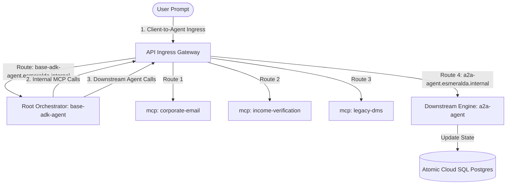
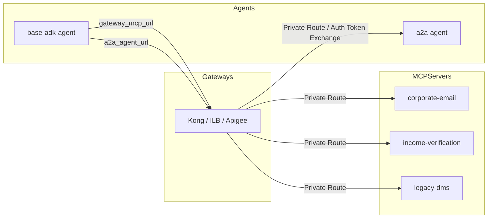

# Stage 4 Workloads: Atomic Agent Reasoning Engines

This module packages Python ADK agent runtimes, automates GCS staging uploads, and provisions Vertex AI Reasoning Engines with fully atomic staging, artifacts, and log buckets.

#### 7.4.3 AI Platform Agent Reasoning Engines (`modules/4-workloads/agents/`)

Esmeralda's downstream execution flow relies on Vertex AI Reasoning Engines deployed declaratively via the Google Antigravity (AGY) / ADK framework. We organize these agents into two separate, self-contained sub-modules:
1.  **Mortgage Assistant Agent (`agents/a2a-agent/`)**: The downstream, specialized reasoning engine executing tasks and storing operational states.
2.  **Root Orchestrator Agent (`agents/base-adk-agent/`)**: The master coordinator handling multi-agent graph routing and dispatching queries.

```text
infrastructure/modules/4-workloads/agents/
├── a2a-agent/                 # Downstream reasoning engine + Atomic Cloud SQL Postgres task store
│   ├── main.tf
│   ├── variables.tf
│   └── outputs.tf
└── base-adk-agent/            # Root Orchestrator reasoning engine
    ├── main.tf
    ├── variables.tf
    └── outputs.tf
```

---

##### A. Sub-Module A: Atomic Mortgage Assistant (`agents/a2a-agent/`)

To guarantee absolute **self-contained portability**, the Cloud SQL PostgreSQL task store, its private subnet service IP allocation ranges, its IAM-authenticated DB user accounts, and database readiness bootstrappers are **fully packaged inside this single workload module**. This encapsulates all infrastructure and database requirements into an atomic, standalone unit. Calling `terragrunt apply` on this module will automatically spin up PostgreSQL, initialize the schema tables via a containerized bootstrap job, and deploy the Vertex AI Reasoning Engine with Direct VPC access peering.

###### 1. Variables Specification (`variables.tf`)
```hcl
variable "project_id" {
  description = "The GCP project ID allocated for downstream agents (prj-esmeralda-agents)"
  type        = string
}

variable "region" {
  description = "The region where Cloud SQL and the Reasoning Engine are deployed"
  type        = string
  default     = "us-central1"
}

variable "vpc_id" {
  description = "The self-link of the central Shared VPC network"
  type        = string
}

variable "subnet_id" {
  description = "The self-link of the backend workload subnet inside the Shared VPC"
  type        = string
}

variable "agent_name" {
  description = "The registered display name of the A2A Mortgage Assistant reasoning engine"
  type        = string
  default     = "a2a-mortgage-agent"
}

variable "agent_service_account" {
  description = "The email address of the dedicated A2A Agent service account created in Stage 3"
  type        = string
}

# Cloud SQL Sizing Variables
variable "sql_tier" {
  description = "The machine instance type allocated for the Cloud SQL PostgreSQL task store"
  type        = string
  default     = "db-custom-1-3840" # Lightweight instance type for standard workloads
}

variable "database_name" {
  description = "The name of the task store relational database"
  type        = string
  default     = "a2a_tasks"
}

# Packaging paths for the ADK bundle
variable "pickle_object_path" {
  description = "The local directory path containing the pre-packaged serialized agent.pkl file"
  type        = string
}

variable "requirements_path" {
  description = "The local directory path containing the pre-packaged requirements.txt bundle"
  type        = string
}

variable "dependencies_path" {
  description = "The local directory path containing the pre-packaged dependencies.tar.gz bundle"
  type        = string
}

variable "network_attachment" {
  description = "Optional Private Service Connect Network Attachment ID for Vertex AI Reasoning Engine VPC attachment"
  type        = string
  default     = ""
}

variable "environment" {
  description = "The active deployment environment name"
  type        = string
  default     = "dev"
}
```

###### 2. Implementation Blueprint (`main.tf`)
```hcl
terraform {
  required_version = ">= 1.0"
  required_providers {
    google = {
      source  = "hashicorp/google"
      version = ">= 5.0"
    }
    random = {
      source  = "hashicorp/random"
      version = ">= 3.0"
    }
  }
}

# -----------------------------------------------------------------------------
# 1. ATOMIC DATA PLANE: PRIVATE SERVICES ACCESS & CLOUD SQL POSTGRESQL
# -----------------------------------------------------------------------------

# Reserved private IP address block inside the VPC for the SQL instance connection
resource "google_compute_global_address" "sql_private_ip" {
  name          = "${var.agent_name}-sql-private-ip-${var.environment}"
  purpose       = "VPC_PEERING"
  address_type  = "INTERNAL"
  prefix_length = 16
  network       = var.vpc_id
  project       = var.project_id
}

# Establish a private VPC peering connection with the Google Service Networking API
resource "google_service_networking_connection" "sql_peering" {
  network                 = var.vpc_id
  service                 = "servicenetworking.googleapis.com"
  reserved_peering_ranges = [google_compute_global_address.sql_private_ip.name]
}

# Provisions a secure, private PostgreSQL instance with IAM authentication enabled
resource "google_sql_database_instance" "task_store" {
  name             = "${var.agent_name}-db-${var.environment}"
  project          = var.project_id
  region           = var.region
  database_version = "POSTGRES_15"
  depends_on       = [google_service_networking_connection.sql_peering]

  settings {
    tier              = var.sql_tier
    availability_type = "ZONAL"
    disk_size         = 15

    ip_configuration {
      ipv4_enabled    = false # Absolute private network isolation
      private_network = var.vpc_id
    }

    database_flags {
      name  = "cloudsql.iam_authentication"
      value = "on"
    }
  }

  deletion_protection = false # Configured for elastic dev/sandbox environments
}

# Provisions the task store database
resource "google_sql_database" "tasks_db" {
  name     = var.database_name
  instance = google_sql_database_instance.task_store.name
  project  = var.project_id
}

# Standard random password generator for local superuser postgres login
resource "random_password" "postgres_pwd" {
  length  = 24
  special = false
}

# Superuser root account
resource "google_sql_user" "postgres_user" {
  name     = "postgres"
  instance = google_sql_database_instance.task_store.name
  project  = var.project_id
  password = random_password.postgres_pwd.result
}

# Create IAM User mapped to the agent's service account to leverage Cloud IAM Db Authentication
resource "google_sql_user" "agent_iam_user" {
  name     = trimsuffix(var.agent_service_account, ".gserviceaccount.com")
  instance = google_sql_database_instance.task_store.name
  project  = var.project_id
  type     = "CLOUD_IAM_SERVICE_ACCOUNT"
  depends_on = [google_sql_user.postgres_user]
}

# Null Resource to wait for database engine to be fully runnable before executing grants
resource "null_resource" "db_ready" {
  depends_on = [
    google_sql_database_instance.task_store,
    google_sql_database.tasks_db,
    google_sql_user.postgres_user,
    google_sql_user.agent_iam_user
  ]

  provisioner "local-exec" {
    command = <<EOT
      echo "⏳ Waiting for Cloud SQL Instance ${google_sql_database_instance.task_store.name} to start..."
      for i in {1..30}; do
        STATE=$(gcloud sql instances describe ${google_sql_database_instance.task_store.name} --project=${var.project_id} --format="value(state)" 2>/dev/null || echo "UNKNOWN")
        if [ "$STATE" = "RUNNABLE" ]; then
          echo "✅ Cloud SQL is ONLINE. Allowing 10 seconds for service stabilization..."
          sleep 10
          exit 0
        fi
        echo "🔄 DB state is $STATE. Retrying (Attempt $i/30)..."
        sleep 10
      done
      exit 1
    EOT
  }
}

# Assign roles/cloudsql.client to the agent service account at project level
resource "google_project_iam_member" "cloudsql_client_role" {
  project = var.project_id
  role    = "roles/cloudsql.client"
  member  = "serviceAccount:${var.agent_service_account}"
}

# Assign roles/cloudsql.instanceUser to enable IAM database token injection
resource "google_project_iam_member" "cloudsql_user_role" {
  project = var.project_id
  role    = "roles/cloudsql.instanceUser"
  member  = "serviceAccount:${var.agent_service_account}"
}

# -----------------------------------------------------------------------------
# 2. PRIVILEGES BOOTSTRAP: VPC-BOUND CLOUD RUN JOB (REPLACES POSTGRESQL PROVIDER)
# -----------------------------------------------------------------------------

# Deploys a lightweight, standard PostgreSQL administrative job inside the Shared VPC.
# This connects privately via direct VPC IP and executes administrative SQL GRANT queries,
# completely eliminating the need for a local-exec postgresql client or provider.
resource "google_cloud_run_v2_job" "schema_bootstrap" {
  name     = "${var.agent_name}-db-bootstrap-${var.environment}"
  location = var.region
  project  = var.project_id
  depends_on = [
    null_resource.db_ready,
    google_project_iam_member.cloudsql_client_role,
    google_project_iam_member.cloudsql_user_role
  ]

  template {
    template {
      # Runs under a standard service account that has access to execute VPC jobs
      service_account = var.agent_service_account
      
      containers {
        # Light, standard alpine-postgres client image
        image = "alpine:latest"
        command = ["/bin/sh", "-c"]
        args = [
          "apk add --no-cache postgresql-client && psql \"postgresql://postgres:${random_password.postgres_pwd.result}@${google_sql_database_instance.task_store.private_ip_address}/${var.database_name}\" -c \"GRANT ALL PRIVILEGES ON DATABASE ${var.database_name} TO \\\"${google_sql_user.agent_iam_user.name}\\\";\""
        ]
      }

      # VPC Access config mapping schema runner container to the private Shared VPC
      vpc_access {
        network_interfaces {
          network    = var.vpc_id
          subnetwork = var.subnet_id
        }
        egress = "ALL_TRAFFIC"
      }
    }
  }
}

# Null Resource triggering the bootstrap job execution during terraform apply
resource "null_resource" "trigger_bootstrap" {
  depends_on = [google_cloud_run_v2_job.schema_bootstrap]

  provisioner "local-exec" {
    command = <<EOT
      echo "🚀 Launching private Cloud Run PostgreSQL bootstrap job..."
      gcloud run jobs execute ${google_cloud_run_v2_job.schema_bootstrap.name} \
        --region="${var.region}" \
        --project="${var.project_id}" \
        --wait
    EOT
  }
}

# -----------------------------------------------------------------------------
# 3. ATOMIC STORAGE & WORKLOAD STAGING (ONE SET OF BUCKETS PER AGENT)
# -----------------------------------------------------------------------------

# Cryptographically unique suffix for bucket naming
resource "random_id" "bucket_suffix" {
  byte_length = 4
}

# 1. Atomic Deployment Dependencies Staging Bucket (Code/Pickle/Deps)
resource "google_storage_bucket" "staging" {
  project                     = var.project_id
  name                        = "${var.project_id}-${var.agent_name}-staging-${var.environment}-${random_id.bucket_suffix.hex}"
  location                    = var.region
  force_destroy               = true # Set to false in sandbox/dev environments
  uniform_bucket_level_access = true
}

# 2. Atomic Runtime Task Artifacts Bucket (Agent operational assets)
resource "google_storage_bucket" "artifacts" {
  project                     = var.project_id
  name                        = "${var.project_id}-${var.agent_name}-artifacts-${var.environment}-${random_id.bucket_suffix.hex}"
  location                    = var.region
  force_destroy               = true
  uniform_bucket_level_access = true
}

# 3. Atomic Logs Offload Bucket (Long-term tracing and logging)
resource "google_storage_bucket" "logs" {
  project                     = var.project_id
  name                        = "${var.project_id}-${var.agent_name}-logs-${var.environment}-${random_id.bucket_suffix.hex}"
  location                    = var.region
  force_destroy               = true
  uniform_bucket_level_access = true
}

# Upload serialized agent.pkl to GCS Staging Bucket
resource "google_storage_bucket_object" "agent_pickle" {
  name   = "agents/${var.agent_name}-${var.environment}/agent.pkl"
  bucket = google_storage_bucket.staging.name
  source = var.pickle_object_path
}

# Upload requirements.txt dependencies mapping
resource "google_storage_bucket_object" "requirements" {
  name   = "agents/${var.agent_name}-${var.environment}/requirements.txt"
  bucket = google_storage_bucket.staging.name
  source = var.requirements_path
}

# Upload compiled dependencies tarball
resource "google_storage_bucket_object" "dependencies" {
  name   = "agents/${var.agent_name}-${var.environment}/dependencies.tar.gz"
  bucket = google_storage_bucket.staging.name
  source = var.dependencies_path
}

# Declaratively define the Vertex AI Reasoning Engine agent
resource "google_vertex_ai_reasoning_engine" "agent" {
  display_name = "${var.agent_name}-${var.environment}"
  description  = "A2A Mortgage Assistant downstream reasoning engine deployed modularly"
  region       = var.region
  project      = var.project_id
  depends_on   = [null_resource.trigger_bootstrap, google_storage_bucket.staging]

  spec {
    agent_framework = "google-adk"
    service_account = var.agent_service_account

    package_spec {
      python_version           = "3.12"
      pickle_object_gcs_uri    = "gs://${google_storage_bucket.staging.name}/${google_storage_bucket_object.agent_pickle.name}"
      requirements_gcs_uri     = "gs://${google_storage_bucket.staging.name}/${google_storage_bucket_object.requirements.name}"
      dependency_files_gcs_uri = "gs://${google_storage_bucket.staging.name}/${google_storage_bucket_object.dependencies.name}"
    }

    # Binds reasoning engine container inside private VPC via PSC Network Attachment if specified
    dynamic "deployment_spec" {
      for_each = var.network_attachment != "" ? [1] : []
      content {
        psc_interface_config {
          network_attachment = var.network_attachment
        }
      }
    }
  }
}
```

###### 3. Outputs Specification (`outputs.tf`)
```hcl
output "engine_id" {
  description = "The fully qualified unique resource name of the deployed A2A Reasoning Engine"
  value       = google_vertex_ai_reasoning_engine.agent.id
}

output "endpoint_url" {
  description = "The internal GCP API Endpoint address allocated for executing predictions against A2A"
  value       = "https://${var.region}-aiplatform.googleapis.com/v1beta1/${google_vertex_ai_reasoning_engine.agent.id}/a2a"
}

output "db_connection_name" {
  description = "The connection string identifier for the atomic Cloud SQL postgres database"
  value       = google_sql_database_instance.task_store.connection_name
}

output "db_private_ip" {
  description = "The private internal IP address allocated for the database"
  value       = google_sql_database_instance.task_store.private_ip_address
}

output "staging_bucket_name" {
  description = "The name of the atomic GCS bucket used for staging code dependencies"
  value       = google_storage_bucket.staging.name
}

output "artifacts_bucket_name" {
  description = "The name of the atomic GCS bucket used for runtime task artifacts"
  value       = google_storage_bucket.artifacts.name
}

output "logs_bucket_name" {
  description = "The name of the atomic GCS bucket used for long-term logs offload"
  value       = google_storage_bucket.logs.name
}
```

---

##### B. Sub-Module B: Root Orchestrator Agent (`agents/base-adk-agent/`)

The active API Ingress Gateway acts as the single, secure entry point and transit router for all Esmeralda agent traffic. The client-side **User Prompt** first hits the gateway, which routes it to the **Root Orchestrator Agent** (`base-adk-agent`). The Root Orchestrator then parses the prompt, and routes any downstream tool service (MCP) requests or specialized downstream assistant queries (such as the `a2a-agent`) **back through the gateway**.

Because we decoupled routing mechanics, **we pass both the Gateway MCP URL and the Gateway-abstracted A2A Agent Ingress URL (`http://a2a-agent.esmeralda.internal`) as standard, runtime variables**. This guarantees complete composition flexibility and eliminates cyclic Terragrunt dependency blocks during platform deployments:



###### 1. Variables Specification (`variables.tf`)
```hcl
variable "project_id" {
  description = "The GCP project ID allocated for orchestrator agents (prj-esmeralda-agents)"
  type        = string
}

variable "region" {
  description = "The region where the Orchestrator Reasoning Engine is deployed"
  type        = string
  default     = "us-central1"
}

variable "agent_name" {
  description = "The registered display name of the Root Orchestrator reasoning engine"
  type        = string
  default     = "base-adk-orchestrator"
}

variable "agent_service_account" {
  description = "The email address of the dedicated Orchestrator Agent service account created in Stage 3"
  type        = string
}

# Run-time Dependency Injections
variable "gateway_mcp_url" {
  description = "The injected private or public endpoint URI of the active API Ingress Gateway (from Option A, B, or C)"
  type        = string
}

variable "a2a_agent_url" {
  description = "The private gateway ingress URI of the downstream A2A Mortgage Assistant (routed via the swappable gateway)"
  type        = string
}

# Packaging paths for the ADK bundle
variable "pickle_object_path" {
  description = "The local directory path containing the pre-packaged serialized agent.pkl file"
  type        = string
}

variable "requirements_path" {
  description = "The local directory path containing the pre-packaged requirements.txt bundle"
  type        = string
}

variable "dependencies_path" {
  description = "The local directory path containing the pre-packaged dependencies.tar.gz bundle"
  type        = string
}

variable "network_attachment" {
  description = "The Private Service Connect Network Attachment ID for Vertex AI Reasoning Engine VPC attachment"
  type        = string
}

variable "environment" {
  description = "The active deployment environment name"
  type        = string
  default     = "dev"
}
```

###### 2. Implementation Blueprint (`main.tf`)
```hcl
terraform {
  required_version = ">= 1.0"
  required_providers {
    google = {
      source  = "hashicorp/google"
      version = ">= 5.0"
    }
  }
}

# -----------------------------------------------------------------------------
# 1. ATOMIC STORAGE & WORKLOAD STAGING (ONE SET OF BUCKETS PER AGENT)
# -----------------------------------------------------------------------------

# Cryptographically unique suffix for bucket naming
resource "random_id" "bucket_suffix" {
  byte_length = 4
}

# 1. Atomic Deployment Dependencies Staging Bucket (Code/Pickle/Deps)
resource "google_storage_bucket" "staging" {
  project                     = var.project_id
  name                        = "${var.project_id}-${var.agent_name}-staging-${var.environment}-${random_id.bucket_suffix.hex}"
  location                    = var.region
  force_destroy               = true # Set to false in sandbox/dev environments
  uniform_bucket_level_access = true
}

# 2. Atomic Runtime Task Artifacts Bucket (Agent operational assets)
resource "google_storage_bucket" "artifacts" {
  project                     = var.project_id
  name                        = "${var.project_id}-${var.agent_name}-artifacts-${var.environment}-${random_id.bucket_suffix.hex}"
  location                    = var.region
  force_destroy               = true
  uniform_bucket_level_access = true
}

# 3. Atomic Logs Offload Bucket (Long-term tracing and logging)
resource "google_storage_bucket" "logs" {
  project                     = var.project_id
  name                        = "${var.project_id}-${var.agent_name}-logs-${var.environment}-${random_id.bucket_suffix.hex}"
  location                    = var.region
  force_destroy               = true
  uniform_bucket_level_access = true
}

# Upload serialized agent.pkl to GCS Staging Bucket
resource "google_storage_bucket_object" "agent_pickle" {
  name   = "agents/${var.agent_name}-${var.environment}/agent.pkl"
  bucket = google_storage_bucket.staging.name
  source = var.pickle_object_path
}

# Upload requirements.txt dependencies mapping
resource "google_storage_bucket_object" "requirements" {
  name   = "agents/${var.agent_name}-${var.environment}/requirements.txt"
  bucket = google_storage_bucket.staging.name
  source = var.requirements_path
}

# Upload compiled dependencies tarball
resource "google_storage_bucket_object" "dependencies" {
  name   = "agents/${var.agent_name}-${var.environment}/dependencies.tar.gz"
  bucket = google_storage_bucket.staging.name
  source = var.dependencies_path
}

# Declaratively define the Vertex AI Reasoning Engine master orchestrator
resource "google_vertex_ai_reasoning_engine" "agent" {
  display_name = "${var.agent_name}-${var.environment}"
  description  = "Root Orchestrator reasoning engine coordinating comopsable multi-agent graph flows"
  region       = var.region
  project      = var.project_id
  depends_on   = [google_storage_bucket.staging]

  spec {
    agent_framework = "google-adk"
    service_account = var.agent_service_account

    package_spec {
      python_version           = "3.12"
      pickle_object_gcs_uri    = "gs://${google_storage_bucket.staging.name}/${google_storage_bucket_object.agent_pickle.name}"
      requirements_gcs_uri     = "gs://${google_storage_bucket.staging.name}/${google_storage_bucket_object.requirements.name}"
      dependency_files_gcs_uri = "gs://${google_storage_bucket.staging.name}/${google_storage_bucket_object.dependencies.name}"
    }

    # Connect reasoning engine container inside private VPC via PSC Network Attachment
    deployment_spec {
      psc_interface_config {
        network_attachment = var.network_attachment
      }
    }
  }
}

# Update agent.yaml runtime values on local filesystem or environment parameters 
# after deployment to link runtime endpoints securely
resource "null_resource" "runtime_config_sync" {
  triggers = {
    orchestrator_id = google_vertex_ai_reasoning_engine.agent.id
    gateway_mcp_url = var.gateway_mcp_url
    a2a_agent_url   = var.a2a_agent_url
  }

  provisioner "local-exec" {
    command = <<EOT
      echo "🔗 Syncing runtime gateway and agent dependencies for base-adk-agent..."
      # This mimics updating the local environment config or calling a centralized config service
      echo "GATEWAY_MCP_URL=${var.gateway_mcp_url}" > .env.runtime
      echo "A2A_AGENT_URL=${var.a2a_agent_url}" >> .env.runtime
    EOT
  }
}
```

###### 3. Outputs Specification (`outputs.tf`)
```hcl
output "engine_id" {
  description = "The fully qualified unique resource name of the deployed Root Orchestrator Reasoning Engine"
  value       = google_vertex_ai_reasoning_engine.agent.id
}

output "endpoint_url" {
  description = "The internal GCP API Endpoint address allocated for executing predictions against the Orchestrator"
  value       = "https://${var.region}-aiplatform.googleapis.com/v1beta1/${google_vertex_ai_reasoning_engine.agent.id}"
}

output "staging_bucket_name" {
  description = "The name of the atomic GCS bucket used for staging code dependencies"
  value       = google_storage_bucket.staging.name
}

output "artifacts_bucket_name" {
  description = "The name of the atomic GCS bucket used for runtime task artifacts"
  value       = google_storage_bucket.artifacts.name
}

output "logs_bucket_name" {
  description = "The name of the atomic GCS bucket used for long-term logs offload"
  value       = google_storage_bucket.logs.name
}
```

###### 4. Composed Inputs-Outputs Mapping Matrix

To configure Terragrunt cross-dependency wiring, this matrix outlines the data flow between gateway adapters, downstream tool servers, and the orchestration engines:



The runtime linkage in `terragrunt.hcl` is established as follows:

| Target Component | Dependency Variable | Injected Value Source | Security Context / IAM Role | Private Network Egress Transit |
| :--- | :--- | :--- | :--- | :--- |
| **`base-adk-agent`** | `gateway_mcp_url` | Output of the selected Gateway adapter module (`outputs.gateway_mcp_url`) | Requires `roles/run.invoker` on targets | Private Load Balancer VIP (`gateway.internal.gateway`) |
| **`base-adk-agent`** | `a2a_agent_url` | Static private DNS zone routing string (`http://a2a-agent.esmeralda.internal`) | Resolved dynamically by the swappable gateway | Resolves to the selected Gateway Ingress VIP inside the Shared VPC |
| **`a2a-agent`** | `database_host` | Output of atomic database user block (`outputs.db_private_ip`) | Requires `roles/cloudsql.client` & `instanceUser` | Private Services Access (PSA) internal range |


