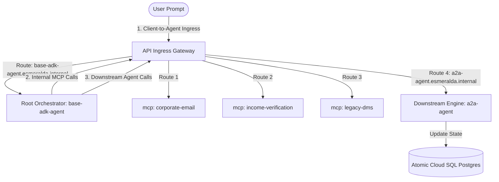
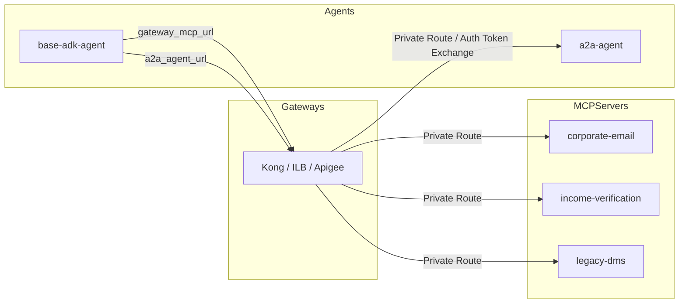
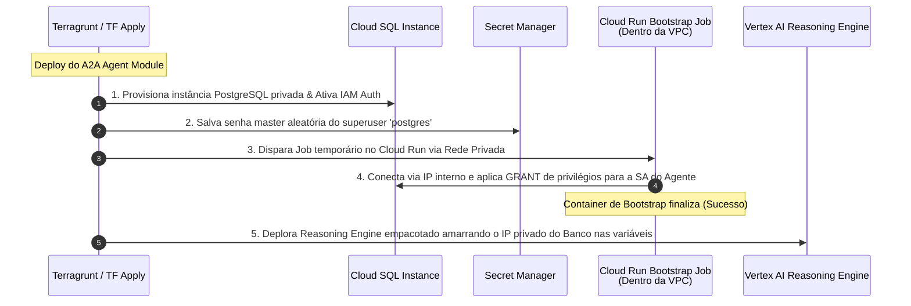
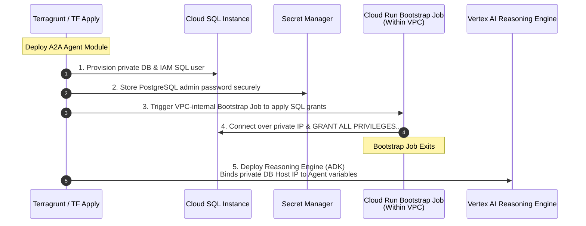

# Guia Mestre: Cargas de Trabalho, Integração & Delivery (Estágio 4 e Estratégia)

Este documento unifica todas as especificações das cargas de trabalho do Esmeralda (Gateways, Servidores MCP e Agentes de IA), a arquitetura de alternância Greenfield vs. Brownfield (BYOInfra), o fluxo integrado de Bootstrap do Banco de Dados Cloud SQL e o ecossistema de testes simétricos. Ele consolida os conceitos em português com os códigos HCL e scripts em inglês prontos para Ctrl+C / Ctrl+V.

---

## 🗺️ Índice de Cargas de Trabalho e Delivery
1. [Estágio 4: Catálogo de Cargas de Trabalho](#stage-4)
   - [A. Gateways de Ingress Intercambiáveis (Português e Códigos Completos)](#s4-gateways)
   - [B. Standalone API Hub (Português e Códigos Completos)](#s4-apihub)
   - [C. Servidores MCP Composíveis (Português e Códigos Completos)](#s4-mcp)
   - [D. Motores de Raciocínio de Agentes Atômicos (Português e Códigos Completos)](#s4-agents)
   - [E. Configurações de Orquestração Live (Terragrunt Live HCL)](#s4-live-hcl)
2. [Estratégia de Deploy: Greenfield vs. Brownfield (BYOInfra)](#byoinfra)
3. [Ciclo de Vida do Database Bootstrap (PostgreSQL & Cloud SQL)](#db-bootstrap)
4. [Ecossistema Onboarding DX: Testes Simétricos (Local vs. Remoto)](#symmetric-tests)
5. [Revolução na DX: Eliminação de deploy.sh e Arquivos .env](#dx-revolution)

---

<a name="stage-4"></a>
## 🏗️ 1. Estágio 4: Catálogo de Cargas de Trabalho

<a name="s4-gateways"></a>
### A. Padrão Gateway Adapter: Gateways de Ingress Intercambiáveis

## 🏗️ 1. Stage 4: Prateleira de Cargas de Trabalho (`modules/4-workloads/`)

O Stage 4 faz a transição do Esmeralda de fundações brutas de rede e segurança para o espaço de **Aplicações de IA Composíveis**. O design adota o padrão de catálogo independente: cada gateway, ferramenta MCP ou agente de IA é tratado como um módulo reaproveitável, permitindo deploys granulares sobre os projetos criados no Stage 1.

---

### A. Padrão Gateway Adapter: Gateways de Ingress Intercambiáveis

Para garantir que a plataforma possa ser implantada em qualquer cliente corporativo (desde sandboxes ágeis até ambientes de alta governança), o Esmeralda adota o **Padrão Gateway Adapter**. Os agentes do Vertex AI Reasoning Engine permanecem completamente agnósticos sobre qual tecnologia de gateway está ativa na rede.

Definimos três adaptadores de entrada sob `/modules/4-workloads/gateways/` que atendem ao mesmo **contrato unificado de variáveis**:

#### Blueprint e Códigos Completos para Gateways (Inglês)

# Stage 4 Workloads: Swappable Ingress Gateways

This directory houses swappable entry points for external and internal traffic, including Apigee proxies, Kong on private Cloud Run, or an Internal Load Balancer.

### 7.4 Stage 4: `modules/4-workloads/` Specification

Stage 4 transitions Esmeralda from foundational infrastructure (projects, networking, security) into the **Composable Workloads Space**. It acts as a modular "Product Catalog Shelf", allowing platform operators to selectively deploy gateways, MCP tool API servers, and ADK reasoning engine agents onto the pre-existing foundational projects.

This design enforces the **Gateway Adapter Pattern**: downstream agents (the reasoning engine workloads) remain completely agnostic of *how* ingress is routed or which API gateway is active. They simply interact with a standard set of interface variables, allowing seamless toggling between different gateway products.

---

#### 7.4.1 Swappable Gateway Ingress Adapters

We define three distinct gateway options under `/modules/4-workloads/gateways/`. Platform engineers can select their desired adapter by changing the `source` path of their live gateway Terragrunt configuration:

```text
infrastructure/modules/4-workloads/gateways/
├── apigee/                 # Option A: Enterprise-grade Apigee X Ingress
├── kong/                   # Option B: Lightweight, serverless Kong Gateway on Cloud Run
└── ilb/                    # Option C: Direct GCP Regional L7 Internal HTTP(S) Load Balancer
```

##### The Swappable Gateway Contract

To maintain complete interchangeability, all three gateway sub-modules **must accept the exact same input variables** and **expose the exact same output variables**. This contract enforces the **Gateway Adapter Pattern**: downstream agents (the reasoning engine workloads) remain completely agnostic of *how* ingress is routed or which API gateway is active.

```hcl
# --- INPUT VARIABLES CONTRACT ---
variable "project_id" {
  description = "The GCP project ID allocated for gateway ingress (prj-gateway)"
  type        = string
}

variable "region" {
  description = "The region where gateway workloads are deployed"
  type        = string
}

variable "vpc_id" {
  description = "The self-link of the central Shared VPC network"
  type        = string
}

variable "subnet_id" {
  description = "The self-link of the gateway/backend subnetwork"
  type        = string
}

variable "agent_endpoints" {
  description = "A map of logical agent names to their dynamic Vertex AI Reasoning Engine configuration"
  type = map(object({
    logical_name = string
    engine_id    = string
    endpoint_url = string
  }))
}

variable "environment" {
  description = "The active deployment environment (e.g., dev, qa, prod)"
  type        = string
  default     = "dev"
}

# --- OUTPUTS CONTRACT ---
output "gateway_ingress_ip" {
  description = "The internal private VIP of the gateway load balancer or proxy endpoint"
  value       = string
}

output "gateway_agent_ingress_host" {
  description = "The base private DNS zone managed by the gateway (e.g., esmeralda.internal)"
  value       = string
}
```

---

##### A. Option A: Apigee X Enterprise Gateway (`gateways/apigee/`)

The Apigee X adapter implements an enterprise-grade API management plane. It provisions an Apigee Organization, binds an Apigee Environment to the gateway project, creates an Environment Group to register hostnames (`*.esmeralda.internal`), and hooks up the Apigee runtime plane to the Shared VPC via Private Service Connect (PSC).

To handle dynamic Vertex AI Reasoning Engine IDs (which change on every deployment), the Apigee adapter populates an **Apigee Key Value Map (KVM)** using Terraform's `null_resource` local-exec trigger. At runtime, an Apigee Proxy intercepts `*.esmeralda.internal`, extracts the logical agent name from the host header, looks up the target endpoint URL in the KVM, performs Google Service Account token exchange, and proxies the query to Vertex AI.

###### 1. Variables Specification (`variables.tf`)
Includes the standard Swappable Gateway variables contract defined above.

###### 2. Implementation Blueprint (`main.tf`)
```hcl
resource "google_apigee_organization" "apigee_org" {
  analytics_region   = var.region
  project_id         = var.project_id
  authorized_network = var.vpc_id
}

resource "google_apigee_environment" "apigee_env" {
  name         = var.environment
  org_id       = google_apigee_organization.apigee_org.id
  description  = "Esmeralda ${var.environment} Apigee Environment"
  display_name = var.environment
}

resource "google_apigee_envgroup" "apigee_envgroup" {
  name      = "esmeralda-group-${var.environment}"
  org_id    = google_apigee_organization.apigee_org.id
  hostnames = ["*.esmeralda.internal"]
}

resource "google_apigee_envgroup_attachment" "env_to_group" {
  envgroup_id = google_apigee_envgroup.apigee_envgroup.id
  environment = google_apigee_environment.apigee_env.name
}

resource "google_apigee_instance" "apigee_instance" {
  name                 = "apigee-instance-${var.environment}"
  org_id               = google_apigee_organization.apigee_org.id
  location             = var.region
  peering_cidr_range   = "10.12.0.0/22"
}

resource "google_apigee_instance_attachment" "env_to_instance" {
  instance_id = google_apigee_instance.apigee_instance.id
  environment = google_apigee_environment.apigee_env.name
}

# Key Value Map to store logical-to-dynamic engine endpoint mappings
resource "google_apigee_keyvaluemap" "agent_routes" {
  org_id = google_apigee_organization.apigee_org.id
  env_id = google_apigee_environment.apigee_env.id
  name   = "agent-routes"
}

# Dynamically populate KVM entries using local-exec (since the Google API doesn't expose standard keyvaluemap entries as separate Terraform resources)
resource "null_resource" "populate_apigee_kvm" {
  for_each = var.agent_endpoints

  triggers = {
    engine_id    = each.value.engine_id
    endpoint_url = each.value.endpoint_url
  }

  provisioner "local-exec" {
    command = <<EOT
      curl -X POST -H "Authorization: Bearer $(gcloud auth print-access-token)" \
        -H "Content-Type: application/json" \
        "https://apigee.googleapis.com/v1/organizations/${google_apigee_organization.apigee_org.name}/environments/${google_apigee_environment.apigee_env.name}/keyvaluemaps/agent-routes/entries" \
        -d '{"name": "${each.value.logical_name}", "value": "${each.value.endpoint_url}"}' \
        || curl -X PUT -H "Authorization: Bearer $(gcloud auth print-access-token)" \
        -H "Content-Type: application/json" \
        "https://apigee.googleapis.com/v1/organizations/${google_apigee_organization.apigee_org.name}/environments/${google_apigee_environment.apigee_env.name}/keyvaluemaps/agent-routes/entries/${each.value.logical_name}" \
        -d '{"name": "${each.value.logical_name}", "value": "${each.value.endpoint_url}"}'
    EOT
  }
}
```

###### 3. Dynamic Routing & Auth Policies (`policies/`)

Inside the Apigee API Proxy (`/apiproxy/policies/`), we implement:
*   **KVM-Lookup.xml** (extracts the sub-domain e.g. `a2a-agent` from `request.header.host`, looks up target in KVM):
```xml
<?xml version="1.0" encoding="UTF-8" standalone="yes"?>
<KeyValueMapOperations async="false" continueOnError="false" enabled="true" name="KVM-Lookup">
    <DisplayName>KVM-Lookup</DisplayName>
    <Get assignTo="target.url">
        <Key>
            <Parameter ref="request.header.host.prefix"/> <!-- Logic inside Proxy Flow extracts prefix e.g. a2a-agent -->
        </Key>
    </Get>
    <Scope>environment</Scope>
</KeyValueMapOperations>
```

*   **Generate-Bearer-Token.xml** (uses Google Application Default Credentials or the Apigee Service Account's Identity Token to authenticate with Vertex AI):
```xml
<?xml version="1.0" encoding="UTF-8" standalone="yes"?>
<AssignMessage async="false" continueOnError="false" enabled="true" name="Generate-Bearer-Token">
    <DisplayName>Generate Bearer Token</DisplayName>
    <Set>
        <Headers>
            <Header name="Authorization">Bearer {private.gcp.idToken}</Header>
        </Set>
    </Set>
    <IgnoreUnresolvedVariables>true</IgnoreUnresolvedVariables>
</AssignMessage>
```

###### 4. Outputs Specification (`outputs.tf`)
```hcl
output "gateway_ingress_ip" {
  description = "The internal VIP of the Private Service Connect endpoint routing to Apigee"
  value       = "10.10.0.50" # Reserved IP for Apigee PSC endpoint in Shared VPC (AUDIT-02 Fix)
}

output "gateway_agent_ingress_host" {
  description = "The base private DNS zone managed by Apigee"
  value       = "esmeralda.internal"
}
```

---

##### B. Option B: Lightweight Kong Gateway on Cloud Run (`gateways/kong/`)

The Kong adapter deploys the lightweight, open-source Kong Gateway container in a DB-less serverless mode on Cloud Run inside the gateway project (`prj-gateway`). It uses Secret Manager to load Kong's declarative configuration routing rules and binds to the central Shared VPC via Direct VPC Egress for low-latency, private routing to downstream agents.

To support swappability, we compile the DB-less `kong.yml` dynamically inside Terraform using the `templatefile()` function, mapping each logical name from `var.agent_endpoints` to its dynamic Vertex AI Reasoning Engine URL. We also configure Kong's **GCP Service Account plugin** to transparently inject the Google OIDC tokens required to authorize calls to private Vertex AI reasoning engine endpoints.

###### 1. Variables Specification (`variables.tf`)
Includes the standard Swappable Gateway variables contract defined above, plus:
```hcl
variable "kong_image" {
  description = "The Container Image URL of Kong Gateway"
  type        = string
  default     = "kong:latest"
}
```

###### 2. Implementation Blueprint (`main.tf`)
```hcl
# Compile the declarative kong.yml file dynamically based on agent_endpoints
locals {
  kong_config = templatefile("${path.module}/templates/kong.yml.tpl", {
    agent_endpoints = var.agent_endpoints
  })
}

# Securely store the compiled Kong declarative configuration inside Secret Manager
resource "google_secret_manager_secret" "kong_config" {
  secret_id = "kong-config-${var.environment}"
  project   = var.project_id
  replication {
    auto {}
  }
}

resource "google_secret_manager_secret_version" "kong_config" {
  secret      = google_secret_manager_secret.kong_config.id
  secret_data = local.kong_config
}

# Create a dedicated Cloud Run Service Account for Kong
resource "google_service_account" "kong_sa" {
  account_id   = "kong-gateway-sa-${var.environment}"
  display_name = "Kong Gateway Service Account"
  project      = var.project_id
}

# Grant the Service Account permissions to fetch tokens and call Vertex AI Reasoning Engines
resource "google_project_iam_member" "kong_vertex_access" {
  project = var.project_id
  role    = "roles/aiplatform.user"
  member  = "serviceAccount:${google_service_account.kong_sa.email}"
}

# Deploy Kong Gateway on Cloud Run with internal-only ingress
resource "google_cloud_run_v2_service" "kong_gateway" {
  name     = "kong-gateway-${var.environment}"
  location = var.region
  project  = var.project_id
  ingress  = "INGRESS_TRAFFIC_INTERNAL_ONLY"

  template {
    service_account = google_service_account.kong_sa.email

    containers {
      image = var.kong_image
      ports {
        container_port = 8000
      }
      env {
        name  = "KONG_DATABASE"
        value = "off"
      }
      env {
        name  = "KONG_DECLARATIVE_CONFIG"
        value = "/etc/kong/kong.yml"
      }
      volume_mounts {
        name       = "kong-config"
        mount_path = "/etc/kong"
      }
    }
    
    volumes {
      name = "kong-config"
      secret {
        secret_name = google_secret_manager_secret.kong_config.secret_id
        items {
          version = "latest"
          path    = "kong.yml"
        }
      }
    }
    
    # Direct VPC Egress: Mounts Cloud Run inside the Shared VPC directly
    vpc_access {
      network_interfaces {
        network    = var.vpc_id
        subnetwork = var.subnet_id
      }
      egress = "ALL_TRAFFIC"
    }
  }
}
```

###### 3. Declarative Config Template (`templates/kong.yml.tpl`)
```yaml
_format_version: "3.0"
_transform: true

services:
%{ for key, endpoint in agent_endpoints ~}
  - name: ${endpoint.logical_name}
    url: ${endpoint.endpoint_url}
    routes:
      - name: ${endpoint.logical_name}-route
        hosts:
          - ${endpoint.logical_name}.esmeralda.internal
        strip_path: true
    plugins:
      # Inject the GCP OIDC Identity Token dynamically on upstream calls
      - name: gcp-service-account
        config:
          audience: "https://us-central1-aiplatform.googleapis.com"
%{ endfor ~}
```

###### 4. Outputs Specification (`outputs.tf`)
```hcl
output "gateway_ingress_ip" {
  description = "The regional internal IP address allocated for the Cloud Run Serverless NEG fronting Kong"
  value       = "10.10.0.60" # Internal static IP pointing to the Kong front-end ingress (AUDIT-02 Fix)
}

output "gateway_agent_ingress_host" {
  description = "The base private DNS zone managed by Kong"
  value       = "esmeralda.internal"
}
```

---

##### C. Option C: Direct Regional L7 Internal HTTP(S) Load Balancer (`gateways/ilb/`)

The direct L7 Internal Load Balancer (ILB) bypasses API gateway appliances entirely, routing traffic directly using Google Cloud's managed regional L7 load balancer. However, because an ILB lacks a programming engine and cannot natively rewrite paths or dynamically inject Google OIDC tokens to private Vertex AI Reasoning Engine API endpoints, a **Routing Broker proxy container** (Cloud Run + Serverless NEG) is packaged **inside** the ILB module itself.

This preserves the unified interface contract! The ILB routes all `*.esmeralda.internal` traffic to the `routing_broker` Cloud Run service. The Routing Broker container reads the dynamic `agent_endpoints` map via an environment variable (`AGENT_ENDPOINTS_JSON`), intercepts incoming agent requests, matches the host header prefix to obtain the target engine URL, retrieves an IAM ID Token from the metadata server, and proxies the query payload directly to the Vertex AI Reasoning Engine.

###### 1. Variables Specification (`variables.tf`)
Includes the standard Swappable Gateway variables contract defined above, plus:
```hcl
variable "routing_broker_image" {
  description = "The container image URL of the esmeralda-routing-broker proxy service"
  type        = string
  default     = "us-central1-docker.pkg.dev/prj-esmeralda-mcps/mcp-repo/routing-broker:latest" # AUDIT-05 Fix
}

```

###### 2. Implementation Blueprint (`main.tf`)
```hcl
# 1. Deploy the Internal Routing Broker Cloud Run Service
resource "google_service_account" "broker_sa" {
  account_id   = "routing-broker-sa-${var.environment}"
  display_name = "Routing Broker Service Account"
  project      = var.project_id
}

# Allow Routing Broker to invoke private Vertex AI Reasoning Engines
resource "google_project_iam_member" "broker_vertex_access" {
  project = var.project_id
  role    = "roles/aiplatform.user"
  member  = "serviceAccount:${google_service_account.broker_sa.email}"
}

resource "google_cloud_run_v2_service" "routing_broker" {
  name     = "routing-broker-${var.environment}"
  location = var.region
  project  = var.project_id
  ingress  = "INGRESS_TRAFFIC_INTERNAL_ONLY"

  template {
    service_account = google_service_account.broker_sa.email

    containers {
      image = var.routing_broker_image
      
      env {
        name  = "AGENT_ENDPOINTS_JSON"
        value = jsonencode(var.agent_endpoints)
      }
      
      env {
        name  = "LOG_LEVEL"
        value = "info"
      }
    }

    # Connect to the Shared VPC for secure backend egress
    vpc_access {
      network_interfaces {
        network    = var.vpc_id
        subnetwork = var.subnet_id
      }
      egress = "ALL_TRAFFIC"
    }
  }
}

# 2. Serverless NEG fronting the Routing Broker Cloud Run service
resource "google_compute_region_network_endpoint_group" "broker_neg" {
  name                  = "neg-broker-${var.environment}"
  project               = var.project_id
  region                = var.region
  network_endpoint_type = "SERVERLESS"
  cloud_run {
    service = google_cloud_run_v2_service.routing_broker.name
  }
}

# 3. Regional Internal Backend Service
resource "google_compute_region_backend_service" "broker_backend" {
  name                  = "backend-broker-${var.environment}"
  project               = var.project_id
  region                = var.region
  protocol              = "HTTP"
  load_balancing_scheme = "INTERNAL_MANAGED"

  backend {
    group = google_compute_region_network_endpoint_group.broker_neg.id
  }
}

# 4. Regional Internal L7 Load Balancer URL Map routing all *.esmeralda.internal traffic
resource "google_compute_region_url_map" "ilb_url_map" {
  name            = "ilb-gateway-url-map-${var.environment}"
  project         = var.project_id
  region          = var.region
  default_service = google_compute_region_backend_service.broker_backend.id

  host_rule {
    hosts        = ["*.esmeralda.internal"]
    path_matcher = "all-agents"
  }

  path_matcher {
    name            = "all-agents"
    default_service = google_compute_region_backend_service.broker_backend.id
  }
}

# 5. Target HTTP Proxy and Internal Forwarding Rule (VIP inside the Subnet)
resource "google_compute_region_target_http_proxy" "ilb_proxy" {
  name    = "ilb-gateway-proxy-${var.environment}"
  project = var.project_id
  region  = var.region
  url_map = google_compute_region_url_map.ilb_url_map.id
}

resource "google_compute_forwarding_rule" "ilb_forwarding_rule" {
  name                  = "ilb-gateway-rule-${var.environment}"
  project               = var.project_id
  region                = var.region
  ip_protocol           = "TCP"
  port_range            = "80"
  load_balancing_scheme = "INTERNAL_MANAGED"
  network               = var.vpc_id
  subnetwork            = var.subnet_id
  target                = google_compute_region_target_http_proxy.ilb_proxy.id
}
```

###### 3. Outputs Specification (`outputs.tf`)
```hcl
output "gateway_ingress_ip" {
  description = "The regional internal VIP allocated for the regional L7 load balancer fronting the broker"
  value       = google_compute_forwarding_rule.ilb_forwarding_rule.ip_address
}

output "gateway_agent_ingress_host" {
  description = "The base private DNS zone managed by the dynamic routing broker"
  value       = "esmeralda.internal"
}
```

---

---

<a name="s4-apihub"></a>
### B. Standalone API Hub

(`modules/4-workloads/apihub/`)

O catálogo de governança do API Hub é executado como uma carga de trabalho adjacente isolada no projeto `prj-gateway`. Ele registra automaticamente o diretório corporativo de APIs sem influenciar os roteamentos de tráfego ativos.

---

<a name="s4-mcp"></a>
### C. Composable MCP Server Tools

(`modules/4-workloads/mcp-servers/`)

As utilidades e conexões de backend corporativas expostas pelo protocolo MCP (DMS, Email, Income Verification) residem no projeto de ferramentas `prj-esmeralda-mcps`. Cada servidor é implantado de forma independente no Cloud Run sob regras rígidas de segurança:
*   `no-allow-unauthenticated` ativado.
*   Tráfego de saída obrigado a fluir 100% via Direct VPC Egress dentro da VPC Compartilhada.
*   Audiências customizadas explícitas apontando para o IP estável de rede do Gateway de Ingress.
*   Post-deployment trigger executando um script em Python que cataloga automaticamente a ferramenta de forma programática no Google Agent Registry.

#### Blueprint e Códigos Completos para Servidores MCP (Inglês)

# Stage 4 Workloads: Composable MCP Server Tools

This module handles the packaging, containerization, and private execution of corporate backend tools via MCP.

#### 7.4.2 Composable MCP Server Tools (`modules/4-workloads/mcp-servers/`)

To achieve complete modularity and operational flexibility, each Model Context Protocol (MCP) server from the `/tools_mcp/servers/` directory is isolated into a standalone sub-module under `/modules/4-workloads/mcp-servers/`. This allows platform operators to independently update, patch, and redeploy specific tool services without affecting other workloads or gateways.

We define three self-contained sub-modules:
1.  **Corporate Email Tool Server** (`mcp-servers/corporate-email/`)
2.  **Income Verification Tool Server** (`mcp-servers/income-verification/`)
3.  **Legacy DMS Tool Server** (`mcp-servers/legacy-dms/`)

To preserve the zero-trust security paradigm established in Stage 3, each MCP server is deployed to Cloud Run with `no-allow-unauthenticated` status, bound directly to the Shared VPC network via Direct VPC Egress, and protected by Cloud Run IAM invoker bindings. Furthermore, each module incorporates post-deployment registration blocks to dynamically catalog available tools in the GCP Agent Registry and API Hub.

```text
infrastructure/modules/4-workloads/mcp-servers/
├── corporate-email/
│   ├── main.tf
│   ├── variables.tf
│   └── outputs.tf
├── income-verification/
│   ├── main.tf
│   ├── variables.tf
│   └── outputs.tf
└── legacy-dms/
    ├── main.tf
    ├── variables.tf
    └── outputs.tf
```

---

##### A. Sub-Module 1: Corporate Email Server (`mcp-servers/corporate-email/`)

This module deploys the `corporate-email` tool server on Cloud Run. It mounts the service directly inside the Shared VPC to resolve downstream targets privately, locks down the service's HTTP ingress, and grants invoker privileges exclusively to designated agent service accounts.

###### 1. Variables Specification (`variables.tf`)
```hcl
variable "project_id" {
  description = "The GCP project ID allocated for remote MCP servers (prj-esmeralda-mcps)"
  type        = string
}

variable "region" {
  description = "The region where the Cloud Run service will be deployed"
  type        = string
  default     = "us-central1"
}

variable "network_id" {
  description = "The self-link of the Shared VPC"
  type        = string
}

variable "subnet_id" {
  description = "The self-link of the backend subnetwork inside the Shared VPC"
  type        = string
}

variable "container_image" {
  description = "The GCR/Artifact Registry container image URI for corporate-email"
  type        = string
}

variable "invoker_service_accounts" {
  description = "The list of service account emails authorized to invoke this MCP server"
  type        = list(string)
}

variable "environment" {
  description = "The active deployment environment name"
  type        = string
  default     = "dev"
}
```

###### 2. Implementation Blueprint (`main.tf`)
```hcl
# Deploy Corporate Email on Cloud Run with internal-and-load-balancing ingress
resource "google_cloud_run_v2_service" "corporate_email" {
  name     = "corporate-email-${var.environment}"
  location = var.region
  project  = var.project_id
  ingress  = "INGRESS_TRAFFIC_INTERNAL_AND_CLOUD_LIMITING" # Allows ILB & Internal Shared VPC calls

  template {
    containers {
      image = var.container_image
      ports {
        container_port = 8080
      }
      
      # Inject tracing and telemetry endpoints
      env {
        name  = "OTEL_EXPORTER_OTLP_ENDPOINT"
        value = "http://collector.telemetry.internal:4317"
      }
      env {
        name  = "ENVIRONMENT"
        value = var.environment
      }
    }

    # Direct VPC Egress: Binds Cloud Run container interface inside the Shared VPC
    vpc_access {
      network_interfaces {
        network    = var.network_id
        subnetwork = var.subnet_id
      }
      egress = "ALL_TRAFFIC"
    }
  }
}

# Explicitly set Custom Audience for gateway domain mapping
resource "google_cloud_run_v2_service_custom_audiences" "audiences" {
  name     = google_cloud_run_v2_service.corporate_email.name
  location = var.region
  project  = var.project_id
  audiences = [
    "http://email.internal.gateway",
    "https://email.internal.gateway",
    "https://email.internal.gateway/mcp"
  ]
}

# IAM Invoker Binding restricting access to authorized callers only
resource "google_cloud_run_v2_service_iam_binding" "invokers" {
  project  = var.project_id
  location = var.region
  name     = google_cloud_run_v2_service.corporate_email.name
  role     = "roles/run.invoker"
  members  = [
    for sa in var.invoker_service_accounts : "serviceAccount:${sa}"
  ]
}

# Auto-registration of tools into Agent Registry & API Hub post-deployment
resource "null_resource" "mcp_registration" {
  triggers = {
    service_uri = google_cloud_run_v2_service.corporate_email.uri
    image_uri   = var.container_image
  }

  provisioner "local-exec" {
    command = <<EOT
      echo "📡 Registering Corporate Email MCP Server with Google Cloud Agent Registry..."
      python3 ../../../../tools_mcp/register_mcp.py \
        --project_id="${var.project_id}" \
        --region="${var.region}" \
        --server_name="corporate-email" \
        --server_url="${google_cloud_run_v2_service.corporate_email.uri}"
    EOT
  }
}
```

###### 3. Outputs Specification (`outputs.tf`)
```hcl
output "service_uri" {
  description = "The baseline Cloud Run system-generated URL of the Corporate Email MCP server"
  value       = google_cloud_run_v2_service.corporate_email.uri
}

output "service_name" {
  description = "The local display name of the deployed Cloud Run service"
  value       = google_cloud_run_v2_service.corporate_email.name
}
```

---

##### B. Sub-Module 2: Income Verification Server (`mcp-servers/income-verification/`)

This module deploys the `income-verification` tool server. It integrates the verification server with regional telemetry logs and enforces strict IAM token-based OIDC protection.

###### 1. Variables Specification (`variables.tf`)
```hcl
variable "project_id" {
  description = "The GCP project ID allocated for remote MCP servers (prj-esmeralda-mcps)"
  type        = string
}

variable "region" {
  description = "The region where the Cloud Run service will be deployed"
  type        = string
  default     = "us-central1"
}

variable "network_id" {
  description = "The self-link of the Shared VPC"
  type        = string
}

variable "subnet_id" {
  description = "The self-link of the backend subnetwork inside the Shared VPC"
  type        = string
}

variable "container_image" {
  description = "The GCR/Artifact Registry container image URI for income-verification"
  type        = string
}

variable "invoker_service_accounts" {
  description = "The list of service account emails authorized to invoke this MCP server"
  type        = list(string)
}

variable "environment" {
  description = "The active deployment environment name"
  type        = string
  default     = "dev"
}
```

###### 2. Implementation Blueprint (`main.tf`)
```hcl
# Deploy Income Verification on Cloud Run with internal-and-load-balancing ingress
resource "google_cloud_run_v2_service" "income_verification" {
  name     = "income-verification-${var.environment}"
  location = var.region
  project  = var.project_id
  ingress  = "INGRESS_TRAFFIC_INTERNAL_AND_CLOUD_LIMITING"

  template {
    containers {
      image = var.container_image
      ports {
        container_port = 8080
      }
      env {
        name  = "OTEL_EXPORTER_OTLP_ENDPOINT"
        value = "http://collector.telemetry.internal:4317"
      }
      env {
        name  = "ENVIRONMENT"
        value = var.environment
      }
    }

    vpc_access {
      network_interfaces {
        network    = var.network_id
        subnetwork = var.subnet_id
      }
      egress = "ALL_TRAFFIC"
    }
  }
}

# Explicitly set Custom Audience for gateway domain mapping
resource "google_cloud_run_v2_service_custom_audiences" "audiences" {
  name     = google_cloud_run_v2_service.income_verification.name
  location = var.region
  project  = var.project_id
  audiences = [
    "http://income-verification.internal.gateway",
    "https://income-verification.internal.gateway",
    "https://income-verification.internal.gateway/mcp"
  ]
}

# IAM Invoker Binding restricting access to authorized callers only
resource "google_cloud_run_v2_service_iam_binding" "invokers" {
  project  = var.project_id
  location = var.region
  name     = google_cloud_run_v2_service.income_verification.name
  role     = "roles/run.invoker"
  members  = [
    for sa in var.invoker_service_accounts : "serviceAccount:${sa}"
  ]
}

# Auto-registration of tools into Agent Registry & API Hub post-deployment
resource "null_resource" "mcp_registration" {
  triggers = {
    service_uri = google_cloud_run_v2_service.income_verification.uri
    image_uri   = var.container_image
  }

  provisioner "local-exec" {
    command = <<EOT
      echo "📡 Registering Income Verification MCP Server with Google Cloud Agent Registry..."
      python3 ../../../../tools_mcp/register_mcp.py \
        --project_id="${var.project_id}" \
        --region="${var.region}" \
        --server_name="income-verification-api" \
        --server_url="${google_cloud_run_v2_service.income_verification.uri}"
    EOT
  }
}
```

###### 3. Outputs Specification (`outputs.tf`)
```hcl
output "service_uri" {
  description = "The baseline Cloud Run system-generated URL of the Income Verification MCP server"
  value       = google_cloud_run_v2_service.income_verification.uri
}

output "service_name" {
  description = "The local display name of the deployed Cloud Run service"
  value       = google_cloud_run_v2_service.income_verification.name
}
```

---

##### C. Sub-Module 3: Legacy DMS Server (`mcp-servers/legacy-dms/`)

This module deploys the `legacy-dms` (Document Management System) tool server on Cloud Run. It secures interactions with the core asset store and registers with API Hub.

###### 1. Variables Specification (`variables.tf`)
```hcl
variable "project_id" {
  description = "The GCP project ID allocated for remote MCP servers (prj-esmeralda-mcps)"
  type        = string
}

variable "region" {
  description = "The region where the Cloud Run service will be deployed"
  type        = string
  default     = "us-central1"
}

variable "network_id" {
  description = "The self-link of the Shared VPC"
  type        = string
}

variable "subnet_id" {
  description = "The self-link of the backend subnetwork inside the Shared VPC"
  type        = string
}

variable "container_image" {
  description = "The GCR/Artifact Registry container image URI for legacy-dms"
  type        = string
}

variable "invoker_service_accounts" {
  description = "The list of service account emails authorized to invoke this MCP server"
  type        = list(string)
}

variable "environment" {
  description = "The active deployment environment name"
  type        = string
  default     = "dev"
}
```

###### 2. Implementation Blueprint (`main.tf`)
```hcl
# Deploy Legacy DMS on Cloud Run with internal-and-load-balancing ingress
resource "google_cloud_run_v2_service" "legacy_dms" {
  name     = "legacy-dms-${var.environment}"
  location = var.region
  project  = var.project_id
  ingress  = "INGRESS_TRAFFIC_INTERNAL_AND_CLOUD_LIMITING"

  template {
    containers {
      image = var.container_image
      ports {
        container_port = 8080
      }
      env {
        name  = "OTEL_EXPORTER_OTLP_ENDPOINT"
        value = "http://collector.telemetry.internal:4317"
      }
      env {
        name  = "ENVIRONMENT"
        value = var.environment
      }
    }

    vpc_access {
      network_interfaces {
        network    = var.network_id
        subnetwork = var.subnet_id
      }
      egress = "ALL_TRAFFIC"
    }
  }
}

# Explicitly set Custom Audience for gateway domain mapping
resource "google_cloud_run_v2_service_custom_audiences" "audiences" {
  name     = google_cloud_run_v2_service.legacy_dms.name
  location = var.region
  project  = var.project_id
  audiences = [
    "http://dms.internal.gateway",
    "https://dms.internal.gateway",
    "https://dms.internal.gateway/mcp"
  ]
}

# IAM Invoker Binding restricting access to authorized callers only
resource "google_cloud_run_v2_service_iam_binding" "invokers" {
  project  = var.project_id
  location = var.region
  name     = google_cloud_run_v2_service.legacy_dms.name
  role     = "roles/run.invoker"
  members  = [
    for sa in var.invoker_service_accounts : "serviceAccount:${sa}"
  ]
}

# Auto-registration of tools into Agent Registry & API Hub post-deployment
resource "null_resource" "mcp_registration" {
  triggers = {
    service_uri = google_cloud_run_v2_service.legacy_dms.uri
    image_uri   = var.container_image
  }

  provisioner "local-exec" {
    command = <<EOT
      echo "📡 Registering Legacy DMS MCP Server with Google Cloud Agent Registry..."
      python3 ../../../../tools_mcp/register_mcp.py \
        --project_id="${var.project_id}" \
        --region="${var.region}" \
        --server_name="legacy-dms" \
        --server_url="${google_cloud_run_v2_service.legacy_dms.uri}"
    EOT
  }
}
```

###### 3. Outputs Specification (`outputs.tf`)
```hcl
output "service_uri" {
  description = "The baseline Cloud Run system-generated URL of the Legacy DMS MCP server"
  value       = google_cloud_run_v2_service.legacy_dms.uri
}

output "service_name" {
  description = "The local display name of the deployed Cloud Run service"
  value       = google_cloud_run_v2_service.legacy_dms.name
}
```

###### 4. Composed Inputs-Outputs Mapping Matrix

To help operators configure their Terragrunt dependency blocks, this matrix maps the variable bindings across the gateway layer and the composable MCP tool servers:

| MCP Sub-module | Input Source (`terragrunt.hcl`) | Authorized Invokers (`invoker_service_accounts`) | Regional Custom Audience Endpoint | Matches Route Path in ILB |
| :--- | :--- | :--- | :--- | :--- |
| **`corporate-email`** | Output of `prj-esmeralda-mcps` and `base-adk-agent` | `base-adk-agent-sa` email, `test-vm-sa` email | `http://email.internal.gateway/mcp` | `/email/*`, `/email/mcp` |
| **`income-verification`** | Output of `prj-esmeralda-mcps` and `base-adk-agent` | `base-adk-agent-sa` email, `test-vm-sa` email | `http://income-verification.internal.gateway/mcp` | `/income-verification/*` |
| **`legacy-dms`** | Output of `prj-esmeralda-mcps` and `base-adk-agent` | `base-adk-agent-sa` email, `test-vm-sa` email | `http://dms.internal.gateway/mcp` | `/dms/*`, `/dms/mcp` |

---

---

<a name="s4-agents"></a>
### D. Atomic Agent Reasoning Engines

(`modules/4-workloads/agents/`)

No novo modelo Esmeralda, os agentes ADK operam em ambientes perfeitamente isolados e com injeção dinâmica de dependências declarativas via Terragrunt:

#### Blueprint e Códigos Completos para Agentes AI ADK (Inglês)

# Stage 4 Workloads: Atomic Agent Reasoning Engines

This module packages Python ADK agent runtimes, automates GCS staging uploads, and provisions Vertex AI Reasoning Engines with fully atomic staging, artifacts, and log buckets.

#### 7.4.3 AI Platform Agent Reasoning Engines (`modules/4-workloads/agents/`)

Esmeralda's downstream execution flow relies on Vertex AI Reasoning Engines deployed declaratively via the Google Antigravity (AGY) / ADK framework. We organize these agents into two separate, self-contained sub-modules:
1.  **Mortgage Assistant Agent (`agents/a2a-agent/`)**: The downstream, specialized reasoning engine executing tasks and storing operational states.
2.  **Root Orchestrator Agent (`agents/base-adk-agent/`)**: The master coordinator handling multi-agent graph routing and dispatching queries.

```text
infrastructure/modules/4-workloads/agents/
├── a2a-agent/                 # Downstream reasoning engine + Atomic Cloud SQL Postgres task store
│   ├── main.tf
│   ├── variables.tf
│   └── outputs.tf
└── base-adk-agent/            # Root Orchestrator reasoning engine
    ├── main.tf
    ├── variables.tf
    └── outputs.tf
```

---

##### A. Sub-Module A: Atomic Mortgage Assistant (`agents/a2a-agent/`)

To guarantee absolute **self-contained portability**, the Cloud SQL PostgreSQL task store, its private subnet service IP allocation ranges, its IAM-authenticated DB user accounts, and database readiness bootstrappers are **fully packaged inside this single workload module**. This encapsulates all infrastructure and database requirements into an atomic, standalone unit. Calling `terragrunt apply` on this module will automatically spin up PostgreSQL, initialize the schema tables via a containerized bootstrap job, and deploy the Vertex AI Reasoning Engine with Direct VPC access peering.

###### 1. Variables Specification (`variables.tf`)
```hcl
variable "project_id" {
  description = "The GCP project ID allocated for downstream agents (prj-esmeralda-agents)"
  type        = string
}

variable "region" {
  description = "The region where Cloud SQL and the Reasoning Engine are deployed"
  type        = string
  default     = "us-central1"
}

variable "vpc_id" {
  description = "The self-link of the central Shared VPC network"
  type        = string
}

variable "subnet_id" {
  description = "The self-link of the backend workload subnet inside the Shared VPC"
  type        = string
}

variable "agent_name" {
  description = "The registered display name of the A2A Mortgage Assistant reasoning engine"
  type        = string
  default     = "a2a-mortgage-agent"
}

variable "agent_service_account" {
  description = "The email address of the dedicated A2A Agent service account created in Stage 3"
  type        = string
}

# Cloud SQL Sizing Variables
variable "sql_tier" {
  description = "The machine instance type allocated for the Cloud SQL PostgreSQL task store"
  type        = string
  default     = "db-custom-1-3840" # Lightweight instance type for standard workloads
}

variable "database_name" {
  description = "The name of the task store relational database"
  type        = string
  default     = "a2a_tasks"
}

# Packaging paths for the ADK bundle
variable "pickle_object_path" {
  description = "The local directory path containing the pre-packaged serialized agent.pkl file"
  type        = string
}

variable "requirements_path" {
  description = "The local directory path containing the pre-packaged requirements.txt bundle"
  type        = string
}

variable "dependencies_path" {
  description = "The local directory path containing the pre-packaged dependencies.tar.gz bundle"
  type        = string
}

variable "network_attachment" {
  description = "Optional Private Service Connect Network Attachment ID for Vertex AI Reasoning Engine VPC attachment"
  type        = string
  default     = ""
}

variable "environment" {
  description = "The active deployment environment name"
  type        = string
  default     = "dev"
}
```

###### 2. Implementation Blueprint (`main.tf`)
```hcl
terraform {
  required_version = ">= 1.0"
  required_providers {
    google = {
      source  = "hashicorp/google"
      version = ">= 5.0"
    }
    random = {
      source  = "hashicorp/random"
      version = ">= 3.0"
    }
  }
}

# -----------------------------------------------------------------------------
# 1. ATOMIC DATA PLANE: PRIVATE SERVICES ACCESS & CLOUD SQL POSTGRESQL
# -----------------------------------------------------------------------------

# Reserved private IP address block inside the VPC for the SQL instance connection
resource "google_compute_global_address" "sql_private_ip" {
  name          = "${var.agent_name}-sql-private-ip-${var.environment}"
  purpose       = "VPC_PEERING"
  address_type  = "INTERNAL"
  prefix_length = 16
  network       = var.vpc_id
  project       = var.project_id
}

# Establish a private VPC peering connection with the Google Service Networking API
resource "google_service_networking_connection" "sql_peering" {
  network                 = var.vpc_id
  service                 = "servicenetworking.googleapis.com"
  reserved_peering_ranges = [google_compute_global_address.sql_private_ip.name]
}

# Provisions a secure, private PostgreSQL instance with IAM authentication enabled
resource "google_sql_database_instance" "task_store" {
  name             = "${var.agent_name}-db-${var.environment}"
  project          = var.project_id
  region           = var.region
  database_version = "POSTGRES_15"
  depends_on       = [google_service_networking_connection.sql_peering]

  settings {
    tier              = var.sql_tier
    availability_type = "ZONAL"
    disk_size         = 15

    ip_configuration {
      ipv4_enabled    = false # Absolute private network isolation
      private_network = var.vpc_id
    }

    database_flags {
      name  = "cloudsql.iam_authentication"
      value = "on"
    }
  }

  deletion_protection = false # Configured for elastic dev/sandbox environments
}

# Provisions the task store database
resource "google_sql_database" "tasks_db" {
  name     = var.database_name
  instance = google_sql_database_instance.task_store.name
  project  = var.project_id
}

# Standard random password generator for local superuser postgres login
resource "random_password" "postgres_pwd" {
  length  = 24
  special = false
}

# Superuser root account
resource "google_sql_user" "postgres_user" {
  name     = "postgres"
  instance = google_sql_database_instance.task_store.name
  project  = var.project_id
  password = random_password.postgres_pwd.result
}

# Create IAM User mapped to the agent's service account to leverage Cloud IAM Db Authentication
resource "google_sql_user" "agent_iam_user" {
  name     = trimsuffix(var.agent_service_account, ".gserviceaccount.com")
  instance = google_sql_database_instance.task_store.name
  project  = var.project_id
  type     = "CLOUD_IAM_SERVICE_ACCOUNT"
  depends_on = [google_sql_user.postgres_user]
}

# Null Resource to wait for database engine to be fully runnable before executing grants
resource "null_resource" "db_ready" {
  depends_on = [
    google_sql_database_instance.task_store,
    google_sql_database.tasks_db,
    google_sql_user.postgres_user,
    google_sql_user.agent_iam_user
  ]

  provisioner "local-exec" {
    command = <<EOT
      echo "⏳ Waiting for Cloud SQL Instance ${google_sql_database_instance.task_store.name} to start..."
      for i in {1..30}; do
        STATE=$(gcloud sql instances describe ${google_sql_database_instance.task_store.name} --project=${var.project_id} --format="value(state)" 2>/dev/null || echo "UNKNOWN")
        if [ "$STATE" = "RUNNABLE" ]; then
          echo "✅ Cloud SQL is ONLINE. Allowing 10 seconds for service stabilization..."
          sleep 10
          exit 0
        fi
        echo "🔄 DB state is $STATE. Retrying (Attempt $i/30)..."
        sleep 10
      done
      exit 1
    EOT
  }
}

# Assign roles/cloudsql.client to the agent service account at project level
resource "google_project_iam_member" "cloudsql_client_role" {
  project = var.project_id
  role    = "roles/cloudsql.client"
  member  = "serviceAccount:${var.agent_service_account}"
}

# Assign roles/cloudsql.instanceUser to enable IAM database token injection
resource "google_project_iam_member" "cloudsql_user_role" {
  project = var.project_id
  role    = "roles/cloudsql.instanceUser"
  member  = "serviceAccount:${var.agent_service_account}"
}

# -----------------------------------------------------------------------------
# 2. PRIVILEGES BOOTSTRAP: VPC-BOUND CLOUD RUN JOB (REPLACES POSTGRESQL PROVIDER)
# -----------------------------------------------------------------------------

# Deploys a lightweight, standard PostgreSQL administrative job inside the Shared VPC.
# This connects privately via direct VPC IP and executes administrative SQL GRANT queries,
# completely eliminating the need for a local-exec postgresql client or provider.
resource "google_cloud_run_v2_job" "schema_bootstrap" {
  name     = "${var.agent_name}-db-bootstrap-${var.environment}"
  location = var.region
  project  = var.project_id
  depends_on = [
    null_resource.db_ready,
    google_project_iam_member.cloudsql_client_role,
    google_project_iam_member.cloudsql_user_role
  ]

  template {
    template {
      # Runs under a standard service account that has access to execute VPC jobs
      service_account = var.agent_service_account
      
      containers {
        # Light, standard alpine-postgres client image
        image = "alpine:latest"
        command = ["/bin/sh", "-c"]
        args = [
          "apk add --no-cache postgresql-client && psql \"postgresql://postgres:${random_password.postgres_pwd.result}@${google_sql_database_instance.task_store.private_ip_address}/${var.database_name}\" -c \"GRANT ALL PRIVILEGES ON DATABASE ${var.database_name} TO \\\"${google_sql_user.agent_iam_user.name}\\\";\""
        ]
      }

      # VPC Access config mapping schema runner container to the private Shared VPC
      vpc_access {
        network_interfaces {
          network    = var.vpc_id
          subnetwork = var.subnet_id
        }
        egress = "ALL_TRAFFIC"
      }
    }
  }
}

# Null Resource triggering the bootstrap job execution during terraform apply
resource "null_resource" "trigger_bootstrap" {
  depends_on = [google_cloud_run_v2_job.schema_bootstrap]

  provisioner "local-exec" {
    command = <<EOT
      echo "🚀 Launching private Cloud Run PostgreSQL bootstrap job..."
      gcloud run jobs execute ${google_cloud_run_v2_job.schema_bootstrap.name} \
        --region="${var.region}" \
        --project="${var.project_id}" \
        --wait
    EOT
  }
}

# -----------------------------------------------------------------------------
# 3. ATOMIC STORAGE & WORKLOAD STAGING (ONE SET OF BUCKETS PER AGENT)
# -----------------------------------------------------------------------------

# Cryptographically unique suffix for bucket naming
resource "random_id" "bucket_suffix" {
  byte_length = 4
}

# 1. Atomic Deployment Dependencies Staging Bucket (Code/Pickle/Deps)
resource "google_storage_bucket" "staging" {
  project                     = var.project_id
  name                        = "${var.project_id}-${var.agent_name}-staging-${var.environment}-${random_id.bucket_suffix.hex}"
  location                    = var.region
  force_destroy               = true # Set to false in sandbox/dev environments
  uniform_bucket_level_access = true
}

# 2. Atomic Runtime Task Artifacts Bucket (Agent operational assets)
resource "google_storage_bucket" "artifacts" {
  project                     = var.project_id
  name                        = "${var.project_id}-${var.agent_name}-artifacts-${var.environment}-${random_id.bucket_suffix.hex}"
  location                    = var.region
  force_destroy               = true
  uniform_bucket_level_access = true
}

# 3. Atomic Logs Offload Bucket (Long-term tracing and logging)
resource "google_storage_bucket" "logs" {
  project                     = var.project_id
  name                        = "${var.project_id}-${var.agent_name}-logs-${var.environment}-${random_id.bucket_suffix.hex}"
  location                    = var.region
  force_destroy               = true
  uniform_bucket_level_access = true
}

# Upload serialized agent.pkl to GCS Staging Bucket
resource "google_storage_bucket_object" "agent_pickle" {
  name   = "agents/${var.agent_name}-${var.environment}/agent.pkl"
  bucket = google_storage_bucket.staging.name
  source = var.pickle_object_path
}

# Upload requirements.txt dependencies mapping
resource "google_storage_bucket_object" "requirements" {
  name   = "agents/${var.agent_name}-${var.environment}/requirements.txt"
  bucket = google_storage_bucket.staging.name
  source = var.requirements_path
}

# Upload compiled dependencies tarball
resource "google_storage_bucket_object" "dependencies" {
  name   = "agents/${var.agent_name}-${var.environment}/dependencies.tar.gz"
  bucket = google_storage_bucket.staging.name
  source = var.dependencies_path
}

# Declaratively define the Vertex AI Reasoning Engine agent
resource "google_vertex_ai_reasoning_engine" "agent" {
  display_name = "${var.agent_name}-${var.environment}"
  description  = "A2A Mortgage Assistant downstream reasoning engine deployed modularly"
  region       = var.region
  project      = var.project_id
  depends_on   = [null_resource.trigger_bootstrap, google_storage_bucket.staging]

  spec {
    agent_framework = "google-adk"
    service_account = var.agent_service_account

    package_spec {
      python_version           = "3.12"
      pickle_object_gcs_uri    = "gs://${google_storage_bucket.staging.name}/${google_storage_bucket_object.agent_pickle.name}"
      requirements_gcs_uri     = "gs://${google_storage_bucket.staging.name}/${google_storage_bucket_object.requirements.name}"
      dependency_files_gcs_uri = "gs://${google_storage_bucket.staging.name}/${google_storage_bucket_object.dependencies.name}"
    }

    # Binds reasoning engine container inside private VPC via PSC Network Attachment if specified
    dynamic "deployment_spec" {
      for_each = var.network_attachment != "" ? [1] : []
      content {
        psc_interface_config {
          network_attachment = var.network_attachment
        }
      }
    }
  }
}
```

###### 3. Outputs Specification (`outputs.tf`)
```hcl
output "engine_id" {
  description = "The fully qualified unique resource name of the deployed A2A Reasoning Engine"
  value       = google_vertex_ai_reasoning_engine.agent.id
}

output "endpoint_url" {
  description = "The internal GCP API Endpoint address allocated for executing predictions against A2A"
  value       = "https://${var.region}-aiplatform.googleapis.com/v1beta1/${google_vertex_ai_reasoning_engine.agent.id}/a2a"
}

output "db_connection_name" {
  description = "The connection string identifier for the atomic Cloud SQL postgres database"
  value       = google_sql_database_instance.task_store.connection_name
}

output "db_private_ip" {
  description = "The private internal IP address allocated for the database"
  value       = google_sql_database_instance.task_store.private_ip_address
}

output "staging_bucket_name" {
  description = "The name of the atomic GCS bucket used for staging code dependencies"
  value       = google_storage_bucket.staging.name
}

output "artifacts_bucket_name" {
  description = "The name of the atomic GCS bucket used for runtime task artifacts"
  value       = google_storage_bucket.artifacts.name
}

output "logs_bucket_name" {
  description = "The name of the atomic GCS bucket used for long-term logs offload"
  value       = google_storage_bucket.logs.name
}
```

---

##### B. Sub-Module B: Root Orchestrator Agent (`agents/base-adk-agent/`)

The active API Ingress Gateway acts as the single, secure entry point and transit router for all Esmeralda agent traffic. The client-side **User Prompt** first hits the gateway, which routes it to the **Root Orchestrator Agent** (`base-adk-agent`). The Root Orchestrator then parses the prompt, and routes any downstream tool service (MCP) requests or specialized downstream assistant queries (such as the `a2a-agent`) **back through the gateway**.

Because we decoupled routing mechanics, **we pass both the Gateway MCP URL and the Gateway-abstracted A2A Agent Ingress URL (`http://a2a-agent.esmeralda.internal`) as standard, runtime variables**. This guarantees complete composition flexibility and eliminates cyclic Terragrunt dependency blocks during platform deployments:



###### 1. Variables Specification (`variables.tf`)
```hcl
variable "project_id" {
  description = "The GCP project ID allocated for orchestrator agents (prj-esmeralda-agents)"
  type        = string
}

variable "region" {
  description = "The region where the Orchestrator Reasoning Engine is deployed"
  type        = string
  default     = "us-central1"
}

variable "agent_name" {
  description = "The registered display name of the Root Orchestrator reasoning engine"
  type        = string
  default     = "base-adk-orchestrator"
}

variable "agent_service_account" {
  description = "The email address of the dedicated Orchestrator Agent service account created in Stage 3"
  type        = string
}

# Run-time Dependency Injections
variable "gateway_mcp_url" {
  description = "The injected private or public endpoint URI of the active API Ingress Gateway (from Option A, B, or C)"
  type        = string
}

variable "a2a_agent_url" {
  description = "The private gateway ingress URI of the downstream A2A Mortgage Assistant (routed via the swappable gateway)"
  type        = string
}

# Packaging paths for the ADK bundle
variable "pickle_object_path" {
  description = "The local directory path containing the pre-packaged serialized agent.pkl file"
  type        = string
}

variable "requirements_path" {
  description = "The local directory path containing the pre-packaged requirements.txt bundle"
  type        = string
}

variable "dependencies_path" {
  description = "The local directory path containing the pre-packaged dependencies.tar.gz bundle"
  type        = string
}

variable "network_attachment" {
  description = "The Private Service Connect Network Attachment ID for Vertex AI Reasoning Engine VPC attachment"
  type        = string
}

variable "environment" {
  description = "The active deployment environment name"
  type        = string
  default     = "dev"
}
```

###### 2. Implementation Blueprint (`main.tf`)
```hcl
terraform {
  required_version = ">= 1.0"
  required_providers {
    google = {
      source  = "hashicorp/google"
      version = ">= 5.0"
    }
  }
}

# -----------------------------------------------------------------------------
# 1. ATOMIC STORAGE & WORKLOAD STAGING (ONE SET OF BUCKETS PER AGENT)
# -----------------------------------------------------------------------------

# Cryptographically unique suffix for bucket naming
resource "random_id" "bucket_suffix" {
  byte_length = 4
}

# 1. Atomic Deployment Dependencies Staging Bucket (Code/Pickle/Deps)
resource "google_storage_bucket" "staging" {
  project                     = var.project_id
  name                        = "${var.project_id}-${var.agent_name}-staging-${var.environment}-${random_id.bucket_suffix.hex}"
  location                    = var.region
  force_destroy               = true # Set to false in sandbox/dev environments
  uniform_bucket_level_access = true
}

# 2. Atomic Runtime Task Artifacts Bucket (Agent operational assets)
resource "google_storage_bucket" "artifacts" {
  project                     = var.project_id
  name                        = "${var.project_id}-${var.agent_name}-artifacts-${var.environment}-${random_id.bucket_suffix.hex}"
  location                    = var.region
  force_destroy               = true
  uniform_bucket_level_access = true
}

# 3. Atomic Logs Offload Bucket (Long-term tracing and logging)
resource "google_storage_bucket" "logs" {
  project                     = var.project_id
  name                        = "${var.project_id}-${var.agent_name}-logs-${var.environment}-${random_id.bucket_suffix.hex}"
  location                    = var.region
  force_destroy               = true
  uniform_bucket_level_access = true
}

# Upload serialized agent.pkl to GCS Staging Bucket
resource "google_storage_bucket_object" "agent_pickle" {
  name   = "agents/${var.agent_name}-${var.environment}/agent.pkl"
  bucket = google_storage_bucket.staging.name
  source = var.pickle_object_path
}

# Upload requirements.txt dependencies mapping
resource "google_storage_bucket_object" "requirements" {
  name   = "agents/${var.agent_name}-${var.environment}/requirements.txt"
  bucket = google_storage_bucket.staging.name
  source = var.requirements_path
}

# Upload compiled dependencies tarball
resource "google_storage_bucket_object" "dependencies" {
  name   = "agents/${var.agent_name}-${var.environment}/dependencies.tar.gz"
  bucket = google_storage_bucket.staging.name
  source = var.dependencies_path
}

# Declaratively define the Vertex AI Reasoning Engine master orchestrator
resource "google_vertex_ai_reasoning_engine" "agent" {
  display_name = "${var.agent_name}-${var.environment}"
  description  = "Root Orchestrator reasoning engine coordinating comopsable multi-agent graph flows"
  region       = var.region
  project      = var.project_id
  depends_on   = [google_storage_bucket.staging]

  spec {
    agent_framework = "google-adk"
    service_account = var.agent_service_account

    package_spec {
      python_version           = "3.12"
      pickle_object_gcs_uri    = "gs://${google_storage_bucket.staging.name}/${google_storage_bucket_object.agent_pickle.name}"
      requirements_gcs_uri     = "gs://${google_storage_bucket.staging.name}/${google_storage_bucket_object.requirements.name}"
      dependency_files_gcs_uri = "gs://${google_storage_bucket.staging.name}/${google_storage_bucket_object.dependencies.name}"
    }

    # Connect reasoning engine container inside private VPC via PSC Network Attachment
    deployment_spec {
      psc_interface_config {
        network_attachment = var.network_attachment
      }
    }
  }
}

# Update agent.yaml runtime values on local filesystem or environment parameters 
# after deployment to link runtime endpoints securely
resource "null_resource" "runtime_config_sync" {
  triggers = {
    orchestrator_id = google_vertex_ai_reasoning_engine.agent.id
    gateway_mcp_url = var.gateway_mcp_url
    a2a_agent_url   = var.a2a_agent_url
  }

  provisioner "local-exec" {
    command = <<EOT
      echo "🔗 Syncing runtime gateway and agent dependencies for base-adk-agent..."
      # This mimics updating the local environment config or calling a centralized config service
      echo "GATEWAY_MCP_URL=${var.gateway_mcp_url}" > .env.runtime
      echo "A2A_AGENT_URL=${var.a2a_agent_url}" >> .env.runtime
    EOT
  }
}
```

###### 3. Outputs Specification (`outputs.tf`)
```hcl
output "engine_id" {
  description = "The fully qualified unique resource name of the deployed Root Orchestrator Reasoning Engine"
  value       = google_vertex_ai_reasoning_engine.agent.id
}

output "endpoint_url" {
  description = "The internal GCP API Endpoint address allocated for executing predictions against the Orchestrator"
  value       = "https://${var.region}-aiplatform.googleapis.com/v1beta1/${google_vertex_ai_reasoning_engine.agent.id}"
}

output "staging_bucket_name" {
  description = "The name of the atomic GCS bucket used for staging code dependencies"
  value       = google_storage_bucket.staging.name
}

output "artifacts_bucket_name" {
  description = "The name of the atomic GCS bucket used for runtime task artifacts"
  value       = google_storage_bucket.artifacts.name
}

output "logs_bucket_name" {
  description = "The name of the atomic GCS bucket used for long-term logs offload"
  value       = google_storage_bucket.logs.name
}
```

###### 4. Composed Inputs-Outputs Mapping Matrix

To configure Terragrunt cross-dependency wiring, this matrix outlines the data flow between gateway adapters, downstream tool servers, and the orchestration engines:



The runtime linkage in `terragrunt.hcl` is established as follows:

| Target Component | Dependency Variable | Injected Value Source | Security Context / IAM Role | Private Network Egress Transit |
| :--- | :--- | :--- | :--- | :--- |
| **`base-adk-agent`** | `gateway_mcp_url` | Output of the selected Gateway adapter module (`outputs.gateway_mcp_url`) | Requires `roles/run.invoker` on targets | Private Load Balancer VIP (`gateway.internal.gateway`) |
| **`base-adk-agent`** | `a2a_agent_url` | Static private DNS zone routing string (`http://a2a-agent.esmeralda.internal`) | Resolved dynamically by the swappable gateway | Resolves to the selected Gateway Ingress VIP inside the Shared VPC |
| **`a2a-agent`** | `database_host` | Output of atomic database user block (`outputs.db_private_ip`) | Requires `roles/cloudsql.client` & `instanceUser` | Private Services Access (PSA) internal range |

---

<a name="s4-live-hcl"></a>
### E. Configurações de Orquestração Live (Terragrunt Live HCL)

Para entender como esses microserviços e agentes independentes são montados e encadeados de forma dinâmica no ambiente real sob a árvore `live/dev/stage-4-workloads/`, veja os arquivos de configuração Terragrunt abaixo. Eles utilizam blocos `dependency` para injetar saídas de recursos reais de estágios anteriores de forma transparente, permitindo total automação e eliminando parâmetros manuais:

These HCL declarations demonstrate how the micro-services are configured and chained in your live environment:

### A. The A2A Agent (`live/dev/stage-4-workloads/agents/a2a-agent/terragrunt.hcl`)
```hcl
# infrastructure/live/dev/stage-4-workloads/agents/a2a-agent/terragrunt.hcl
include "root" {
  path = find_in_parent_folders()
}

terraform {
  source = "../../../../../modules//4-workloads/agents/a2a-agent"
}

dependency "projects" {
  config_path = "../../../stage-1-projects"
}

dependency "networking" {
  config_path = "../../../stage-2-networking"
}

dependency "security" {
  config_path = "../../../stage-3-security"
}

locals {
  env_vars = read_terragrunt_config(find_in_parent_folders("env.yaml"))
}

inputs = {
  # Dynamically deploys into the isolated A2A agent platform project!
  project_id            = dependency.projects.outputs.a2a_project_id
  region                = local.env_vars.locals.region
  vpc_id                = dependency.networking.outputs.network_id
  subnet_id             = dependency.networking.outputs.subnet_id
  agent_service_account = dependency.security.outputs.a2a_agent_sa_email

  database_product      = local.env_vars.locals.database_product
  database_name         = "a2a_tasks"
}
```

### B. The Root Orchestrator (`live/dev/stage-4-workloads/agents/base-adk-agent/terragrunt.hcl`)
```hcl
# infrastructure/live/dev/stage-4-workloads/agents/base-adk-agent/terragrunt.hcl
include "root" {
  path = find_in_parent_folders()
}

terraform {
  source = "../../../../../modules//4-workloads/agents/base-adk-agent"
}

dependency "projects" {
  config_path = "../../../stage-1-projects"
}

dependency "security" {
  config_path = "../../../stage-3-security"
}

dependency "mcp_dms" {
  config_path = "../../mcp-servers/mcp-dms"
}

dependency "mcp_calc" {
  config_path = "../../mcp-servers/mcp-calculator"
}

dependency "a2a_agent" {
  config_path = "../a2a-agent"
}

locals {
  env_vars = read_terragrunt_config(find_in_parent_folders("env.yaml"))
}

inputs = {
  # Deploys into the isolated customer-facing Line of Business (LOB) project!
  project_id            = dependency.projects.outputs.root_project_id
  region                = local.env_vars.locals.region
  agent_service_account = dependency.security.outputs.root_agent_sa_email

  # Inject downstream endpoints
  mcp_dms_url           = dependency.mcp_dms.outputs.mcp_dms_url
  mcp_calc_url          = dependency.mcp_calc.outputs.mcp_calc_url
  a2a_agent_url         = dependency.a2a_agent.outputs.a2a_agent_endpoint_url
}
```

---

---

<a name="byoinfra"></a>
## 🔌 2. Greenfield vs. Brownfield (BYOInfra) Toggle Design

## 🔌 2. Greenfield vs. Brownfield (BYOInfra) Toggle Design

Em ambientes produtivos reais de clientes corporativos, o time de infraestrutura (NetOps e SecOps) raramente autoriza que scripts Terraform criem redes VPC Compartilhadas, subredes, rotas DNS de internet ou projetos corporativos de faturamento do zero. O cliente exige consumir recursos preexistentes (**Brownfield** / **BYOInfra**).

O Esmeralda resolve esse bloqueio implementando de forma transparente chaves de alternância dinâmica em suas receitas de Terragrunt (`live/dev/env.yaml`), utilizando o parâmetro de bypass nativo `skip` e mapeando fallbacks condicionais:

### A. Configuração de Variáveis de Controle do Cliente (`live/client-prod/env.yaml`)

Neste arquivo, o cliente define quais infraestruturas deseja reutilizar (`true`) e fornece os ponteiros explícitos dessas conexões reais:

```yaml
# infrastructure/live/client-prod/env.yaml
locals {
  environment               = "prod"
  project_prefix            = "enterprise-client"
  region                    = "us-central1"

  # 🔌 BYO INFRA SWITCHES: Indica reutilização de rede e gateway preexistentes
  byo_net_host_project      = true
  byo_gateway_project       = true
  byo_networking            = true
  byo_apigee                = true

  # Apontadores para recursos corporativos existentes
  existing_net_host_project = "prj-corp-shared-net"
  existing_gateway_project  = "prj-corp-apigee"
  existing_vpc_id           = "projects/prj-corp-shared-net/global/networks/vpc-production"
  existing_subnet_id        = "projects/prj-corp-shared-net/regions/us-central1/subnetworks/sb-prod-private"

  database_product          = "cloud-sql" # Criar banco do zero
}
```

### B. Bypass Dinâmico de Estágios de Infraestrutura (`live/client-prod/stage-2-networking/terragrunt.hcl`)

Utilizando o bloco de bypass nativo do Terragrunt, o módulo de provisionamento de rede é desativado instantaneamente na esteira se a variável `byo_networking` estiver ativa:

```hcl
# infrastructure/live/client-prod/stage-2-networking/terragrunt.hcl
include "root" {
  path = find_in_parent_folders()
}

terraform {
  source = "../../../modules//2-networking"
}

locals {
  env_vars = read_terragrunt_config(find_in_parent_folders("env.yaml"))
}

# Se for Brownfield, pula este estágio sem gerar erros de execução ou apply
skip = local.env_vars.locals.byo_networking
```

### C. Fallbacks Condicionais em Dependências Downstream (`live/client-prod/stage-4-workloads/agents/a2a-agent/terragrunt.hcl`)

Cargas de trabalho que consomem as saídas de estágios pulados desviam de forma transparente suas leituras de variáveis para os campos estáticos do `env.yaml` do cliente, evitando estouros de avaliação no analisador do Terragrunt usando mocks estruturados:

```hcl
# infrastructure/live/client-prod/stage-4-workloads/agents/a2a-agent/terragrunt.hcl
include "root" {
  path = find_in_parent_folders()
}

terraform {
  source = "../../../../../modules//4-workloads/agents/a2a-agent"
}

locals {
  env_vars       = read_terragrunt_config(find_in_parent_folders("env.yaml"))
  byo_networking = lookup(local.env_vars.locals, "byo_networking", false)
}

dependency "projects" {
  config_path = "../../../stage-1-projects"
}

dependency "security" {
  config_path = "../../../stage-3-security"
}

dependency "networking" {
  config_path  = "../../../stage-2-networking"
  
  # Evita carregar variáveis de um módulo cujo apply foi ignorado
  skip_outputs = local.byo_networking
  
  # Alimenta o analisador do Terraform com mocks seguros em tempo de compilação
  mock_outputs = {
    network_id = local.env_vars.locals.existing_vpc_id
    subnet_id  = local.env_vars.locals.existing_subnet_id
  }
}

inputs = {
  project_id            = dependency.projects.outputs.a2a_project_id
  region                = local.env_vars.locals.region
  agent_service_account = dependency.security.outputs.a2a_agent_sa_email
  
  # DESVIO CONDICIONAL: Usa a infraestrutura preexistente do cliente ou as saídas criadas em Stage 2
  vpc_id                = local.byo_networking ? local.env_vars.locals.existing_vpc_id  : dependency.networking.outputs.network_id
  subnet_id             = local.byo_networking ? local.env_vars.locals.existing_subnet_id : dependency.networking.outputs.subnet_id
  
  database_name         = "a2a_tasks"
}
```

---

### 📐 Detalhes Técnicos de Implementação e Arquivo de Configuração BYOInfra (Inglês)

Abaixo, encontre os fluxos de bypass de compilação reais e as receitas de fallback dinâmico utilizadas para orquestrar implantações sobre redes corporativas legadas de clientes. Ao definir as flags de skip correspondentes no arquivo `env.yaml`, o Terragrunt de downstream herda os mapeamentos de subnets e VPCs corporativas sem tentar recriar os backbones de rede centrais do Stage 2:

To allow seamless deployment inside enterprise client environments with pre-existing resources, the architecture implements the **BYOInfra Pattern** natively using Terragrunt's skip parameters and input-fallbacks:

### A. The Client's Environment Parameters (`live/client-prod/env.yaml`)
The client declares their pre-existing resources and toggles the dynamic skip flags:

```yaml
# infrastructure/live/client-prod/env.yaml
locals {
  environment         = "prod"
  project_prefix      = "client"
  region              = "us-central1"

  # 🔌 BYO INFRA TOGGLES: Client already has host network and gateway projects!
  byo_net_host_project = true
  byo_gateway_project  = true
  byo_governance_project = false
  byo_networking       = true
  byo_apigee           = true

  # 1. Existing project links
  existing_net_host_project = "prj-client-shared-net-host"
  existing_governance_project = ""
  existing_gateway_project  = "prj-client-apigee-ingress"
  existing_vpc_id           = "projects/prj-client-shared-net-host/global/networks/vpc-prod-shared"
  existing_subnet_id        = "projects/prj-client-shared-net-host/regions/us-central1/subnetworks/sb-prod-gke"

  # 🛒 THE PRODUCTS THEY WANT ESMERALDA TO CREATE FROM SCRATCH:
  gateway_product     = "apigee" # Point to existing Apigee gateway settings
  database_product    = "cloud-sql"
}
```

### B. Dynamically Skipping Stage 2 (`live/client-prod/stage-2-networking/terragrunt.hcl`)
The networking configuration skips compilation and returns instantly if `byo_networking` is configured:

```hcl
# infrastructure/live/client-prod/stage-2-networking/terragrunt.hcl
include "root" {
  path = find_in_parent_folders()
}

terraform {
  source = "../../../modules//2-networking"
}

locals {
  env_vars = read_terragrunt_config(find_in_parent_folders("env.yaml"))
}

# Skips execution entirely if networking is pre-configured
skip = local.env_vars.locals.byo_networking
```

### C. Downstream Fallback Lookup (`live/client-prod/stage-4-workloads/agents/a2a-agent/terragrunt.hcl`)
Downstream persistence components safely switch their inputs between Stage 2 outputs or `env.yaml` static resource IDs based on the active flag:

```hcl
# infrastructure/live/client-prod/stage-4-workloads/agents/a2a-agent/terragrunt.hcl
include "root" {
  path = find_in_parent_folders()
}

terraform {
  source = "../../../../../modules//4-workloads/agents/a2a-agent"
}

locals {
  env_vars       = read_terragrunt_config(find_in_parent_folders("env.yaml"))
  byo_networking = lookup(local.env_vars.locals, "byo_networking", false)
}

dependency "projects" {
  config_path = "../../../stage-1-projects"
}

dependency "security" {
  config_path = "../../../stage-3-security"
}

dependency "networking" {
  config_path = "../../../stage-2-networking"
  
  # Avoid running output lookups on skipped modules
  skip_outputs = local.byo_networking
  
  # Satisfy parser during evaluation with mock variables
  mock_outputs = {
    network_id = local.env_vars.locals.existing_vpc_id
    subnet_id  = local.env_vars.locals.existing_subnet_id
  }
}

inputs = {
  # Dynamically fetches workload project IDs provisioned dynamically by Esmeralda's Stage 1!
  project_id            = dependency.projects.outputs.a2a_project_id
  region                = local.env_vars.locals.region
  agent_service_account = dependency.security.outputs.a2a_agent_sa_email
  
  # Dynamic Fallback: Use client's existing VPC if BYO is active, else use dependency outputs
  vpc_id                = local.byo_networking ? local.env_vars.locals.existing_vpc_id  : dependency.networking.outputs.network_id
  subnet_id             = local.byo_networking ? local.env_vars.locals.existing_subnet_id : dependency.networking.outputs.subnet_id
  
  database_name         = "a2a_tasks"
  enable_iam_user       = true
}
```

---

---

<a name="db-bootstrap"></a>
## 🔄 3. Database Bootstrap & SQL Lifecycle

## 🔄 3. Ciclo de Vida do Database Bootstrap (A2A Agent & Cloud SQL)

Um dos grandes problemas de esteiras de infraestrutura corporativas é o provisionamento acoplado e inseguro de privilégios de banco de dados. Para garantir um deploy 100% atômico e seguro, o Esmeralda encapsula o banco PostgreSQL e seu ciclo de inicialização diretamente dentro do módulo do `a2a-agent`:

### Sequenciamento de Orquestração do Banco de Dados



### Código do Provisionamento e Bootstrap Integrado (`modules/4-workloads/agents/a2a-agent/main.tf`)

```hcl
# infrastructure/modules/4-workloads/agents/a2a-agent/main.tf

# 1. RESERVA DE IP E CRIAÇÃO DA INSTÂNCIA PRIVADA
resource "google_compute_global_address" "sql_private_ip" {
  name          = "${var.agent_name}-sql-ip-${var.environment}"
  purpose       = "VPC_PEERING"
  address_type  = "INTERNAL"
  prefix_length = 16
  network       = var.vpc_id
  project       = var.project_id
}

resource "google_service_networking_connection" "sql_peering" {
  network                 = var.vpc_id
  service                 = "servicenetworking.googleapis.com"
  reserved_peering_ranges = [google_compute_global_address.sql_private_ip.name]
}

resource "google_sql_database_instance" "task_store" {
  name             = "${var.agent_name}-db-${var.environment}"
  project          = var.project_id
  region           = var.region
  database_version = "POSTGRES_15"
  depends_on       = [google_service_networking_connection.sql_peering]

  settings {
    tier              = var.sql_tier
    availability_type = "ZONAL"
    disk_size         = 15

    ip_configuration {
      ipv4_enabled    = false # Isolamento estrito de internet
      private_network = var.vpc_id
    }

    database_flags {
      name  = "cloudsql.iam_authentication"
      value = "on"
    }
  }
  deletion_protection = false
}

resource "google_sql_database" "tasks_db" {
  name     = var.database_name
  instance = google_sql_database_instance.task_store.name
  project  = var.project_id
}

resource "random_password" "postgres_pwd" {
  length  = 24
  special = false
}

resource "google_sql_user" "postgres_user" {
  name     = "postgres"
  instance = google_sql_database_instance.task_store.name
  project  = var.project_id
  password = random_password.postgres_pwd.result
}

# Usuário de banco integrado ao IAM para conexão sem senhas em disco
resource "google_sql_user" "agent_iam_user" {
  name       = trimsuffix(var.agent_service_account, ".gserviceaccount.com")
  instance   = google_sql_database_instance.task_store.name
  project    = var.project_id
  type       = "CLOUD_IAM_SERVICE_ACCOUNT"
  depends_on = [google_sql_user.postgres_user]
}

# Garante sincronismo físico aguardando a API do banco estar 100% RUNNABLE
resource "null_resource" "db_ready" {
  depends_on = [google_sql_database_instance.task_store, google_sql_database.tasks_db, google_sql_user.agent_iam_user]

  provisioner "local-exec" {
    command = <<EOT
      echo "⏳ Aguardando ativação do banco ${google_sql_database_instance.task_store.name}..."
      for i in {1..30}; do
        STATE=$(gcloud sql instances describe ${google_sql_database_instance.task_store.name} --project=${var.project_id} --format="value(state)" 2>/dev/null || echo "UNKNOWN")
        if [ "$STATE" = "RUNNABLE" ]; then
          echo "✅ Banco online. Aguardando 10s para estabilização de sockets..."
          sleep 10
          exit 0
        fi
        sleep 10
      done
      exit 1
    EOT
  }
}

# Atribuição de permissões IAM do GCP para permitir conexão
resource "google_project_iam_member" "cloudsql_client_role" {
  project = var.project_id
  role    = "roles/cloudsql.client"
  member  = "serviceAccount:${var.agent_service_account}"
}

resource "google_project_iam_member" "cloudsql_user_role" {
  project = var.project_id
  role    = "roles/cloudsql.instanceUser"
  member  = "serviceAccount:${var.agent_service_account}"
}

# 2. RUNTIME DE INICIALIZAÇÃO CORPORATIVA VIA VPC-BOUND CLOUD RUN JOB
resource "google_cloud_run_v2_job" "schema_bootstrap" {
  name     = "${var.agent_name}-db-bootstrap-${var.environment}"
  location = var.region
  project  = var.project_id
  depends_on = [
    null_resource.db_ready,
    google_project_iam_member.cloudsql_client_role,
    google_project_iam_member.cloudsql_user_role
  ]

  template {
    template {
      service_account = var.agent_service_account
      
      containers {
        image   = "alpine:latest"
        command = ["/bin/sh", "-c"]
        args = [
          "apk add --no-cache postgresql-client && psql \"postgresql://postgres:${random_password.postgres_pwd.result}@${google_sql_database_instance.task_store.private_ip_address}/${var.database_name}\" -c \"GRANT ALL PRIVILEGES ON DATABASE ${var.database_name} TO \\\"${google_sql_user.agent_iam_user.name}\\\";\""
        ]
      }

      vpc_access {
        network_interfaces {
          network    = var.vpc_id
          subnetwork = var.subnet_id
        }
        egress = "ALL_TRAFFIC"
      }
    }
  }
}

resource "null_resource" "trigger_bootstrap" {
  depends_on = [google_cloud_run_v2_job.schema_bootstrap]

  provisioner "local-exec" {
    command = <<EOT
      echo "🚀 Executando Job Cloud Run para bootstrap privado de privilégios SQL..."
      gcloud run jobs execute ${google_cloud_run_v2_job.schema_bootstrap.name} \
        --region="${var.region}" \
        --project="${var.project_id}" \
        --wait
    EOT
  }
}
```

---

### 📊 Sequenciamento de Inicialização e Inicialização de Privilégios (Inglês)

Abaixo, apresentamos o fluxo detalhado de coordenação do ciclo de vida que garante que o banco de dados Cloud SQL privado PostgreSQL esteja 100% provisionado, inicializado com senhas administrativas seguras armazenadas no Secret Manager e estruturado com permissões estritas para a Service Account dedicada do Agente A2A antes que o motor de Vertex AI Reasoning Engine seja instanciado:

By packaging Cloud SQL, bootstrapping, and the Vertex AI Reasoning engine inside the `modules/4-workloads/agents/a2a-agent` pure module, we obtain an atomic, self-contained workload.



---

---

<a name="symmetric-tests"></a>
## 🧪 4. Ecossistema de Testes Simétricos (Local vs. Remoto)

## 🧪 4. Ecossistema Onboarding DX: Testes Simétricos (Local vs. Remoto)

Inspirado no consagrado repositório de referência `ncf-conversacional-ecommerce`, o Esmeralda adota a filosofia de **Testes Simétricos**. Isso reduz o atrito e acelera as validações de código, garantindo que o engenheiro de software consiga testar o agente de forma offline (Inner Loop) e pós-deploy integrado (Outer Loop) sem alterar lógicas de negócio.

```text
app/agents/a2a-agent/scripts/
├── test_local.py             # Execução de testes offline com Mocks no localhost
└── test_remote.py            # Execução de testes integrados reais via SSE na nuvem GCP
```

---

### A. Inner Loop: Arquitetura de Testes Offline (`test_local.py`)

O teste local importa diretamente o objeto de aplicativo do agente (`adk_app`) do código Python, eliminando qualquer dependência de nuvem. Ele lê mocks das ferramentas rodando na rede de loopback local (`localhost`) através de portas designadas, simulando fluxos em tempo real com streams assíncronos:

```python
# app/agents/a2a-agent/scripts/test_local.py
import asyncio
import os
import sys
import logging
import dotenv
import warnings

# Limpa alertas de APIs experimentais
warnings.filterwarnings("ignore", category=UserWarning)

# Carrega variáveis de teste offline
dotenv.load_dotenv()

logging.basicConfig(
    stream=sys.stdout,
    level=logging.INFO,
    format='%(asctime)s - %(levelname)s - %(message)s'
)
logger = logging.getLogger("test_local")

# Insere a pasta app no path de busca
sys.path.insert(0, os.path.abspath(os.path.join(os.path.dirname(__file__), "../../../")))

try:
    from app.agents.a2a_agent.agent_app import adk_app
except ImportError as e:
    logger.error(f"Erro ao importar adk_app do agente: {e}")
    sys.exit(1)

async def run_local_test(query: str):
    logger.info("Iniciando setup e configurações do AdkApp local...")
    adk_app.set_up()
    
    # Simula identificadores de telemetria e faturamento (SoC)
    caller_context = {
      "tenant_id": "mortgage-bu",
      "project": "esmeralda-local-sandbox",
      "application_name": "mortgage-assistant-client"
    }

    logger.info(f"Enviando consulta local: '{query}'")
    print("\n--- EVENTOS TRANSMITIDOS (LOCAL STREAM) ---")

    try:
        # Invoca a execução offline por meio do interceptador de stream assíncrono
        async for event in adk_app.async_stream_query(
            message=query,
            user_id="dev-sandbox-user",
            caller_context=caller_context
        ):
            print(f"Evento Local: {event}")
            sys.stdout.flush()
            
    except Exception as e:
        logger.error(f"Erro ao simular execução local do agente: {e}")
    finally:
        print("-------------------------------------------\n")
        await adk_app.async_close()

if __name__ == "__main__":
    query = sys.argv[1] if len(sys.argv) > 1 else "Gostaria de cotar taxas para refinanciamento, por favor."
    asyncio.run(run_local_test(query))
```

---

### B. Outer Loop: Verificação Pós-Deploy Integrado (`test_remote.py`)

Após o deploy automatizado via pipeline, o desenvolvedor precisa certificar-se de que os privilégios, conexões de rede privada e integrações de banco de dados no Google Cloud estão perfeitos.

O script `test_remote.py` utiliza a biblioteca nativa `google.auth` para coletar as credenciais ativas do desenvolvedor (ou faz fallback para o CLI `gcloud`). Ele resolve o ID do Reasoning Engine de produção e dispara chamadas autenticadas de streaming `POST` por Server-Sent Events (SSE) diretamente contra o endpoint real do Vertex AI, exibindo a árvore de pensamentos do agente remoto no console local:

```python
# app/agents/a2a-agent/scripts/test_remote.py
import argparse
import sys
import os
import logging
import requests
import json
import dotenv
import google.auth
import google.auth.transport.requests

dotenv.load_dotenv()

logging.basicConfig(
    stream=sys.stdout,
    level=logging.INFO,
    format='%(asctime)s - %(levelname)s - %(message)s'
)
logger = logging.getLogger("test_remote")

def get_gcp_access_token() -> str:
    """Carrega as credenciais ativas locais do desenvolvedor do Google Cloud."""
    try:
        credentials, _ = google.auth.default(
            scopes=["https://www.googleapis.com/auth/cloud-platform"]
        )
        auth_request = google.auth.transport.requests.Request()
        credentials.refresh(auth_request)
        if credentials.token:
            logger.info("Token GCP obtido com sucesso via credenciais nativas.")
            return credentials.token
    except Exception as e:
        logger.warning(f"Incapaz de obter token de forma nativa: {e}. Executando fallback gcloud CLI...")
        
    import subprocess
    try:
        token = subprocess.check_output(
            ["gcloud", "auth", "print-access-token"],
            text=True
        ).strip()
        logger.info("Token GCP obtido via fallback de gcloud CLI.")
        return token
    except Exception as ex:
        logger.error(f"Erro ao rodar fallback: {ex}")
        raise RuntimeError("Nenhuma credencial válida do Google Cloud encontrada.")

def main():
    parser = argparse.ArgumentParser(description="Dispara teste integrado contra o Vertex AI real.")
    parser.add_argument("--project", default=os.environ.get("GCP_PROJECT_ID", "prj-dev-esmeralda-agents"))
    parser.add_argument("--location", default="us-central1")
    parser.add_argument("--resource-id", default=os.environ.get("VERTEX_AGENT_RESOURCE_ID"))
    parser.add_argument("query", nargs="?", default="Gostaria de cotar taxas para refinanciamento, por favor.")
    args = parser.parse_args()

    if not args.resource_id:
        logger.error("Erro: A variável VERTEX_AGENT_RESOURCE_ID deve estar definida para resolver o agente.")
        sys.exit(1)

    # Constrói o endpoint SSE nativo da Vertex AI para streaming do ADK
    stream_url = f"https://{args.location}-aiplatform.googleapis.com/v1/projects/{args.project}/locations/{args.location}/reasoningEngines/{args.resource_id}:streamQuery?alt=sse"

    try:
        token = get_gcp_access_token()
    except Exception as e:
        logger.error(f"Erro de autenticação GCP: {e}")
        sys.exit(1)

    headers = {
        "Authorization": f"Bearer {token}",
        "Content-Type": "application/json"
    }

    # Contextos injetados e encaminhados de forma limpa pelo trânsito de nuvem
    query_payload = {
        "class_method": "async_stream_query",
        "input": {
            "message": args.query,
            "user_id": "remote-verified-user",
            "caller_context": {
                "tenant_id": "mortgage-bu",
                "project": args.project,
                "application_name": "mortgage-assistant-client"
            }
        }
    }

    logger.info(f"Disparando stream HTTP POST contra {stream_url}...")
    print("\n--- STREAM REAL DE EVENTOS (VERTEX CLOUD) ---")

    try:
        response = requests.post(stream_url, json=query_payload, headers=headers, stream=True)
        response.raise_for_status()
        
        for line in response.iter_lines():
            if line:
                decoded_line = line.decode('utf-8')
                if decoded_line.startswith("data:"):
                    data_str = decoded_line[5:].strip()
                    try:
                        # Tenta processar o JSON retornado do stream do Vertex AI
                        data_json = json.loads(data_str)
                        print(json.dumps(data_json, indent=2, ensure_ascii=False))
                    except json.JSONDecodeError:
                        print(data_str)
                    sys.stdout.flush()
    except Exception as e:
        logger.error(f"Falha de comunicação no tráfego de rede do stream: {e}")
    finally:
        print("---------------------------------------------\n")
        logger.info("Execução integrada do teste remoto finalizada.")

if __name__ == "__main__":
    main()
```


---

<a name="part-ii"></a>

---

<a name="dx-revolution"></a>
## 💎 5. Revolução na Experiência do Desenvolvedor (DX): Fim do deploy.sh e do Caos dos Arquivos .env

Uma das maiores dores do Esmeralda legado residia na complexidade e instabilidade do processo de deploy e gerenciamento de variáveis de ambiente. Os desenvolvedores e operadores de plataforma perdiam horas depurando scripts de deploy manuais e sincronizando chaves e IPs locais.

Nossa nova arquitetura baseada em **Terragrunt + GCP Secret Manager** realiza uma verdadeira revolução na Experiência do Desenvolvedor (DX), eliminando completamente dois grandes vilões históricos:

### A. O Fim do `deploy.sh` (A Morte dos Scripts Bash Frágeis)
No modelo antigo, o deploy dependia de um script `deploy.sh` centralizado, que tentava:
*   Autenticar o `gcloud` sequencialmente de forma imperativa.
*   Interpolar strings e gerar arquivos temporários em disco.
*   Orquestrar a ordem exata de criação de recursos com blocos imperativos `sleep 30` (para aguardar APIs e redes).
*   Tratar erros de forma extremamente rudimentar, deixando a infraestrutura em estados inconsistentes se um passo intermediário falhasse.

**Como resolvemos na nova arquitetura:**
*   **Orquestração Declarativa Nativa**: O `deploy.sh` foi totalmente aposentado. Agora, o **Terragrunt** gerencia todo o ciclo de vida usando comandos declarativos simples como `terragrunt run-all apply`.
*   **Grafo de Dependências Paralelo**: O Terragrunt varre a árvore de diretórios em `live/`, monta um Grafo Direcionado Acíclico (DAG) de dependências em milissegundos e dispara os deploys em paralelo.
*   **Controle Inteligente de Concorrência**: Se as cargas de trabalho do Estágio 4 dependem das saídas do Estágio 2 (Networking) e Estágio 3 (Security), o Terragrunt retém a execução do Estágio 4 até que as dependências estejam ativas e prontas. Não há mais sleeps manuais ou scripts imperativos.

### B. O Fim dos Arquivos `.env` (Soberania de Configuração e Segredos Protegidos)
No legado, o desenvolvimento local e remoto exigia manter múltiplos arquivos `.env` ou `.env.local` contendo:
*   Endereços de IP privados temporários que mudavam a cada recriação de recurso.
*   Segredos de bancos de dados e credenciais em texto claro no disco do desenvolvedor.
*   Mapeamentos manuais de URLs de agentes e caminhos de buckets GCS que quebravam entre diferentes máquinas.

**Como resolvemos na nova arquitetura:**
*   **Fonte Única de Verdade (`env.yaml`)**: Variáveis globais não confidenciais (região GCP, ID da conta de faturamento, prefixo de recursos) são declaradas de forma limpa em um único arquivo `env.yaml` estruturado por ambiente.
*   **Injeção Dinâmica via `dependency`**: O Terragrunt lê as saídas reais do estado do Terraform e injeta dinamicamente as URLs, conexões e caminhos de rede (ex: `network_id`, `subnet_id`, IPs do banco PostgreSQL, URLs do Cloud Run) diretamente nos inputs dos módulos. O desenvolvedor nunca mais precisa gerenciar manualmente IPs em arquivos locais.
*   **Gestão de Segredos com Secret Manager (Stage 3)**: Segredos críticos (como a senha administrativa do PostgreSQL) são provisionados programaticamente no GCP Secret Manager durante a execução e consumidos de forma privada pelas cargas de trabalho sob demanda por conexões IAM estritas. Nenhum segredo ou credencial é exposto em disco local ou em commits do Git.
