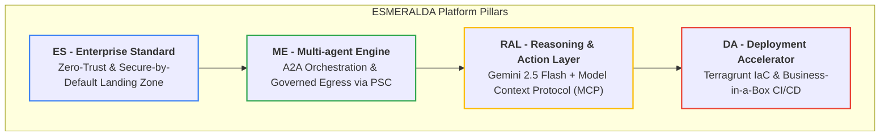
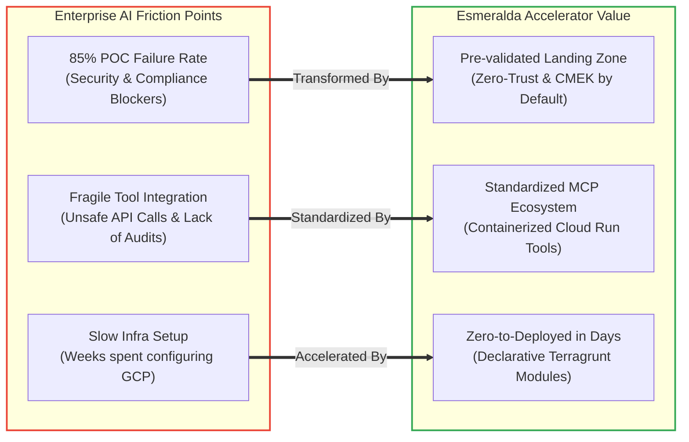
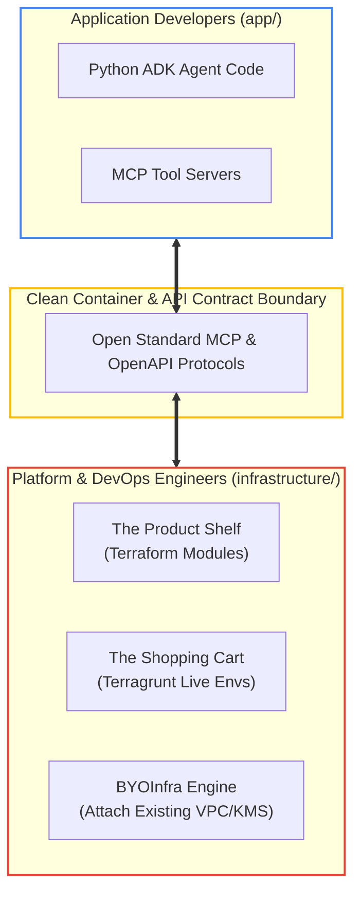

# Slide 1: Executive Overview & Core Pillars

## What is ESMERALDA?
An opinionated, commercial-grade blueprint on Google Cloud designed to accelerate the path to production for AI Agents.

---

### The 4 Pillars of ESMERALDA

---

### The Enterprise AI Challenge vs. Esmeralda Solution

---

### Core Philosophy: Decoupled Application & Infrastructure

