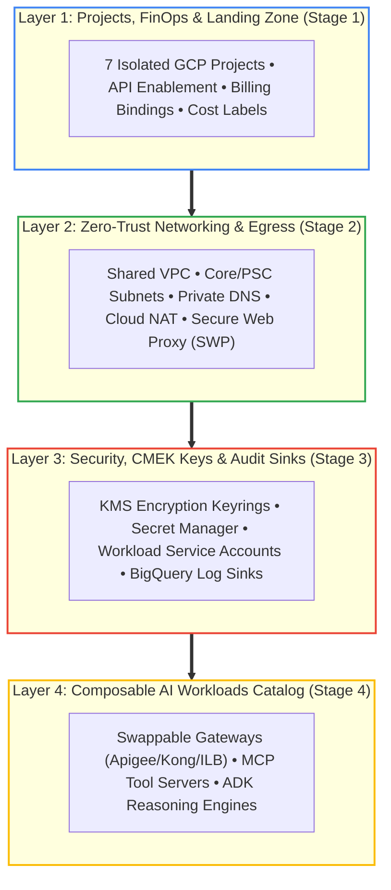
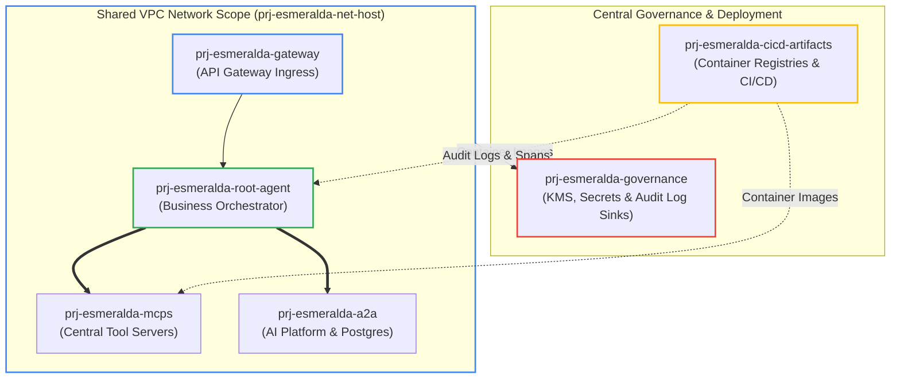
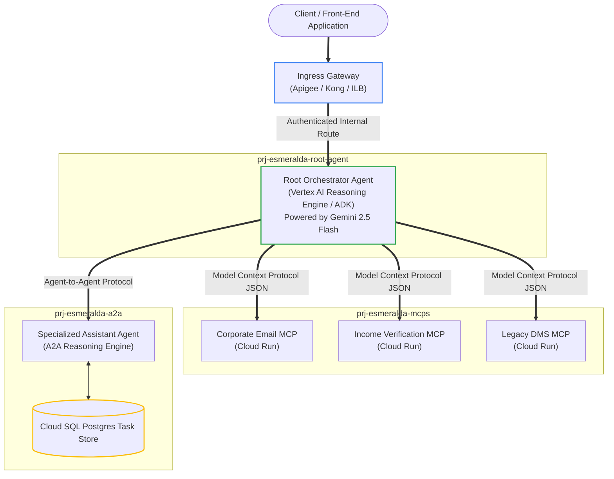

# Slide 2: The Reference Agentic Architecture

## 4-Layer Enterprise Modular Architecture Stack

---

## Multi-Project Topology & Governance (7 Isolated GCP Projects)

---

## Runtime Orchestration: Multi-Agent Engine & MCP Ecosystem

