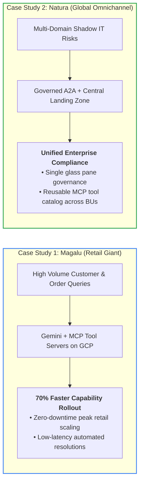
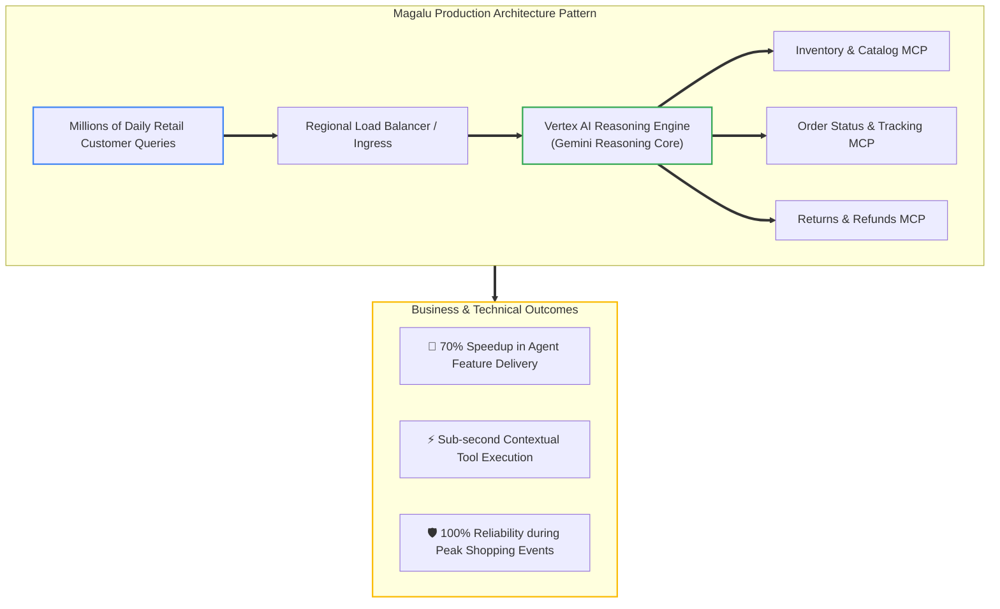
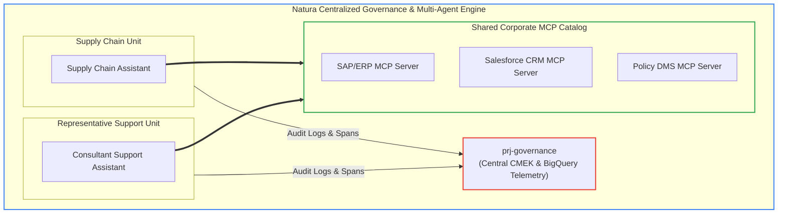

# Slide 3: Proven Success — Enterprise Case Studies

## Enterprise Validation: Proven at Scale with Magalu & Natura

---

### Case Study Breakdown 1: Magalu (High-Scale Retail Orchestration)

---

### Case Study Breakdown 2: Natura (Multi-Domain Governance & Reusability)

