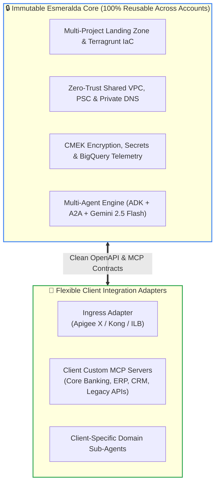
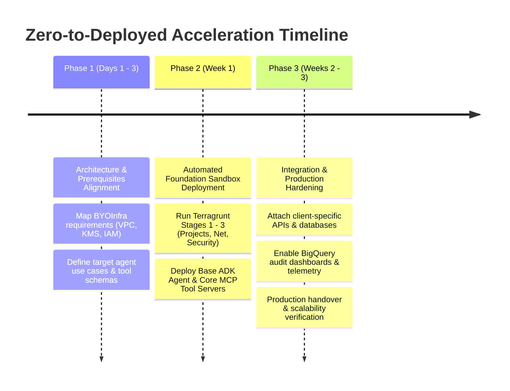

# Slide 4: Adoption Path & Value Delivery

## Strategic Reusability: 100% Account-Agnostic Core

---

## The "Zero-to-Deployed" Acceleration Roadmap (3 Weeks)

---

## Phased Execution & Value Delivery Lifecycle

```mermaid
flowchart LR
    subgraph Step1["Step 1: Align & Map"]
        A1["Identify Agent Use Cases"]
        A2["Map BYOInfra Settings"]
    end

    subgraph Step2["Step 2: Deploy Platform"]
        B1["Run Terragrunt Stages 1-4"]
        B2["Spin Up Base ADK Agent"]
    end

    subgraph Step3["Step 3: Plug & Harden"]
        C1["Connect Custom MCP Tools"]
        C2["Enable Audit Telemetry"]
    end

    subgraph Step4["Step 4: Scale Value"]
        D1["Production Rollout"]
        D2["Add Domain Sub-Agents"]
    end

    Step1 ==> Step2 ==> Step3 ==> Step4

    style Step1 stroke:#4285F4,stroke-width:2px
    style Step2 stroke:#34A853,stroke-width:2px
    style Step3 stroke:#FBBC05,stroke-width:2px
    style Step4 stroke:#EA4335,stroke-width:2px
```

