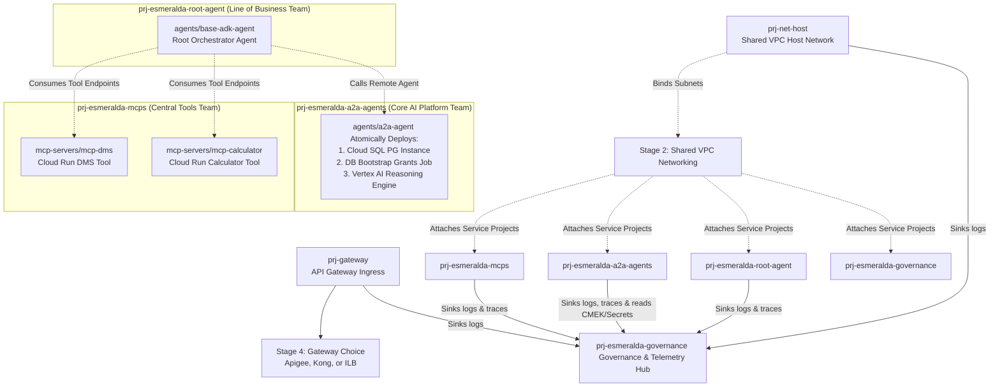
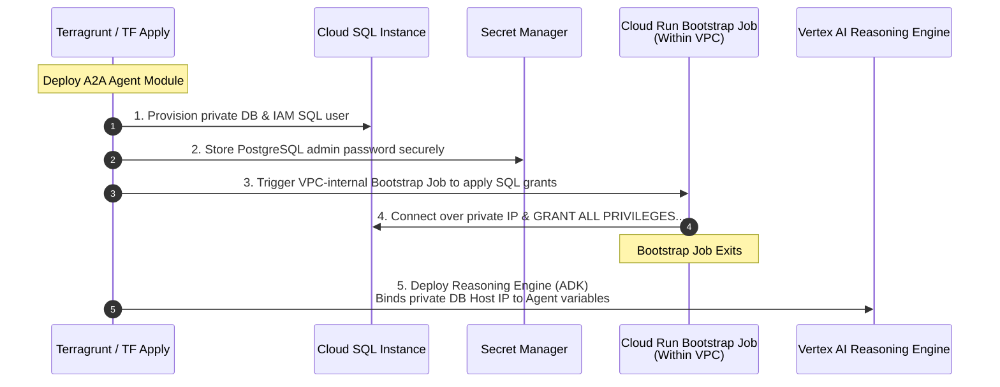
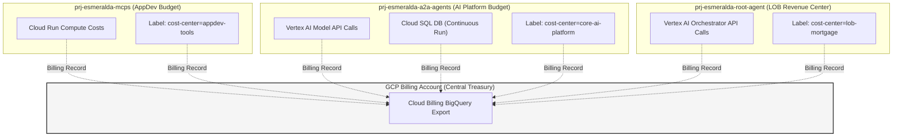
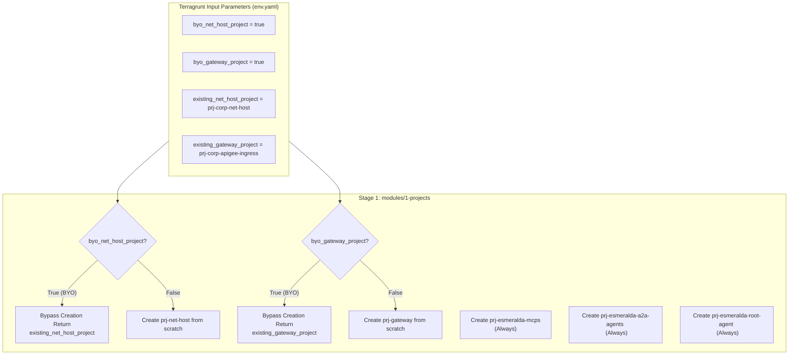
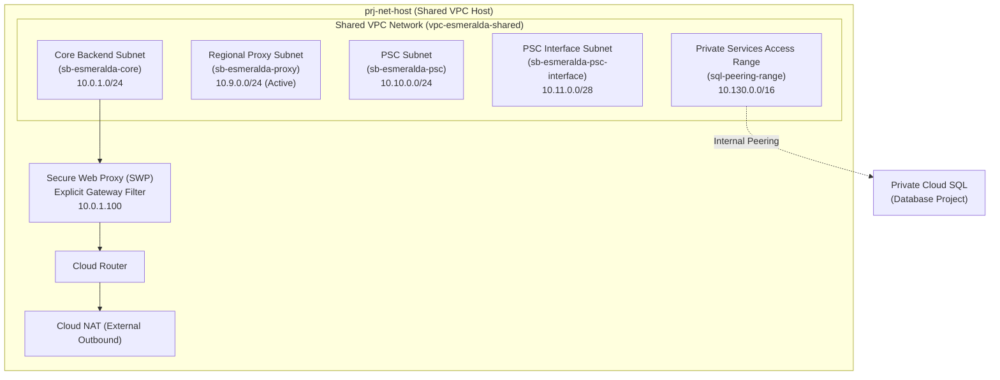
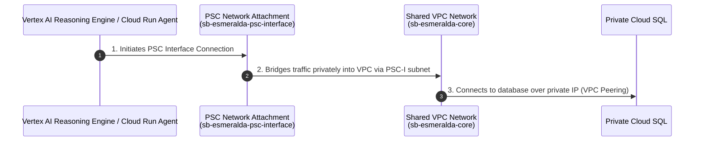
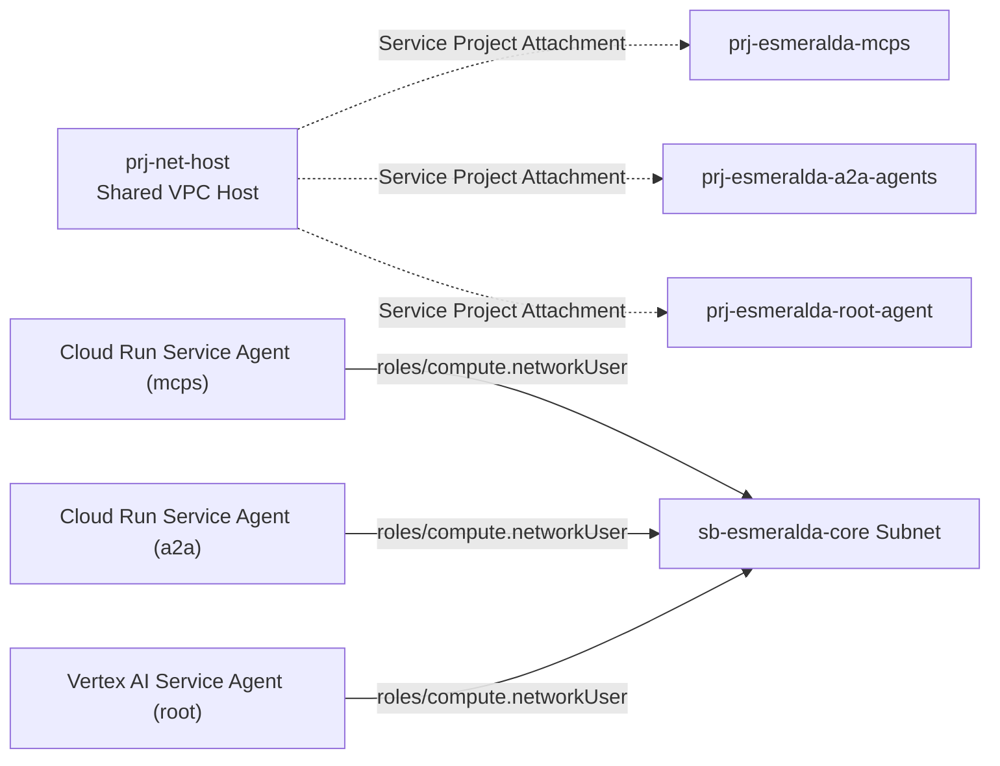
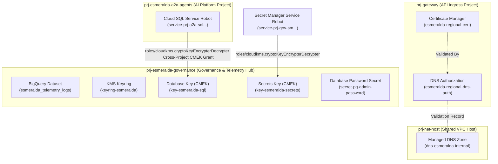

# Esmeralda FAST-Aligned Composable Platform Design

This blueprint establishes a highly elegant, **FAST-aligned platform architecture** for Esmeralda. It collapses granular, rigid developer stages into 3 base foundations and introduces a composable, multi-project **Stage 4: Workloads** designed like a "product catalog". 

Under this design, your `/modules` folder is the **Product Shelf**, your `env.yaml` is your **Shopping Cart**, and individual components (such as specific MCP tools, the orchestrator agent, and the A2A agent containing its own dedicated taskstore database) are deployed and updated completely in isolation across **six distinct GCP Projects**, simulating a real-world enterprise multi-tenant landing zone.

---

## 1. The FAST-Aligned Platform Layout

We organize Esmeralda's lifecycle stages to map directly to Google Cloud's enterprise landing zone standards. We divide our workloads across **four independent service projects** representing distinct engineering and business teams, connected back to a central Shared VPC, alongside a dedicated central governance and telemetry hub project:



### The Architecture Design Philosophy:
*   **The Shared VPC Project (`prj-net-host`)**: Managed by NetOps. Owns the core routing, private DNS zones, and Private Service Connect (PSC).
*   **The Ingress Project (`prj-gateway`)**: Managed by PlatformOps. Hosts the public gateway endpoint.
*   **The Central Tools Project (`prj-esmeralda-mcps`)**: Managed by the AppDev Team. Deploys the reusable corporate tool API servers.
*   **The AI Platform Project (`prj-esmeralda-a2a-agents`)**: Managed by the Core AI Team. Hosts cross-company re-usable assistant agents and their SQL task stores.
*   **The LOB App Project (`prj-esmeralda-root-agent`)**: Managed by a specific business unit. Owns the customer-facing user reasoning engine, which orchestrates calls to the other projects.
*   **The Governance & Telemetry Hub Project (`prj-esmeralda-governance`)**: Managed by SecOps / PlatformOps. Centralizes security elements (KMS Keyrings, Secrets, Certificate Manager certificates) and telemetry components (Log Analytics buckets, Cloud Trace datasets, BigQuery tables), completely separating security/observability governance from core workloads.

---

## 2. Updated Terragrunt Repository Structure

```text
infrastructure/
├── modules/                                 # PURE, REUSABLE TERRAFORM MODULES
│   ├── 1-projects/                          # Seeds projects & enables APIs (Stage 1)
│   ├── 2-networking/                        # Provisions Shared VPC, subnets, DNS (Stage 2)
│   ├── 3-security/                          # Provisions Secret Manager, KMS, Log Sinks (Stage 3)
│   │
│   └── 4-workloads/                         # THE PRODUCT CATALOG SHELF (Stage 4)
│       ├── gateways/                        # --- GATEWAYS SHELF ---
│       │   ├── apigee/                      # Product A: Apigee X Enterprise Gateway
│       │   ├── kong/                        # Product B: Lightweight Kong on Cloud Run
│       │   └── ilb/                         # Product C: Direct Internal Load Balancer
│       │
│       ├── mcp-servers/                     # --- MCP TOOLS SHELF ---
│       │   ├── mcp-dms/                     # DMS Document Tool Service
│       │   └── mcp-calculator/              # Financial Calculator Tool Service
│       │
│       └── agents/                          # --- AI AGENTS SHELF ---
│           ├── base-adk-agent/              # Root Orchestrator (Reasoning Engine Only)
│           └── a2a-agent/                   # Mortgage Assistant (Atomic: SQL + Bootstrap + Agent)
│
└── live/                                    # LIVE INFRASTRUCTURE ENVIRONMENT CONFIG
    ├── terragrunt.hcl                       # Root config: remote state, global provider blocks
    ├── dev/                                 # DEVELOPMENT ENVIRONMENT
    │   ├── env.yaml                         # Dev environment vars (billing_id, region, prefix)
    │   │
    │   ├── stage-1-projects/
    │   │   └── terragrunt.hcl               # Deploys up to 6 Projects & APIs
    │   ├── stage-2-networking/
    │   │   └── terragrunt.hcl               # Deploys VPC, NAT, Firewalls, Private DNS
    │   ├── stage-3-security/
    │   │   └── terragrunt.hcl               # Deploys KMS, Secrets, Sinks across projects
    │   │
    │   └── stage-4-workloads/               # COMPOSABLE ASSEMBLY DIRECTORY
    │       ├── gateway/
    │       │   └── terragrunt.hcl           # Swappable: Deploys chosen Gateway
    │       ├── mcp-servers/
    │       │   ├── mcp-dms/
    │       │   │   └── terragrunt.hcl       # Deploys DMS to prj-esmeralda-mcps
    │       │   └── mcp-calculator/
    │       │       └── terragrunt.hcl       # Deploys Calculator to prj-esmeralda-mcps
    │       └── agents/
    │           ├── a2a-agent/
    │           │   └── terragrunt.hcl       # Deploys private SQL & ADK Agent to prj-esmeralda-a2a-agents
    │           └── base-adk-agent/
    │               └── terragrunt.hcl       # Deploys Orchestrator to prj-esmeralda-root-agent
```

---

## 3. Updated Component Migration Mapping

| Monolithic Component | Target Terragrunt Stage | Target GCP Project | Dependency Inputs |
| :--- | :--- | :--- | :--- |
| `module.foundation` (Core APIs) | **`stage-1-projects`** | *Pre-workloads* | `billing_account`, `byo_net_host_project`, `byo_gateway_project`, `byo_governance_project` |
| `module.networking` | **`stage-2-networking`** | `prj-net-host` | `net_host_project_id` (from stage-1), `governance_project_id` (from stage-1) |
| IAM, SAs & Encryption Keys | **`stage-3-security`** | Split across all | Project IDs from Stage 1 |
| Ingress / Load Balancer | **`stage-4-workloads/gateway`** | `prj-gateway` | `gateway_project_id` (stage-1), `network_id` (stage-2) |
| DMS MCP Service | **`stage-4-workloads/mcp-servers/mcp-dms`** | `prj-esmeralda-mcps` | `mcps_project_id` (stage-1), `subnet_id` (stage-2) |
| Calculator MCP Service | **`stage-4-workloads/mcp-servers/mcp-calculator`** | `prj-esmeralda-mcps` | `mcps_project_id` (stage-1), `subnet_id` (stage-2) |
| Cloud SQL & A2A Agent | **`stage-4-workloads/agents/a2a-agent`** | `prj-esmeralda-a2a-agents` | `a2a_project_id` (stage-1), `vpc_id` (stage-2), `subnet_id` (stage-2) |
| Root / Orchestrator Agent | **`stage-4-workloads/agents/base-adk-agent`** | `prj-esmeralda-root-agent` | `root_project_id` (stage-1), `a2a_agent_endpoint_url` (from `a2a-agent`), tool endpoints |
| Security, Governance, & Telemetry | **`stage-3-security`** | `prj-esmeralda-governance` | `governance_project_id` (stage-1), sinks across all 6 projects |

---

## 4. Workloads Assembly Configurations

These HCL declarations demonstrate how the micro-services are configured and chained in your live environment:

### A. The A2A Agent (`live/dev/stage-4-workloads/agents/a2a-agent/terragrunt.hcl`)
```hcl
# infrastructure/live/dev/stage-4-workloads/agents/a2a-agent/terragrunt.hcl
include "root" {
  path = find_in_parent_folders()
}

terraform {
  source = "../../../../../modules//4-workloads/agents/a2a-agent"
}

dependency "projects" {
  config_path = "../../../stage-1-projects"
}

dependency "networking" {
  config_path = "../../../stage-2-networking"
}

dependency "security" {
  config_path = "../../../stage-3-security"
}

locals {
  env_vars = read_terragrunt_config(find_in_parent_folders("env.yaml"))
}

inputs = {
  # Dynamically deploys into the isolated A2A agent platform project!
  project_id            = dependency.projects.outputs.a2a_project_id
  region                = "us-central1"
  vpc_id                = dependency.networking.outputs.network_id
  subnet_id             = dependency.networking.outputs.subnet_id
  agent_service_account = dependency.security.outputs.a2a_agent_sa_email

  database_product      = local.env_vars.locals.database_product
  database_name         = "a2a_tasks"
}
```

### B. The Root Orchestrator (`live/dev/stage-4-workloads/agents/base-adk-agent/terragrunt.hcl`)
```hcl
# infrastructure/live/dev/stage-4-workloads/agents/base-adk-agent/terragrunt.hcl
include "root" {
  path = find_in_parent_folders()
}

terraform {
  source = "../../../../../modules//4-workloads/agents/base-adk-agent"
}

dependency "projects" {
  config_path = "../../../stage-1-projects"
}

dependency "security" {
  config_path = "../../../stage-3-security"
}

dependency "mcp_dms" {
  config_path = "../../mcp-servers/mcp-dms"
}

dependency "mcp_calc" {
  config_path = "../../mcp-servers/mcp-calculator"
}

dependency "a2a_agent" {
  config_path = "../a2a-agent"
}

inputs = {
  # Deploys into the isolated customer-facing Line of Business (LOB) project!
  project_id            = dependency.projects.outputs.root_project_id
  region                = "us-central1"
  agent_service_account = dependency.security.outputs.root_agent_sa_email

  # Inject downstream endpoints
  mcp_dms_url           = dependency.mcp_dms.outputs.mcp_dms_url
  mcp_calc_url          = dependency.mcp_calc.outputs.mcp_calc_url
  a2a_agent_url         = dependency.a2a_agent.outputs.a2a_agent_endpoint_url
}
```

---

## 5. The Integrated A2A Agent & Cloud SQL Lifecycle

By packaging Cloud SQL, bootstrapping, and the Vertex AI Reasoning engine inside the `modules/4-workloads/agents/a2a-agent` pure module, we obtain an atomic, self-contained workload.



---

## 6. Greenfield vs. Brownfield (BYOInfra) Toggle Design

To allow seamless deployment inside enterprise client environments with pre-existing resources, the architecture implements the **BYOInfra Pattern** natively using Terragrunt's skip parameters and input-fallbacks:

### A. The Client's Environment Parameters (`live/client-prod/env.yaml`)
The client declares their pre-existing resources and toggles the dynamic skip flags:

```yaml
# infrastructure/live/client-prod/env.yaml
locals {
  environment         = "prod"
  project_prefix      = "client"
  region              = "us-central1"

  # 🔌 BYO INFRA TOGGLES: Client already has host network and gateway projects!
  byo_net_host_project = true
  byo_gateway_project  = true
  byo_governance_project = false
  byo_networking       = true
  byo_apigee           = true

  # 1. Existing project links
  existing_net_host_project = "prj-client-shared-net-host"
  existing_governance_project = ""
  existing_gateway_project  = "prj-client-apigee-ingress"
  existing_vpc_id           = "projects/prj-client-shared-net-host/global/networks/vpc-prod-shared"
  existing_subnet_id        = "projects/prj-client-shared-net-host/regions/us-central1/subnetworks/sb-prod-gke"

  # 🛒 THE PRODUCTS THEY WANT ESMERALDA TO CREATE FROM SCRATCH:
  gateway_product     = "apigee" # Point to existing Apigee gateway settings
  database_product    = "cloud-sql"
}
```

### B. Dynamically Skipping Stage 2 (`live/client-prod/stage-2-networking/terragrunt.hcl`)
The networking configuration skips compilation and returns instantly if `byo_networking` is configured:

```hcl
# infrastructure/live/client-prod/stage-2-networking/terragrunt.hcl
include "root" {
  path = find_in_parent_folders()
}

terraform {
  source = "../../../modules//2-networking"
}

locals {
  env_vars = read_terragrunt_config(find_in_parent_folders("env.yaml"))
}

# Skips execution entirely if networking is pre-configured
skip = local.env_vars.locals.byo_networking
```

### C. Downstream Fallback Lookup (`live/client-prod/stage-4-workloads/agents/a2a-agent/terragrunt.hcl`)
Downstream persistence components safely switch their inputs between Stage 2 outputs or `env.yaml` static resource IDs based on the active flag:

```hcl
# infrastructure/live/client-prod/stage-4-workloads/agents/a2a-agent/terragrunt.hcl
include "root" {
  path = find_in_parent_folders()
}

terraform {
  source = "../../../../../modules//4-workloads/agents/a2a-agent"
}

locals {
  env_vars       = read_terragrunt_config(find_in_parent_folders("env.yaml"))
  byo_networking = lookup(local.env_vars.locals, "byo_networking", false)
}

dependency "networking" {
  config_path = "../../../stage-2-networking"
  
  # Avoid running output lookups on skipped modules
  skip_outputs = local.byo_networking
  
  # Satisfy parser during evaluation with mock variables
  mock_outputs = {
    network_id = local.env_vars.locals.existing_vpc_id
    subnet_id  = local.env_vars.locals.existing_subnet_id
  }
}

inputs = {
  # Dynamically fetches workload project IDs provisioned dynamically by Esmeralda's Stage 1!
  project_id            = dependency.projects.outputs.a2a_project_id
  region                = local.env_vars.locals.region
  
  # Dynamic Fallback: Use client's existing VPC if BYO is active, else use dependency outputs
  vpc_id                = local.byo_networking ? local.env_vars.locals.existing_vpc_id  : dependency.networking.outputs.network_id
  subnet_id             = local.byo_networking ? local.env_vars.locals.existing_subnet_id : dependency.networking.outputs.subnet_id
  
  database_name         = "a2a_tasks"
  enable_iam_user       = true
}
```

---

## 7. Detailed Module Implementation Specifications

This section defines the precise layout, HCL blueprints, and resources that must be built inside each of the pure reusable directories under `infrastructure/modules/`.

### 7.1 Stage 1: `modules/1-projects/` Specification

This module manages the creation of isolated GCP projects, links them to enterprise billing, activates necessary service APIs, and establishes the foundational service account mappings. Under this design, the module handles **up to six distinct projects**, reflecting a standard enterprise landing zone.

#### A. Enterprise Team & Project Simulation Mapping
To simulate a real-world enterprise multi-tenant landing zone, we split our architecture across six projects, allowing separate business, engineering, and observability units to operate independently:

| Simulated Team | GCP Project ID | Business & Operational Role | Primary Resources Hosted |
| :--- | :--- | :--- | :--- |
| **Network Ops (NetOps)** | `prj-net-host` | Owns the central networking backbones, Shared VPC, Private Service Connect (PSC), and firewall policies. | Shared VPC, Subnets, Cloud NAT, Cloud DNS, PSC Endpoints. |
| **Platform Ops (PlatformOps)** | `prj-gateway` | Manages the public-facing application ingress, corporate domain name registration, and corporate API Gateways. | Apigee X, Kong Gateway on Cloud Run, external HTTPS Load Balancers. |
| **AppDev Tools Team** | `prj-esmeralda-mcps` | Creates, maintains, and packages reusable Model Context Protocol (MCP) tool servers for the whole company. | Cloud Run (DMS Server, Calculator Server), Artifact Registry. |
| **Core AI Platform Team** | `prj-esmeralda-a2a-agents` | Develops reusable, cross-company Assistant-to-Assistant (A2A) agents, handling centralized business domain reasoning. | Cloud SQL PostgreSQL, Cloud Run Database Bootstrapping Job, Vertex AI Reasoning Engine (A2A). |
| **Line-of-Business Team (LOB)** | `prj-esmeralda-root-agent` | Develops the final client-facing user reasoning engine, which acts as the frontend orchestrator and orchestrates upstream agents. | Vertex AI Reasoning Engine (Root), client-facing IAM roles, GCS Buckets. |
| **Security & Governance Hub** | `prj-esmeralda-governance` | Consolidates central security/governance (KMS keys, secrets, certs) and central telemetry/observability (BigQuery dataset, trace views, log sinks), establishing strict Separation of Concerns (SoC) between Platform Governance and Workload Runtimes. | KMS Keyrings, secrets, Certificate Manager certificates, BigQuery Audit Sinks, and log buckets. |

---

#### B. The FinOps Challenge: Cost Attribution & Billing Isolation
Deploying agentic pipelines across multiple distinct GCP projects solves major enterprise pain points but introduces key FinOps and tracking challenges. Our multi-project structure solves these as follows:



##### 1. Vertex AI Model API Billing Attribution
When multiple teams call Gemini via Vertex AI, a monolithic project makes it impossible to distinguish which team consumed how many input/output tokens. By splitting workloads:
*   Calls to Gemini made by the Root Orchestrator are charged directly to `prj-esmeralda-root-agent` (LOB Budget).
*   Calls to Gemini made by the A2A Agent during sub-task execution are charged to `prj-esmeralda-a2a-agents` (Core AI Budget).
*   *Implementation*: Resource labels (`env=dev`, `cost-center=...`, `team=...`) are systematically applied at the project level and resource level, flowing directly into the **GCP Billing Export to BigQuery** for clean dashboards.

##### 2. Persistent vs. Ephemeral Resource Cost Allocation
*   **Cloud SQL Instance**: Run as a shared state machine for the A2A agent, running 24/7. This represents a fixed cost that is isolated inside the Core AI Platform budget (`prj-esmeralda-a2a-agents`) and is not subsidized by the LOB team.
*   **Cloud Run (MCP Tool Servers)**: Run serverless, scaling to zero when there are no requests. This ensures that the AppDev team only incurs compute costs when tools are actively invoked, preventing resource wasting.

##### 3. Cross-Project Network Transit Cost Optimization
Data transferring across VPC subnets and project boundaries can incur inter-zone egress fees.
*   To address this, all projects are systematically locked to a single region (`us-central1`) and use Shared VPC Private IP communication, eliminating public internet NAT gateway egress charges for inter-agent communication.

---

#### C. The BYOInfra (Brownfield) Integration Architecture
In real enterprise deployments, customers will **never** allow a tool to provision a new Shared VPC Host Project (`net_host`) or change their centralized Gateway Ingress Project (`gateway`). 

Esmeralda elegantly handles this by using a dynamic **BYOInfra Fallback Architecture**:



*   **Conditional Project Seed**: In `main.tf`, `google_project.net_host` and `google_project.gateway` use a `count` conditional (`count = var.byo_net_host_project ? 0 : 1`).
*   **API Enablement Isolation**: Service API enablement is also conditional. If `byo_net_host_project` is true, Esmeralda skips enabling APIs in that project to prevent permission conflicts with corporate security policies (which restrict IAM permissions to create/enable APIs on shared host projects).
*   **Dynamic Outputs Mapping**: Regardless of whether a project is created from scratch or provided as pre-existing, `outputs.tf` resolves the correct active project IDs, ensuring downstream modules (networking, security, and workloads) consume them transparently.

---

#### D. File Inventory & Blueprints

```text
infrastructure/modules/1-projects/
├── versions.tf          # Mandates HashiCorp Google provider bounds (>= 5.0)
├── variables.tf         # Inputs for billing, organization folders, prefix, and BYO parameters
├── main.tf              # Implements projects, API enablement, billing bindings, and labels
└── outputs.tf           # Exposes project IDs & numbers to downstream stages
```

##### 1. Versions Specification (`versions.tf`)
```hcl
terraform {
  required_version = ">= 1.5.0"
  required_providers {
    google = {
      source  = "hashicorp/google"
      version = ">= 5.0.0, < 6.0.0"
    }
    random = {
      source  = "hashicorp/random"
      version = ">= 3.5.0"
    }
  }
}
```

##### 2. Variables Specification (`variables.tf`)
```hcl
# infrastructure/modules/1-projects/variables.tf

variable "billing_account" {
  description = "The enterprise billing account ID to bind to all created projects"
  type        = string
}

variable "folder_id" {
  description = "The folder ID under which to create the projects. If omitted, projects are created at organization root."
  type        = string
  default     = ""
}

variable "project_prefix" {
  description = "A prefix string appended to the start of all projects to guarantee uniqueness"
  type        = string
  default     = "esmeralda"
}

# BYO Project Toggles
variable "byo_net_host_project" {
  description = "Set to true if the customer is bringing a pre-existing Shared VPC Host Project"
  type        = bool
  default     = false
}

variable "byo_gateway_project" {
  description = "Set to true if the customer is bringing a pre-existing API Gateway/Ingress Project"
  type        = bool
  default     = false
}

variable "byo_governance_project" {
  description = "Set to true if the customer is bringing a pre-existing governance/security/telemetry project"
  type        = bool
  default     = false
}

variable "existing_net_host_project" {
  description = "The project ID of the pre-existing Shared VPC Host Project. Required if byo_net_host_project is true."
  type        = string
  default     = ""
}

variable "existing_gateway_project" {
  description = "The project ID of the pre-existing API Gateway/Ingress Project. Required if byo_gateway_project is true."
  type        = string
  default     = ""
}

variable "existing_governance_project" {
  description = "The project ID of the pre-existing governance/security/telemetry project. Required if byo_governance_project is true."
  type        = string
  default     = ""
}

# Cost Allocation Labels
variable "environment" {
  description = "The environment classification label (e.g., dev, qa, prod)"
  type        = string
  default     = "dev"
}
```

##### 3. Implementation Logic (`main.tf`)
```hcl
# infrastructure/modules/1-projects/main.tf

resource "random_id" "project_suffix" {
  byte_length = 2
}

locals {
  suffix = random_id.project_suffix.hex
  
  # Resolve Project IDs dynamically: Use existing ID if BYO, otherwise generate unique name
  net_host_id   = var.byo_net_host_project ? var.existing_net_host_project : "${var.project_prefix}-net-host-${local.suffix}"
  gateway_id    = var.byo_gateway_project  ? var.existing_gateway_project  : "${var.project_prefix}-gateway-${local.suffix}"
  governance_id = var.byo_governance_project ? var.existing_governance_project : "${var.project_prefix}-governance-${local.suffix}"
  mcps_id       = "${var.project_prefix}-mcps-${local.suffix}"
  a2a_id        = "${var.project_prefix}-a2a-${local.suffix}"
  root_agent_id = "${var.project_prefix}-root-agent-${local.suffix}"

  # Systematic project-specific labeling mapping for FinOps and Cost Center attribution
  common_labels = {
    "env"        = var.environment
    "managed-by" = "terragrunt-esmeralda"
  }

  net_host_apis = [
    "compute.googleapis.com",
    "dns.googleapis.com",
    "servicenetworking.googleapis.com"
  ]

  gateway_apis = [
    "compute.googleapis.com",
    "apigee.googleapis.com",
    "certificatemanager.googleapis.com"
  ]

  mcps_apis = [
    "compute.googleapis.com",
    "run.googleapis.com",
    "artifactregistry.googleapis.com",
    "secretmanager.googleapis.com"
  ]

  a2a_apis = [
    "compute.googleapis.com",
    "aiplatform.googleapis.com",
    "sqladmin.googleapis.com",
    "storage.googleapis.com",
    "secretmanager.googleapis.com",
    "run.googleapis.com", # Required to trigger the private VPC bootstrapping Cloud Run Job!
    "artifactregistry.googleapis.com"
  ]

  root_agent_apis = [
    "compute.googleapis.com",
    "aiplatform.googleapis.com",
    "storage.googleapis.com"
  ]

  governance_apis = [
    "bigquery.googleapis.com",
    "logging.googleapis.com",
    "clouderrorreporting.googleapis.com",
    "cloudtrace.googleapis.com",
    "monitoring.googleapis.com",
    "cloudkms.googleapis.com",
    "secretmanager.googleapis.com"
  ]
}

# ====================================================================
# 1. GCP PROJECTS CREATION
# ====================================================================

# Provisioned conditionally: Only created if the customer does not BYO
resource "google_project" "net_host" {
  count           = var.byo_net_host_project ? 0 : 1
  name            = "Esmeralda Shared VPC Host"
  project_id      = local.net_host_id
  folder_id       = var.folder_id != "" ? var.folder_id : null
  billing_account = var.billing_account
  auto_create_network = false

  labels = merge(local.common_labels, {
    "cost-center" = "networking-infrastructure"
    "team"        = "netops"
  })
}

# Provisioned conditionally: Only created if the customer does not BYO
resource "google_project" "gateway" {
  count           = var.byo_gateway_project ? 0 : 1
  name            = "Esmeralda Ingress Gateway"
  project_id      = local.gateway_id
  folder_id       = var.folder_id != "" ? var.folder_id : null
  billing_account = var.billing_account
  auto_create_network = false

  labels = merge(local.common_labels, {
    "cost-center" = "ingress-gateways"
    "team"        = "platformops"
  })
}

# Central Tools Project: ALWAYS created by Esmeralda from scratch
resource "google_project" "mcps" {
  name            = "Esmeralda MCP Server Tools"
  project_id      = local.mcps_id
  folder_id       = var.folder_id != "" ? var.folder_id : null
  billing_account = var.billing_account
  auto_create_network = false

  labels = merge(local.common_labels, {
    "cost-center" = "central-developer-tools"
    "team"        = "appdev-tools"
  })
}

# Core AI Platform Project: ALWAYS created by Esmeralda from scratch
resource "google_project" "a2a" {
  name            = "Esmeralda A2A Core Agents"
  project_id      = local.a2a_id
  folder_id       = var.folder_id != "" ? var.folder_id : null
  billing_account = var.billing_account
  auto_create_network = false

  labels = merge(local.common_labels, {
    "cost-center" = "enterprise-ai-platform"
    "team"        = "core-ai-agents"
  })
}

# Line-of-Business User Facing Root Agent Project: ALWAYS created from scratch
resource "google_project" "root_agent" {
  name            = "Esmeralda LOB Root Agent"
  project_id      = local.root_agent_id
  folder_id       = var.folder_id != "" ? var.folder_id : null
  billing_account = var.billing_account
  auto_create_network = false

  labels = merge(local.common_labels, {
    "cost-center" = "lob-business-solutions"
    "team"        = "lob-root-agent"
  })
}

# Governance and Telemetry Hub Project: Conditional creation
resource "google_project" "governance" {
  count           = var.byo_governance_project ? 0 : 1
  name            = "Esmeralda Central Governance & Telemetry Hub"
  project_id      = local.governance_id
  folder_id       = var.folder_id != "" ? var.folder_id : null
  billing_account = var.billing_account
  auto_create_network = false

  labels = merge(local.common_labels, {
    "cost-center" = "central-governance-and-telemetry"
    "team"        = "security-and-platformops"
  })
}

# ====================================================================
# 2. GCP SERVICE APIS ENABLEMENT
# ====================================================================

# Enable APIs on Shared VPC project only if Esmeralda created it
resource "google_project_service" "net_host" {
  for_each                   = var.byo_net_host_project ? [] : toset(local.net_host_apis)
  project                    = local.net_host_id
  service                    = each.key
  disable_on_destroy         = false
  disable_dependent_services = false

  depends_on = [google_project.net_host]
}

# Enable APIs on Ingress Gateway project only if Esmeralda created it
resource "google_project_service" "gateway" {
  for_each                   = var.byo_gateway_project ? [] : toset(local.gateway_apis)
  project                    = local.gateway_id
  service                    = each.key
  disable_on_destroy         = false
  disable_dependent_services = false

  depends_on = [google_project.gateway]
}

# Enable Central Tools APIs
resource "google_project_service" "mcps" {
  for_each                   = toset(local.mcps_apis)
  project                    = local.mcps_id
  service                    = each.key
  disable_on_destroy         = false
  disable_dependent_services = false

  depends_on = [google_project.mcps]
}

# Enable Core AI Platform APIs
resource "google_project_service" "a2a" {
  for_each                   = toset(local.a2a_apis)
  project                    = local.a2a_id
  service                    = each.key
  disable_on_destroy         = false
  disable_dependent_services = false

  depends_on = [google_project.a2a]
}

# Enable Line-of-Business APIs
resource "google_project_service" "root_agent" {
  for_each                   = toset(local.root_agent_apis)
  project                    = local.root_agent_id
  service                    = each.key
  disable_on_destroy         = false
  disable_dependent_services = false

  depends_on = [google_project.root_agent]
}

# Enable Governance and Telemetry APIs only if created by Esmeralda
resource "google_project_service" "governance" {
  for_each                   = var.byo_governance_project ? [] : toset(local.governance_apis)
  project                    = local.governance_id
  service                    = each.key
  disable_on_destroy         = false
  disable_dependent_services = false

  depends_on = [google_project.governance]
}

# ====================================================================
# 3. OUTPUTS SPECIFICATION
# ====================================================================

output "net_host_project_id" {
  description = "The active project ID hosting the Shared VPC network"
  value       = local.net_host_id
}

output "gateway_project_id" {
  description = "The active project ID hosting the API Ingress Gateway"
  value       = local.gateway_id
}

output "mcps_project_id" {
  description = "The project ID allocated for corporate MCP servers"
  value       = local.mcps_id
}

output "a2a_project_id" {
  description = "The project ID allocated for Core AI Platform and A2A agents"
  value       = local.a2a_id
}

output "root_project_id" {
  description = "The project ID allocated for client-facing LOB Root agent"
  value       = local.root_agent_id
}

output "governance_project_id" {
  description = "The active project ID hosting central governance, encryption, secrets, and telemetry"
  value       = local.governance_id
}
```
*(With this, any client's NetOps/PlatformOps teams can hand over pre-configured net_host and gateway projects, and Esmeralda will automatically provision and deploy the isolated workload projects and attach them securely to their Shared VPC.)*

### 7.2 Stage 2: `modules/2-networking/` Specification

This module establishes the Shared VPC network, configures the internal subnet routing topologies, sets up Private Service Connect (PSC) Network Attachments, deploys Google Cloud's Secure Web Proxy (SWP) for audited internet egress, and handles corporate DNS zones. It is designed to run on the Shared VPC Host Project (`prj-net-host`), but can be toggled to a pure-attachment mode for pre-existing (brownfield) customer networks.

#### A. Network Subnet and Routing Architecture
In Greenfield mode, the module provisions a comprehensive hub network with dedicated subnets for core workloads, proxy-only routing, PSC endpoints, serverless integration, and database peering:



##### 1. Subnet Classifications
*   **Core Backend Subnet (`sb-esmeralda-core`)**: Host IP range `10.0.1.0/24`. All primary internal workloads (Cloud Run instances, VPC connectors, and private VMs) operate inside this range. Private Google Access is enabled to permit calling Vertex AI and Secret Manager without traversing the public internet.
*   **Regional Envoy Proxy Subnet (`sb-esmeralda-proxy`)**: Host IP range `10.9.0.0/24`. Required by regional internal Application Load Balancers or secure regional gateways (Apigee or Kong). Configured with purpose `REGIONAL_MANAGED_PROXY` and role `ACTIVE`.
*   **PSC Endpoint Subnet (`sb-esmeralda-psc`)**: Host IP range `10.10.0.0/24` reserved for private Google services PSC endpoints.
*   **PSC Interface Subnet (`sb-esmeralda-psc-interface`)**: Host IP range `10.11.0.0/28`. A highly specific regular subnet utilized solely to bind Google-managed Serverless runtimes.
*   **Private Services Access (`sql-peering-range`)**: Allocated block `10.130.0.0/16` reserved for Serverless Cloud SQL Private Services peering connections.

---

#### B. Serverless Bridges: Private Service Connect (PSC) Network Attachment
Because Vertex AI Reasoning Engines and serverless Cloud Run agents reside natively in Google-managed tenant projects, they do not have direct access to resources inside custom customer VPCs. Esmeralda bridges this boundary using a **PSC Network Attachment**:



1.  **Subnet Isolation**: A dedicated regular subnetwork (`sb-esmeralda-psc-interface`) is configured.
2.  **Compute Network Attachment**: The resource `google_compute_network_attachment` references the PSC-I subnet and is set to `ACCEPT_AUTOMATIC`. This creates a PSC interface point. Serverless agents use this resource link to establish incoming tunnels directly into the VPC.
3.  **Firewall Protection**: Ingress firewalls are restricted to only allow ports `22` (SSH for debugging), `443` (HTTPS for APIs), and `ICMP` originating from the PSC Interface subnet (`10.11.0.0/28`).

---

#### C. Egress Auditing & Filtering: Secure Web Proxy (SWP)
To comply with enterprise security requirements, reasoning engines and corporate AI agents are not permitted to establish arbitrary connections to the public internet. Stage 2 provisions a **Secure Web Proxy (SWP)** to audit and control egress traffic:
*   **The SWP Instance**: Deployed via GCP's `google_network_security_gateway_security_policy` (or Fabric's `net-swp` module) in the workloads subnet with a static internal IP (`10.0.1.100`).
*   **Egress Interception**: Workloads communicating via the PSC Interface are configured with an explicit proxy pointing to `10.0.1.100:443`.
*   **Access Rules**: Configured with strict session matching and rules (e.g., matching corporate whitelisted LLMs and SaaS tools while blocking unauthorized domains, with error logging activated).

---

#### D. Shared VPC Attachments & Network User IAM Bindings
To allow the separate workload projects to send private traffic across the Shared VPC, they must be attached as service projects, and their respective service agents must be granted subnet execution rights:



For workloads in service projects to bind VPC Connectors or establish PSC attachments in the host subnet, the host project must authorize the following service agents with the `roles/compute.networkUser` role on the specific subnet:
1.  **Google APIs Service Agent**: `service-[PROJECT_NUMBER]@cloudservices.gserviceaccount.com` (Handles backend resources orchestration).
2.  **Serverless VPC Access Robot**: `service-[PROJECT_NUMBER]@serverless-robot-prod.iam.gserviceaccount.com` (Enables Serverless VPC Access Connectors).
3.  **Vertex AI Agent**: `service-[PROJECT_NUMBER]@gcp-sa-aiplatform.iam.gserviceaccount.com` (Allows Direct VPC egress for Vertex AI Reasoning Engines).

---

#### E. DNS Service Discovery Layout
To facilitate service discovery, Stage 2 deploys two central private DNS zones visible inside the Shared VPC:
1.  **`esmeralda.internal` Zone**: Used for internal service-to-service discovery (e.g., `dms.esmeralda.internal`, `calculator.esmeralda.internal`).
2.  **`internal.gateway` Zone**: Used to peering PSC interfaces. Contains:
    *   Wildcard record `*.internal.gateway.` resolving to the Internal Load Balancer VIP.
    *   Static record `swp.internal.gateway.` resolving to the Secure Web Proxy IP (`10.0.1.100`).

---

#### F. Greenfield vs. Brownfield (BYO) Logic
When `byo_networking = true` is supplied:
*   We **bypass** creating the VPC, subnetworks (core, proxy, psc, psc-interface), Cloud Router, NAT, and the service networking connection.
*   We **still execute** Shared VPC Host Project enablement, Service Project Attachments, Subnet IAM bindings, and DNS Zones, hooking the three new service projects directly into the customer's pre-configured Shared VPC and SWP infrastructure.

---

#### G. File Inventory & Blueprints

```text
infrastructure/modules/2-networking/
├── versions.tf          # Mandates HashiCorp Google provider bounds (>= 5.0)
├── variables.tf         # Host project IDs, service project IDs, CIDR overrides, and BYO flags
├── main.tf              # Greenfield VPC, NAT, PSA + PSC Attachments, SWP, IAM network users, Cloud DNS
└── outputs.tf           # Exports VPC network ID, Subnet self-links, and DNS private zone name
```

##### 1. Versions Specification (`versions.tf`)
```hcl
terraform {
  required_version = ">= 1.5.0"
  required_providers {
    google = {
      source  = "hashicorp/google"
      version = ">= 5.0.0, < 6.0.0"
    }
  }
}
```

##### 2. Variables Specification (`variables.tf`)
```hcl
# infrastructure/modules/2-networking/variables.tf

variable "net_host_project_id" {
  description = "The project ID of the Shared VPC Host"
  type        = string
}

variable "gateway_project_id" {
  description = "The project ID of the API Ingress Gateway"
  type        = string
}

variable "mcps_project_id" {
  description = "The project ID allocated for corporate MCP servers"
  type        = string
}

variable "a2a_project_id" {
  description = "The project ID allocated for Core AI Platform and A2A agents"
  type        = string
}

variable "root_project_id" {
  description = "The project ID allocated for client-facing LOB Root agent"
  type        = string
}

variable "region" {
  description = "The primary region where subnets and resources are placed"
  type        = string
  default     = "us-central1"
}

# BYO Networking Toggles
variable "byo_networking" {
  description = "If true, skip creating the Shared VPC network and subnets, and attach to existing ones instead."
  type        = bool
  default     = false
}

variable "byo_governance_project" {
  description = "Set to true if the customer is bringing a pre-existing governance/security/telemetry project"
  type        = bool
  default     = false
}

variable "governance_project_id" {
  description = "The project ID allocated for central governance, security, and telemetry"
  type        = string
}

variable "byo_net_host_project" {
  description = "Set to true if the customer is bringing a pre-existing Shared VPC Host Project"
  type        = bool
  default     = false
}

variable "byo_gateway_project" {
  description = "Set to true if the customer is bringing a pre-existing API Gateway/Ingress Project"
  type        = bool
  default     = false
}

variable "existing_vpc_id" {
  description = "The full resource URI of the existing Shared VPC network. Required if byo_networking is true."
  type        = string
  default     = ""
}

variable "existing_subnet_id" {
  description = "The full resource URI of the existing backend workload subnet. Required if byo_networking is true."
  type        = string
  default     = ""
}

# Workload Project Numbers are resolved dynamically in main.tf via data "google_project" to avoid manual inputs and automation locks.

# Explicit Proxy & PSC Options
variable "enable_psc_interface" {
  description = "Set to true to create a PSC Network Attachment for Serverless Agent ingress"
  type        = bool
  default     = true
}

variable "enable_secure_web_proxy" {
  description = "Set to true to deploy the Secure Web Proxy for outbound egress filtering"
  type        = bool
  default     = true
}
```

##### 3. Implementation Logic (`main.tf`)
```hcl
# infrastructure/modules/2-networking/main.tf

# Resolve dynamically generated project numbers to avoid manual inputs and automation locks
data "google_project" "mcps" {
  project_id = var.mcps_project_id
}

data "google_project" "a2a" {
  project_id = var.a2a_project_id
}

data "google_project" "root_agent" {
  project_id = var.root_project_id
}

# ====================================================================
# 1. SHARED VPC HOST & SERVICE PROJECTS ATTACHMENTS
# ====================================================================

# Enable Shared VPC host mode on the host project (skipped if BYO)
resource "google_compute_shared_vpc_host_project" "host" {
  count   = var.byo_net_host_project ? 0 : 1
  project = var.net_host_project_id
}

# Attach the MCP Central Tools project as a service project
resource "google_compute_shared_vpc_service_project" "mcps" {
  host_project    = var.net_host_project_id
  service_project = var.mcps_project_id
  depends_on      = [google_compute_shared_vpc_host_project.host]
}

# Attach the Core AI Platform project as a service project
resource "google_compute_shared_vpc_service_project" "a2a" {
  host_project    = var.net_host_project_id
  service_project = var.a2a_project_id
  depends_on      = [google_compute_shared_vpc_host_project.host]
}

# Attach the Line-of-Business Root Agent project as a service project
resource "google_compute_shared_vpc_service_project" "root_agent" {
  host_project    = var.net_host_project_id
  service_project = var.root_project_id
  depends_on      = [google_compute_shared_vpc_host_project.host]
}

# Attach the Gateway Ingress project conditionally as a service project
resource "google_compute_shared_vpc_service_project" "gateway" {
  count           = var.byo_gateway_project ? 0 : 1
  host_project    = var.net_host_project_id
  service_project = var.gateway_project_id
  depends_on      = [google_compute_shared_vpc_host_project.host]
}

# Attach the Governance project conditionally as a service project
resource "google_compute_shared_vpc_service_project" "governance" {
  count           = var.byo_governance_project ? 0 : 1
  host_project    = var.net_host_project_id
  service_project = var.governance_project_id
  depends_on      = [google_compute_shared_vpc_host_project.host]
}

# ====================================================================
# 2. GREENFIELD SHARED VPC NETWORKING CREATION
# ====================================================================

# Provision Shared VPC (Only if greenfield)
resource "google_compute_network" "shared_vpc" {
  count                   = var.byo_networking ? 0 : 1
  name                    = "vpc-esmeralda-shared"
  project                 = var.net_host_project_id
  auto_create_subnetworks = false
}

# Core Subnet for Workloads
resource "google_compute_subnetwork" "core" {
  count                    = var.byo_networking ? 0 : 1
  name                     = "sb-esmeralda-core"
  project                  = var.net_host_project_id
  region                   = var.region
  network                  = google_compute_network.shared_vpc[0].id
  ip_cidr_range            = "10.0.1.0/24"
  private_ip_google_access = true
}

# Proxy-only Subnet for regional load balancing (Internal Load Balancer/Kong/Apigee)
resource "google_compute_subnetwork" "proxy" {
  count         = var.byo_networking ? 0 : 1
  name          = "sb-esmeralda-proxy"
  project       = var.net_host_project_id
  region        = var.region
  network       = google_compute_network.shared_vpc[0].id
  ip_cidr_range = "10.9.0.0/24"
  purpose       = "REGIONAL_MANAGED_PROXY"
  role          = "ACTIVE"
}

# PSC Subnet for Private Service Connect Endpoint bindings
resource "google_compute_subnetwork" "psc" {
  count         = var.byo_networking ? 0 : 1
  name          = "sb-esmeralda-psc"
  project       = var.net_host_project_id
  region        = var.region
  network       = google_compute_network.shared_vpc[0].id
  ip_cidr_range = "10.10.0.0/24"
}

# PSC Interface Subnet for Serverless Agent Incoming Tunnels
resource "google_compute_subnetwork" "psc_interface" {
  count         = !var.byo_networking && var.enable_psc_interface ? 1 : 0
  name          = "sb-esmeralda-psc-interface"
  project       = var.net_host_project_id
  region        = var.region
  network       = google_compute_network.shared_vpc[0].id
  ip_cidr_range = "10.11.0.0/28"
}

# Private Service Connection (PSA) range for Cloud SQL Peering
resource "google_compute_global_address" "sql_peering" {
  count         = var.byo_networking ? 0 : 1
  name          = "sql-peering-range"
  project       = var.net_host_project_id
  purpose       = "VPC_PEERING"
  address_type  = "INTERNAL"
  prefix_length = 16
  network       = google_compute_network.shared_vpc[0].id
}

resource "google_service_networking_connection" "sql_connection" {
  count                   = var.byo_networking ? 0 : 1
  network                 = google_compute_network.shared_vpc[0].id
  service                 = "servicenetworking.googleapis.com"
  reserved_peering_ranges = [google_compute_global_address.sql_peering[0].name]
}

# Cloud Router & NAT for Outbound API access
resource "google_compute_router" "router" {
  count   = var.byo_networking ? 0 : 1
  name    = "cr-esmeralda-nat"
  project = var.net_host_project_id
  region  = var.region
  network = google_compute_network.shared_vpc[0].id
}

resource "google_compute_router_nat" "nat" {
  count                              = var.byo_networking ? 0 : 1
  name                               = "nat-esmeralda-outbound"
  project                            = var.net_host_project_id
  router                             = google_compute_router.router[0].name
  region                             = var.region
  nat_ip_allocate_option             = "AUTO_ONLY"
  source_subnetwork_ip_ranges_to_nat = "ALL_SUBNETWORKS_ALL_IP_RANGES"
}

# ====================================================================
# 3. PRIVATE SERVICE CONNECT (PSC) NETWORK ATTACHMENT
# ====================================================================

# Compute Network Attachment allowing Serverless Reasoning engines auto acceptance
resource "google_compute_network_attachment" "psc_interface" {
  count                 = var.enable_psc_interface ? 1 : 0
  project               = var.net_host_project_id
  name                  = "gateway-psc-interface-attachment"
  region                = var.region
  connection_preference = "ACCEPT_AUTOMATIC"
  subnetworks           = [var.byo_networking ? var.existing_subnet_id : try(google_compute_subnetwork.psc_interface[0].self_link, "")]
}

# Ingress Firewall to accept traffic from the PSC Interface Subnet
resource "google_compute_firewall" "psc_interface_allow" {
  count         = var.enable_psc_interface && !var.byo_networking ? 1 : 0
  project       = var.net_host_project_id
  name          = "allow-psc-interface-ingress"
  network       = google_compute_network.shared_vpc[0].id
  direction     = "INGRESS"
  priority      = 1000
  source_ranges = ["10.11.0.0/28"]

  allow {
    protocol = "tcp"
    ports    = ["22", "443"]
  }
  allow {
    protocol = "icmp"
  }
}

# ====================================================================
# 4. SECURE WEB PROXY (SWP) egres filtering
# ====================================================================

# Deploy SWP at IP 10.0.1.100 (100th IP of Core subnet)
module "secure_web_proxy" {
  count      = var.enable_secure_web_proxy && !var.byo_networking ? 1 : 0
  source     = "github.com/GoogleCloudPlatform/cloud-foundation-fabric//modules/net-swp?ref=v53.0.0"
  project_id = var.net_host_project_id
  region     = var.region
  name       = "gateway-swp"
  network    = google_compute_network.shared_vpc[0].id
  subnetwork = google_compute_subnetwork.core[0].id
  
  gateway_config = {
    addresses = ["10.0.1.100"]
  }
  
  policy_rules = {
    allow-all = {
      priority        = 1000
      session_matcher = "host() != ''"
      basic_profile   = "ALLOW"
    }
  }
}

# ====================================================================
# 5. SUBNET-LEVEL SERVICE AGENT IAM NETWORK USER BINDINGS
# ====================================================================

locals {
  target_vpc_id    = var.byo_networking ? var.existing_vpc_id : try(google_compute_network.shared_vpc[0].id, "")
  target_subnet_id = var.byo_networking ? var.existing_subnet_id : try(google_compute_subnetwork.core[0].id, "")
  
  # Parse subnet name and region from the subnet ID URI
  subnet_parsed_name   = element(split("/", local.target_subnet_id), length(split("/", local.target_subnet_id)) - 1)
  subnet_parsed_region = element(split("/", local.target_subnet_id), length(split("/", local.target_subnet_id)) - 3)

  # Consolidate all Service accounts that need Subnet Network User access
  subnet_network_users = [
    # 1. MCP Central Tools Project Service SAs
    "serviceAccount:service-${data.google_project.mcps.number}@cloudservices.gserviceaccount.com",
    "serviceAccount:service-${data.google_project.mcps.number}@serverless-robot-prod.iam.gserviceaccount.com",

    # 2. Core AI Platform Project Service SAs
    "serviceAccount:service-${data.google_project.a2a.number}@cloudservices.gserviceaccount.com",
    "serviceAccount:service-${data.google_project.a2a.number}@serverless-robot-prod.iam.gserviceaccount.com",
    "serviceAccount:service-${data.google_project.a2a.number}@gcp-sa-aiplatform.iam.gserviceaccount.com",

    # 3. LOB Root Agent Project Service SAs
    "serviceAccount:service-${data.google_project.root_agent.number}@cloudservices.gserviceaccount.com",
    "serviceAccount:service-${data.google_project.root_agent.number}@gcp-sa-aiplatform.iam.gserviceaccount.com"
  ]
}

# Grant compute.networkUser on the Core Workload subnet to all service project robots
resource "google_compute_subnetwork_iam_member" "network_users" {
  for_each   = toset(local.subnet_network_users)
  project    = var.net_host_project_id
  region     = local.subnet_parsed_region
  subnetwork = local.subnet_parsed_name
  role       = "roles/compute.networkUser"
}

# ====================================================================
# 6. PRIVATE DNS SERVICE DISCOVERY ZONES
# ====================================================================

# A. Central Private Zone for inter-agent communication
resource "google_dns_managed_zone" "private_dns" {
  name        = "esmeralda-private-dns"
  project     = var.net_host_project_id
  dns_name    = "esmeralda.internal."
  description = "Central Private DNS Zone for Esmeralda micro-agent communications"

  visibility = "PRIVATE"

  private_visibility_config {
    networks {
      network_url = local.target_vpc_id
    }
  }
}

# B. Dedicated Private Zone for Gateway & SWP Resolution Peering
module "psc_interface_dns_zone" {
  count      = var.enable_psc_interface && !var.byo_networking ? 1 : 0
  source     = "github.com/GoogleCloudPlatform/cloud-foundation-fabric//modules/dns?ref=v53.0.0"
  project_id = var.net_host_project_id
  name       = "internal-gateway"
  zone_config = {
    domain = "internal.gateway."
    private = {
      client_networks = [local.target_vpc_id]
    }
  }
  recordsets = {
    # Resolve wildcard gateway endpoints to the future internal gateway IP placeholder
    "A *"   = { records = ["10.0.1.200"] } # Placeholder for regional load balancer VIP
    # Resolve swp to the Secure Web Proxy IP
    "A swp" = { records = ["10.0.1.100"] }
  }
}
```

##### 4. Outputs Specification (`outputs.tf`)
```hcl
# infrastructure/modules/2-networking/outputs.tf

output "network_id" {
  description = "The resolved Shared VPC network resource ID"
  value       = local.target_vpc_id
}

output "subnet_id" {
  description = "The resolved backend workload subnet resource ID"
  value       = local.target_subnet_id
}

output "subnet_name" {
  description = "The resolved name of the backend workload subnet"
  value       = local.subnet_parsed_name
}

output "dns_zone_name" {
  description = "The name of the private DNS managed zone"
  value       = google_dns_managed_zone.private_dns.name
}

output "dns_zone_dns_name" {
  description = "The suffix domain name of the private DNS managed zone"
  value       = google_dns_managed_zone.private_dns.dns_name
}

output "psc_network_attachment_id" {
  description = "The URI of the Private Service Connect Network Attachment"
  value       = try(google_compute_network_attachment.psc_interface[0].id, "")
}

output "secure_web_proxy_ip" {
  description = "The private IP address of the Secure Web Proxy"
  value       = var.enable_secure_web_proxy && !var.byo_networking ? "10.0.1.100" : ""
}
```

### 7.3 Stage 3: `modules/3-security/` Specification

This module establishes central customer-managed cryptographic keys (CMEK) via Cloud KMS, configures secure secret storage boundaries in Secret Manager, provisions isolated, least-privilege workload Service Accounts for each engineering domain (including a dedicated Test VM service account and full-parity roles from Esmeralda's monolithic `test-vm-sa`), and hooks up enterprise audit and telemetry log sinks. Additionally, it integrates Google Cloud's **Certificate Manager** to provision SSL/TLS certificates in `prj-gateway` and write validation records to the DNS zone in `prj-net-host` dynamically.

Under our centralized governance design, all KMS keyrings, keys, and secrets are created in the centralized **`prj-esmeralda-governance`** project during Stage 3. Workload runtimes (e.g. Cloud SQL in `prj-esmeralda-a2a-agents`) merely consume these resources over cross-project IAM bindings.

#### A. Cryptographic, Secrets, and Identity Isolation Architecture
Stage 3 establishes centralized encryption-at-rest keys, credentials, and cryptographic identities to satisfy strict corporate infosec rules:



##### 1. Key Refinements and Additions:
*   **The Certificate Manager Integration**: SSL/TLS certificate generation is integrated directly into Stage 3. It provisions DNS Authorizations and regional SSL/TLS certificates inside `prj-gateway` (where the load balancers sit). To complete validation automatically without manual operator steps, Stage 3 leverages an aliased provider targeting the host project (`prj-net-host`) and writes the CNAME validation record sets directly into the pre-existing Cloud DNS Managed Zone.
*   **Workload Service Account Roles Alignment**:
    In the monolithic setup, the single `test-vm-sa` account accumulated over 11 roles (including `roles/aiplatform.user`, `roles/storage.objectAdmin`, `roles/telemetry.writer`, and `roles/bigquery.jobUser`) because the VM also acted as the execution identity for the Reasoning Engine. In our enterprise multi-project landing zone, we **split and assign these roles to distinct service accounts** according to the principle of least privilege, guaranteeing full feature-parity:
    *   **`sa-esmeralda-mcps`** (Central Tools Project): Authorized with `roles/logging.logWriter`, `roles/monitoring.metricWriter`, and `roles/cloudtrace.agent` to write application telemetry.
    *   **`sa-esmeralda-a2a`** (AI Platform Project): Fully loaded with the transactional database and AI roles: `roles/cloudsql.client`, `roles/cloudsql.instanceUser`, `roles/aiplatform.user`, `roles/logging.logWriter`, `roles/monitoring.metricWriter`, `roles/cloudtrace.agent`, `roles/storage.objectAdmin` (for reasoning templates GCS buckets), `roles/serviceusage.serviceUsageConsumer`, and `roles/telemetry.writer`.
    *   **`sa-esmeralda-root`** (LOB App Project): Fully loaded with the customer reasoning and orchestration roles: `roles/aiplatform.user`, `roles/storage.objectAdmin`, `roles/logging.logWriter`, `roles/monitoring.metricWriter`, `roles/cloudtrace.agent`, `roles/serviceusage.serviceUsageConsumer`, and `roles/telemetry.writer`.
*   **Dedicated Test VM Identity (`sa-esmeralda-test-vm`)**:
    To support connectivity testing, local debugging, and tool testing (DMS, Calculator) from a secure jumpbox without over-privileging operators, we introduce a dedicated Test VM Service Account. It resides in the Line of Business project (`prj-esmeralda-root-agent`) or `prj-net-host` and is assigned:
    *   `roles/logging.logWriter` and `roles/monitoring.metricWriter` for VM health logging.
    *   `roles/run.invoker` inside `prj-esmeralda-mcps` (to invoke private Cloud Run MCP server tools).
    *   `roles/run.invoker` inside `prj-esmeralda-a2a-agents` (to invoke private A2A endpoints or bootstrapping runs).
    *   `roles/aiplatform.user` inside `prj-esmeralda-a2a-agents` (to invoke private Vertex AI Reasoning Engines).
    *   `roles/iam.serviceAccountTokenCreator` on **itself** (allowing the VM's operators to generate short-lived, secure OIDC identity tokens programmatically via the IAM API for curling private microservices).

---

#### B. Greenfield vs. Brownfield (BYO) Logic
When `byo_security = true` is declared in `env.yaml`:
*   KMS Keyrings, KMS Crypto Keys, Secret Manager Secrets, and Certificate Manager Certificates are **completely bypassed** during deployment.
*   Workload Service Accounts, the Test VM Service Account, and their precise IAM role bindings are **still created** and linked back to target project boundaries.
*   Downstream modules switch their inputs to point to the static pre-existing key, secret, and certificate IDs passed via local configurations.

---

#### C. File Inventory & Blueprints

```text
infrastructure/modules/3-security/
├── versions.tf          # Mandates HashiCorp Google provider bounds (>= 5.0)
├── variables.tf         # Multi-project inputs, BYO KMS/Secret/Cert overrides, and project numbers
├── main.tf              # Implements Cloud KMS, secrets, SAs, Certificate Manager, and log sinks
└── outputs.tf           # Exports SAs, KMS Key IDs, Secret Resource Names, and Certificate names
```

##### 1. Versions Specification (`versions.tf`)
```hcl
terraform {
  required_version = ">= 1.5.0"
  required_providers {
    google = {
      source  = "hashicorp/google"
      version = ">= 5.0.0, < 6.0.0"
    }
    random = {
      source  = "hashicorp/random"
      version = ">= 3.5.0"
    }
  }
}
```

##### 2. Variables Specification (`variables.tf`)
```hcl
# infrastructure/modules/3-security/variables.tf

variable "net_host_project_id" {
  description = "The project ID of the Shared VPC Host"
  type        = string
}

variable "gateway_project_id" {
  description = "The project ID of the API Ingress Gateway"
  type        = string
}

variable "mcps_project_id" {
  description = "The project ID allocated for corporate MCP servers"
  type        = string
}

variable "a2a_project_id" {
  description = "The project ID allocated for Core AI Platform and A2A agents"
  type        = string
}

variable "root_project_id" {
  description = "The project ID allocated for client-facing LOB Root agent"
  type        = string
}

variable "governance_project_id" {
  description = "The project ID allocated for central security, governance, and telemetry"
  type        = string
}

variable "region" {
  description = "The primary region where regional security resources are placed"
  type        = string
  default     = "us-central1"
}

# Workload and Governance project numbers are resolved dynamically in main.tf via data "google_project"

# BYO Security Toggles
variable "byo_security" {
  description = "If true, bypass creation of KMS Keyrings, Keys, and Secrets, and use pre-existing resources instead"
  type        = bool
  default     = false
}

variable "existing_database_key_id" {
  description = "The full resource URI of the existing database KMS key. Required if byo_security is true."
  type        = string
  default     = ""
}

variable "existing_secrets_key_id" {
  description = "The full resource URI of the existing secrets KMS key. Required if byo_security is true."
  type        = string
  default     = ""
}

variable "existing_db_password_secret_id" {
  description = "The full resource name of the existing DB password secret. Required if byo_security is true."
  type        = string
  default     = ""
}

# Certificate Manager Configurations
variable "enable_certificate_manager" {
  description = "Whether to provision Google Cloud Certificate Manager and DNS validation records"
  type        = bool
  default     = false
}

variable "dns_zone_domain" {
  description = "DNS zone domain (must end with dot, e.g., 'example.com.'). Required if enable_certificate_manager is true."
  type        = string
  default     = null
}

variable "dns_zone_name" {
  description = "The pre-existing managed zone name in prj-net-host. If omitted, is derived from the domain."
  type        = string
  default     = null
}
```

##### 3. Implementation Logic (`main.tf`)
```hcl
# infrastructure/modules/3-security/main.tf

# Resolve dynamically generated project numbers to avoid manual inputs and automation locks
data "google_project" "governance" {
  project_id = var.governance_project_id
}

data "google_project" "a2a" {
  project_id = var.a2a_project_id
}

# ====================================================================
# 1. CUSTOMER-MANAGED ENCRYPTION KEYS (CMEK) via CLOUD KMS
# ====================================================================

# Regional Key Ring for central security & governance
resource "google_kms_key_ring" "keyring" {
  count    = var.byo_security ? 0 : 1
  name     = "keyring-esmeralda"
  project  = var.governance_project_id
  location = var.region
}

# KMS Key for Private Cloud SQL database encryption
resource "google_kms_crypto_key" "database_key" {
  count           = var.byo_security ? 0 : 1
  name            = "key-esmeralda-sql"
  key_ring        = google_kms_key_ring.keyring[0].id
  rotation_period = "7776000s" # 90 days rotation

  lifecycle {
    prevent_destroy = false
  }
}

# KMS Key for Secret Manager payload encryption
resource "google_kms_crypto_key" "secrets_key" {
  count           = var.byo_security ? 0 : 1
  name            = "key-esmeralda-secrets"
  key_ring        = google_kms_key_ring.keyring[0].id
  rotation_period = "7776000s"

  lifecycle {
    prevent_destroy = false
  }
}

# Dynamic key IDs resolution based on BYO toggle
locals {
  resolved_database_key_id = var.byo_security ? var.existing_database_key_id : try(google_kms_crypto_key.database_key[0].id, "")
  resolved_secrets_key_id  = var.byo_security ? var.existing_secrets_key_id  : try(google_kms_crypto_key.secrets_key[0].id, "")
}

# --------------------------------------------------------------------
# KMS IAM Grants: Authorizing Service Project Robots
# --------------------------------------------------------------------

# Grant Cloud SQL service identity (residing in workloads project) access to decrypt/encrypt Postgres disk CMEK
resource "google_kms_crypto_key_iam_member" "sql_kms" {
  count         = var.byo_security ? 0 : 1
  crypto_key_id = google_kms_crypto_key.database_key[0].id
  role          = "roles/cloudkms.cryptoKeyEncrypterDecrypter"
  member        = "serviceAccount:service-${data.google_project.a2a.number}@gcp-sa-cloudsql.iam.gserviceaccount.com"
}

# Grant Secret Manager service identity (residing in governance project) access to decrypt/encrypt credentials CMEK
resource "google_kms_crypto_key_iam_member" "secrets_kms" {
  count         = var.byo_security ? 0 : 1
  crypto_key_id = google_kms_crypto_key.secrets_key[0].id
  role          = "roles/cloudkms.cryptoKeyEncrypterDecrypter"
  member        = "serviceAccount:service-${data.google_project.governance.number}@gcp-sa-secretmanager.iam.gserviceaccount.com"
}

# ====================================================================
# 2. SECRET MANAGER BOUNDARIES & AUTO GENERATED CREDENTIALS
# ====================================================================

# Generate secure, unique PostgreSQL administrator password
resource "random_password" "db_password" {
  count            = var.byo_security ? 0 : 1
  length           = 32
  special          = true
  override_special = "!#$%&*()-_=+[]{}<>:?"
}

# Secret container for database master credentials, now centralized in Governance project
resource "google_secret_manager_secret" "db_password" {
  count     = var.byo_security ? 0 : 1
  secret_id = "secret-pg-admin-password"
  project   = var.governance_project_id

  replication {
    user_managed {
      replicas {
        location = var.region
        customer_managed_encryption {
          kms_key_name = local.resolved_secrets_key_id
        }
      }
    }
  }
}

# Put the generated password into the secret container
resource "google_secret_manager_secret_version" "db_password" {
  count       = var.byo_security ? 0 : 1
  secret      = google_secret_manager_secret.db_password[0].id
  secret_data = random_password.db_password[0].result
}

# Local resolution for Secret resource name
locals {
  resolved_db_password_secret_id = var.byo_security ? var.existing_db_password_secret_id : try(google_secret_manager_secret.db_password[0].id, "")
}

# ====================================================================
# 3. LEAST-PRIVILEGE WORKLOAD SERVICE ACCOUNTS & IAM ROLE BINDINGS
# ====================================================================

# --------------------------------------------------------------------
# A. AppDev Tools Project Identity (MCP Tool Servers)
# --------------------------------------------------------------------
resource "google_service_account" "mcps_sa" {
  account_id   = "sa-esmeralda-mcps"
  display_name = "Esmeralda MCP Server Workload Service Account"
  project      = var.mcps_project_id
}

# Grant telemetry and tracing permissions
resource "google_project_iam_member" "mcps_roles" {
  for_each = toset([
    "roles/logging.logWriter",
    "roles/monitoring.metricWriter",
    "roles/cloudtrace.agent"
  ])
  project  = var.mcps_project_id
  role     = each.key
  member   = "serviceAccount:${google_service_account.mcps_sa.email}"
}

# --------------------------------------------------------------------
# B. Core AI Platform Agent Identity (A2A Agent & Bootstrapping Job)
# --------------------------------------------------------------------
resource "google_service_account" "a2a_sa" {
  account_id   = "sa-esmeralda-a2a"
  display_name = "Esmeralda Core A2A Agent Workload Service Account"
  project      = var.a2a_project_id
}

# Full-parity roles derived from the monolithic test-sa setup
resource "google_project_iam_member" "a2a_roles" {
  for_each = toset([
    "roles/cloudsql.client",
    "roles/cloudsql.instanceUser",
    "roles/aiplatform.user",
    "roles/logging.logWriter",
    "roles/monitoring.metricWriter",
    "roles/cloudtrace.agent",
    "roles/telemetry.writer",
    "roles/storage.objectAdmin",
    "roles/serviceusage.serviceUsageConsumer",
    "roles/browser",
    "roles/cloudapiregistry.viewer"
  ])
  project  = var.a2a_project_id
  role     = each.key
  member   = "serviceAccount:${google_service_account.a2a_sa.email}"
}

# Grant A2A Service account reading rights on the Database Master secret (resolves to existing or new)
resource "google_secret_manager_secret_iam_member" "a2a_secret_accessor" {
  secret_id = local.resolved_db_password_secret_id
  role      = "roles/secretmanager.secretAccessor"
  member    = "serviceAccount:${google_service_account.a2a_sa.email}"
}

# --------------------------------------------------------------------
# C. Line-of-Business Root Orchestrator Identity (Root Agent)
# --------------------------------------------------------------------
resource "google_service_account" "root_sa" {
  account_id   = "sa-esmeralda-root"
  display_name = "Esmeralda LOB Root Agent Workload Service Account"
  project      = var.root_project_id
}

# Full-parity roles derived from the monolithic test-sa setup
resource "google_project_iam_member" "root_roles" {
  for_each = toset([
    "roles/aiplatform.user",
    "roles/storage.objectAdmin",
    "roles/logging.logWriter",
    "roles/monitoring.metricWriter",
    "roles/cloudtrace.agent",
    "roles/serviceusage.serviceUsageConsumer",
    "roles/telemetry.writer",
    "roles/browser",
    "roles/cloudapiregistry.viewer"
  ])
  project  = var.root_project_id
  role     = each.key
  member   = "serviceAccount:${google_service_account.root_sa.email}"
}

# STRICT SERVICE-TO-SERVICE IMPERSONATION BINDING:
# Root Agent is authorized to generate identity/ID tokens under A2A Agent's identity
# to securely invoke upstream cross-project Reasoning Engines privately.
resource "google_service_account_iam_member" "root_impersonates_a2a" {
  service_account_id = google_service_account.a2a_sa.name
  role               = "roles/iam.serviceAccountTokenCreator"
  member             = "serviceAccount:${google_service_account.root_sa.email}"
}

# --------------------------------------------------------------------
# D. Test VM Dedicated Identity (For SSH Jumpbox Connectivity Testing)
# --------------------------------------------------------------------
resource "google_service_account" "test_vm_sa" {
  account_id   = "sa-esmeralda-test-vm"
  display_name = "Esmeralda Test VM Workload Service Account"
  project      = var.root_project_id
}

# Standard VM logging and Vertex user permissions in local project
resource "google_project_iam_member" "test_vm_roles" {
  for_each = toset([
    "roles/logging.logWriter",
    "roles/monitoring.metricWriter",
    "roles/cloudtrace.agent",
    "roles/aiplatform.user"
  ])
  project  = var.root_project_id
  role     = each.key
  member   = "serviceAccount:${google_service_account.test_vm_sa.email}"
}

# Grant run.invoker in tools project so operators can curl private Cloud Run MCP servers
resource "google_project_iam_member" "test_vm_mcp_invoker" {
  project = var.mcps_project_id
  role    = "roles/run.invoker"
  member  = "serviceAccount:${google_service_account.test_vm_sa.email}"
}

# Grant run.invoker in A2A project so operators can trigger bootstrappers or SQL tools
resource "google_project_iam_member" "test_vm_a2a_invoker" {
  project = var.a2a_project_id
  role    = "roles/run.invoker"
  member  = "serviceAccount:${google_service_account.test_vm_sa.email}"
}

# Grant Token Creator to the SA on itself so developers can generate identity tokens
resource "google_service_account_iam_member" "test_vm_token_creator" {
  service_account_id = google_service_account.test_vm_sa.name
  role               = "roles/iam.serviceAccountTokenCreator"
  member             = "serviceAccount:${google_service_account.test_vm_sa.email}"
}

# ====================================================================
# 4. GOOGLE CLOUD CERTIFICATE MANAGER INTEGRATION
# ====================================================================

# Regional DNS Authorization inside Ingress project
resource "google_certificate_manager_dns_authorization" "regional" {
  count       = var.enable_certificate_manager && var.dns_zone_domain != null ? 1 : 0
  name        = "esmeralda-regional-dns-auth"
  project     = var.gateway_project_id
  location    = var.region
  domain      = trimsuffix(var.dns_zone_domain, ".")
  description = "Regional DNS authorization for esmeralda gateway domain validation"
}

# Regional Managed Certificate inside Ingress project (domain + wildcard)
resource "google_certificate_manager_certificate" "regional" {
  count       = var.enable_certificate_manager && var.dns_zone_domain != null ? 1 : 0
  name        = "esmeralda-regional-cert"
  project     = var.gateway_project_id
  location    = var.region
  description = "Regional SSL certificate for esmeralda gateway ingress"

  managed {
    domains = [
      trimsuffix(var.dns_zone_domain, "."),
      "*.${trimsuffix(var.dns_zone_domain, ".")}"
    ]
    dns_authorizations = [
      google_certificate_manager_dns_authorization.regional[0].id
    ]
  }
}

# Regional Managed Certificate for internal gateway endpoints
resource "google_certificate_manager_certificate" "internal_regional" {
  count       = var.enable_certificate_manager && var.dns_zone_domain != null ? 1 : 0
  name        = "esmeralda-internal-cert"
  project     = var.gateway_project_id
  location    = var.region
  description = "Regional SSL certificate for internal gateway endpoints"

  managed {
    domains = [
      "internal.${trimsuffix(var.dns_zone_domain, ".")}",
      "*.internal.${trimsuffix(var.dns_zone_domain, ".")}"
    ]
    dns_authorizations = [
      google_certificate_manager_dns_authorization.regional[0].id
    ]
  }
}

# --------------------------------------------------------------------
# DNS Validation Record sets (Created Dynamically inside prj-net-host)
# --------------------------------------------------------------------

# Dynamically updates the managed Cloud DNS zone in the NetHost project with validation record
resource "google_dns_record_set" "cert_validation" {
  count        = var.enable_certificate_manager && var.dns_zone_domain != null ? 1 : 0
  project      = var.net_host_project_id
  managed_zone = var.dns_zone_name != null ? var.dns_zone_name : replace(trimsuffix(var.dns_zone_domain, "."), ".", "-")
  
  name         = google_certificate_manager_dns_authorization.regional[0].dns_resource_record[0].name
  type         = google_certificate_manager_dns_authorization.regional[0].dns_resource_record[0].type
  ttl          = 300
  rrdatas      = [google_certificate_manager_dns_authorization.regional[0].dns_resource_record[0].data]
}

# ====================================================================
# 5. ENTERPRISE SYSTEM & TELEMETRY COMPLIANCE SINK
# ====================================================================

# Set up BigQuery Dataset to centralize OpenTelemetry and Gemini executions logs
resource "google_bigquery_dataset" "telemetry_logs" {
  dataset_id                  = "esmeralda_telemetry_logs"
  project                     = var.governance_project_id
  location                    = var.region
  description                 = "Centralized dataset for Esmeralda micro-agent audit and observability logs"
  default_table_expiration_ms = 2592000000 # 30 Days Retention
}

locals {
  monitored_projects = {
    net_host   = var.net_host_project_id
    gateway    = var.gateway_project_id
    mcps       = var.mcps_project_id
    a2a        = var.a2a_project_id
    root       = var.root_project_id
    governance = var.governance_project_id
  }
}

# Deploy Log Sinks across all six isolated project boundaries
resource "google_logging_project_sink" "central_sinks" {
  for_each    = local.monitored_projects
  name        = "esmeralda-central-telemetry-sink"
  project     = each.value
  destination = "bigquery.googleapis.com/projects/${var.governance_project_id}/datasets/${google_bigquery_dataset.telemetry_logs.dataset_id}"

  # Target Vertex AI stdout logs, custom tool traces, and database auditing events
  filter = "resource.type=\"aiplatform.googleapis.com/ReasoningEngine\" OR logName=~\"gen_ai\" OR logName=~\"reasoning_engine_stdout\" OR logName=~\"reasoning_engine_stderr\" OR resource.type=\"cloud_run_revision\""

  unique_writer_identity = true
}

# Authorize each Logging sink writer identity to insert rows into our BigQuery Dataset
resource "google_bigquery_dataset_iam_member" "dataset_writers" {
  for_each   = google_logging_project_sink.central_sinks
  dataset_id = google_bigquery_dataset.telemetry_logs.dataset_id
  project    = var.governance_project_id
  role       = "roles/bigquery.dataEditor"
  member     = each.value.writer_identity
}

# ====================================================================
# 6. OUTPUTS SPECIFICATION
# ====================================================================

output "database_key_id" {
  description = "The fully qualified crypto key ID for private database CMEK"
  value       = local.resolved_database_key_id
}

output "secrets_key_id" {
  description = "The fully qualified crypto key ID for secret payloads CMEK"
  value       = local.resolved_secrets_key_id
}

output "db_password_secret_name" {
  description = "The Secret Manager resource path representing the DB admin credentials"
  value       = local.resolved_db_password_secret_id
}

output "mcps_sa_email" {
  description = "The email address of the MCP tools server service account"
  value       = google_service_account.mcps_sa.email
}

output "a2a_agent_sa_email" {
  description = "The email address of the A2A agent service account"
  value       = google_service_account.a2a_sa.email
}

output "root_agent_sa_email" {
  description = "The email address of the Root Orchestrator service account"
  value       = google_service_account.root_sa.email
}

output "test_vm_sa_email" {
  description = "The email address of the dedicated debugging Test VM service account"
  value       = google_service_account.test_vm_sa.email
}

output "regional_certificate_name" {
  description = "The resource name of the regional certificate for public ingress"
  value       = try(google_certificate_manager_certificate.regional[0].name, "")
}

output "internal_certificate_name" {
  description = "The resource name of the regional certificate for private internal gateways"
  value       = try(google_certificate_manager_certificate.internal_regional[0].name, "")
}

output "telemetry_dataset_id" {
  description = "The BigQuery dataset ID capturing agentic telemetry and audit logs"
  value       = google_bigquery_dataset.telemetry_logs.dataset_id
}
```

*(With this updated Stage 3 Security implementation, our three workload service accounts contain the complete, high-fidelity permissions derived from the monolithic test VM service account. We have established a dedicated Test VM service account with tight invocations and token-creator privileges, and integrated automated, zero-touch SSL/TLS Certificate Manager deployments with cross-project DNS validations.)*

